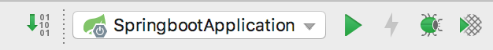

### 17.1.3　启动Spring Boot应用程序

要运行Spring Boot项目，只需在IDE中单击【Run】按钮运行即可。每个Spring Boot项目都有一个main方法作为应用程序主入口，main方法会调用SpringApplication.run()来启动整个Spring Boot程序，如图17-6所示。


<center class="my_markdown"><b class="my_markdown">图17-6　启动Spring Boot应用程序</b></center>

Spring Boot将启动程序分为3个部分，第一部分进行SpringApplication的初始化模块操作，配置一些基本的环境变量、资源、构造器和监听器；第二部分实现应用具体的启动方案，包括启动流程的监听模块、加载配置环境模块及创建上下文环境模块；第三部分是自动化配置模块，该模块是Spring Boot自动配置的核心。

此时，如果在浏览器中输入“http://localhost:8080/”来访问Spring Boot程序是不会有任何输出的，因为应用程序没有提供任何内容输出。新建一个Controller类并添加如下的内容。

```python
@RestController
class HelloController {
    @GetMapping("/hello")
    fun hello(): String {
        return "hello SpringBoot"
    }
}
```

在上面的实例中，用到了@RestController注解和@GetMapping注解，其中，@RestController注解用于将调用的结果直接返回给调用者，是@Controller注解和@ResponseBody注解的结合体。除此之外，在Controller层中还有以下几个注解需要注意。

+ @Controller：创建和处理HTTP请求。
+ @PathVariable：获取URL中的数据。
+ @RequestParam：获取请求参数的值。
+ @GetMapping/@PostMapping：组合注解，请求的方式。

此时，再次启动Spring Boot项目，在浏览器中输入如下地址便可以看到“hello SpringBoot”等内容输出。

```python
http://localhost:8080/hello
```

当然，除了使用IDE方式运行项目之外，Spring Boot还提供了命令行和JAR包方式来运行Spring Boot应用程序。具体的命令如下。

```python
//通过Maven构建的项目命令行方式启动
mvn spring-boot:run
//mvn install生成的JAR
mvn install
```

