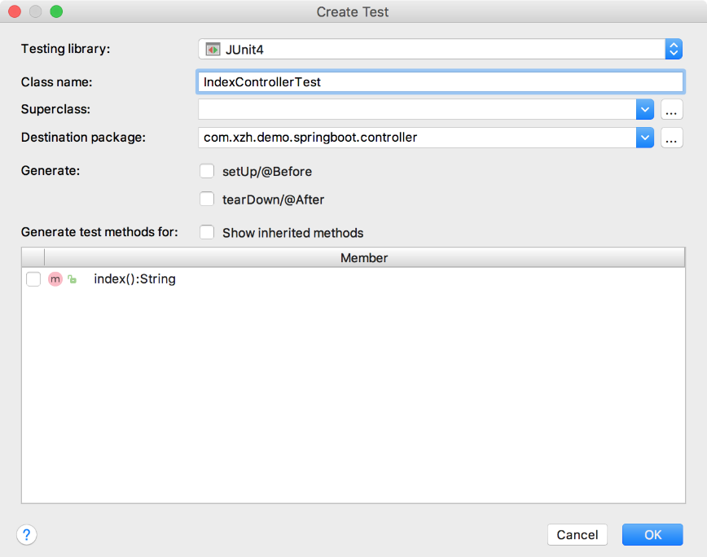
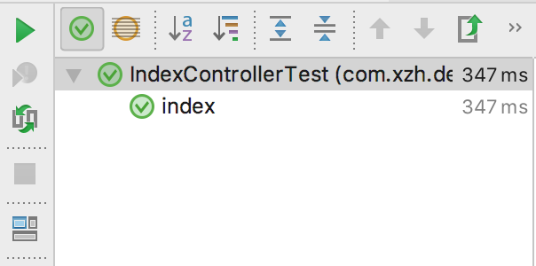
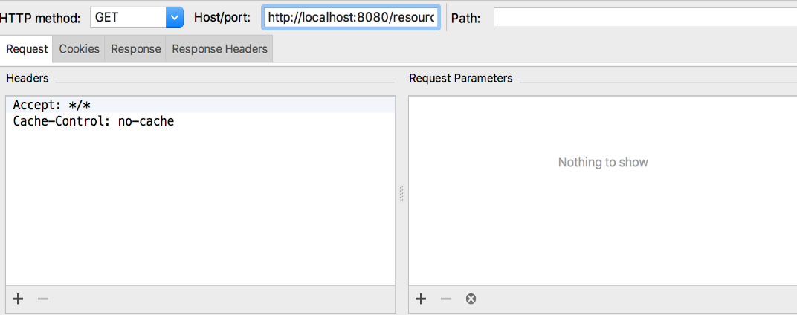

### 17.1.4　应用测试

在软件开发过程中，使用诸如JUnit测试框架进行单元测试是软件开发必不可少的内容。作为一个开源且可重复使用的自动化开源测试框架，JUnit测试框架常常被开发者用于实施单元测试和回归测试。合理地使用测试框架不仅可以提高软件的编码质量，还可以加快程序的编写速度，为开发者带来便利。

使用Spring Boot创建项目时，系统默认集成了spring-boot-starter-test这一单元测试框架，该框架除了支持JUnit的功能外，还提供诸如Spring Test、AssertJ和Mockito等测试框架的功能。

在使用spring-boot-starter-test进行单元测试之前，必须先在Spring Boot项目中添加相关的环境依赖。对于Maven方式构建的项目，打开项目的pom.xml文件，在dependency标签中添加如下内容。

```python
<dependency>
    <groupId>org.springframework.boot</groupId>
    <artifactId>spring-boot-starter-test</artifactId>
    <scope>test</scope>
</dependency>
```

如果是通过Gradle方式构建的项目，则需要在build.gradle文件的dependencies节点中添加如下配置。

```python
dependencies {
   testCompile('org.springframework.boot:spring-boot-starter-test')
   … //省略其他配置
}
```

spring-boot-starter-test测试框架除了支持整个类对象测试之外，还可以对某个方法进行测试。在Spring Boot应用程序开发中，我们经常使用它对Controller和Service类编写测试用例。例如，有这样一个Controller类。

```python
import org.springframework.web.bind.annotation.RequestMapping;
import org.springframework.web.bind.annotation.RestController;
@RestController
class IndexController {
    @RequestMapping("/index")
    fun index(): String {
        return "index"
    }
}
```

要对上面的Controller类进行单元测试，可以新建一个测试类。不过，此处有一个更加简便的方法，选中Controller类或具体的方法并单击右键，然后依次选择【Go To】→【Test】，新建JUnit测试类，新建页面如图17-7所示。

在IndexControllerTest类中，使用MockMvc来模拟一个简单的HTTP请求并提供一个用于测试的函数。

```python
@RunWith(SpringRunner::class)
@SpringBootTest
class IndexControllerTest {
      private var mockMvc: MockMvc? = null
    @Before
    fun setUp() {
         mockMvc = MockMvcBuilders.standaloneSetup(IndexController()).build()
    }
    @Test
    @Throws(Exception::class)
    fun index() {
        mockMvc!!.perform(MockMvcRequestBuilders.get("/index")
                .accept(MediaType.APPLICATION_JSON))
                .andExpect(status().isOk)
                .andExpect(content().string(equalTo("index")))
    }
}
```


<center class="my_markdown"><b class="my_markdown">图17-7　Controller类新建单元测试</b></center>

然后，选择index()方法，如图17-8所示，单击右键运行，如果测试通过，则会得到正确的反馈结果；反之会得到错误内容提示。


<center class="my_markdown"><b class="my_markdown">图17-8　index()方法</b></center>

在上面的注解实例中，我们使用到了@RunWith和@Before等注解标签，作为spring- boot-starter-test测试框架的重要组成部分，用于修饰测试的注解主要包括以下几个。

+ @RunWith：用于修饰需要进行单元测试的执行类。
+ @Before：该方法在每个用例运行之前执行，用于初始化某些必要的先决条件。
+ @After：该方法在每项测试后执行，用于释放资源。
+ @Test：使用该标签修饰则表示为测试用例。
+ @Ignore：需要忽略的测试方法。
+ @BeforeClass：该方法必须在所有针对性测试之前执行，而且只能执行一次，必须为static void类型。
+ @AfterClass：该方法在所有针对性测试之后执行，而且只能执行一次，必须为static void类型。

使用上面的注解，执行测试用例的顺序为@BeforeClass →@Before → @Test →@After→ @AfterClass，即先加载必要环境，再进行测试，最后释放资源。

除了上面的常规测试方法外，还可以使用IntelliJ IDEA自带的Web Service测试工具进行接口测试。具体来说，依次选择【Tools】→【Test RESTful Web Service】来打开接口调试工具。图17-9所示为IntelliJ IDEA自带的REST Client测试工具。


<center class="my_markdown"><b class="my_markdown">图17-9　IntelliJ IDEA自带REST Client测试工具</b></center>

