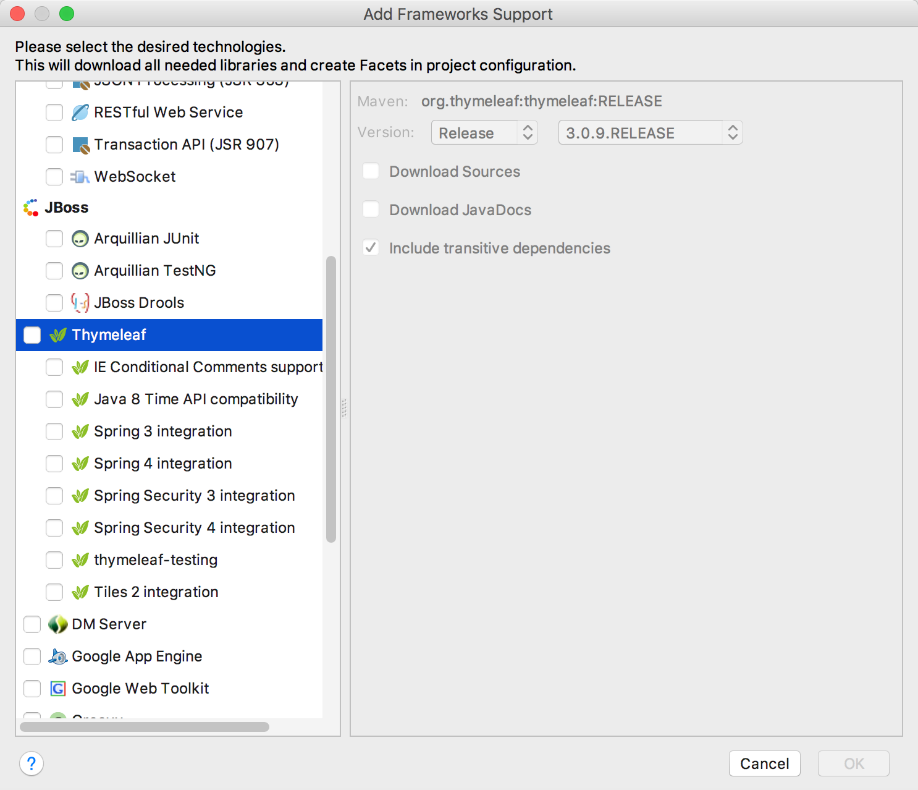

### 17.2　Spring Boot之Thymeleaf模板

Spring Boot提供了大量的模板引擎，包括FreeMarker、Groovy、Thymeleaf和Mustache等。作为一款Spring Boot推荐使用的模板引擎，相比于其他模板引擎，Thymeleaf的语法更加接近HTML，而且具有不错的扩展性。

Thymeleaf提供了一个用于整合Spring MVC的可选模块，作为MVC应用程序的view层，可以使用Thymeleaf模板来代替传统的JSP页面或其他模板引擎，如Velocity、FreeMarker等。Thymeleaf的主要目标在于提供一种可被浏览器正确显示且格式良好的模板创建方式，因此还可以用作静态建模。

Thymeleaf模板主要由数据、模板、模板引擎和结果文档4个部分组成，在项目中使用Thymeleaf模板需要先添加相关依赖，对于通过Maven方式构建的项目，需要在pom.xml文件中添加如下依赖脚本。

```python
<dependency>
   <groupId>org.springframework.boot</groupId>
   <artifactId>spring-boot-starter-thymeleaf</artifactId>
</dependency>
```

如果是通过Gradle方式构建的项目，则需要在build.gradle中的dependency中加入以下配置。

```python
compile "org.springframework.boot:spring-boot-starter-thymeleaf"
```

除了上面两种方式外，还可以通过IEDA图形化方式来添加，在项目名处右键，选择【Add Frameworks Support】→【Thymeleaf】来添加JAR包依赖，如图17-10所示。


<center class="my_markdown"><b class="my_markdown">图17-10　通过Add Frameworks Support添加Thymeleaf模板</b></center>

在Spring Boot项目中加入Thymeleaf依赖后即可启动其默认配置，如果想自定义Thymeleaf的配置，则可以在application.properties文件中添加。

```python
# 是否开启模板缓存，默认true
spring.thymeleaf.cache=true 
# 检查模板位置是否存在
spring.thymeleaf.check-template-location=true 
# Content-Type value
spring.thymeleaf.content-type=text/html 
# 是否启用MVC-Thymeleaf视图
spring.thymeleaf.enabled=true 
# 模板编码
spring.thymeleaf.encoding=UTF-8 
# 应该从解析中排除的视图名称列表（用逗号分隔）
spring.thymeleaf.excluded-view-names= 
# 要应用于模板的模板模式。另请参见StandardTemplateModeHandlers
spring.thymeleaf.mode=HTML5 
# 在链接网址时预先查看名称的前缀
spring.thymeleaf.prefix=classpath:/templates/ 
# 链接网址时附加到视图名称的后缀
spring.thymeleaf.suffix=.html
# 指定模板的解析顺序，默认为第一个
spring.thymeleaf.template-resolver-order= 
# 指定使用模板的视图名，多个以逗号分隔
spring.thymeleaf.view-names=
```

当然，关于Thymeleaf配置更多的细节，还可以通过ThymeleafProperties类来获取。事实上，上面的配置就是注入该类的属性值。

接下来，新建一个ThymeleafController控制类并添加如下内容。

```python
@Controller
public class ThymeleafController {
      @RequestMapping(name="/thymeleaf",method = RequestMethod.GET)
      public String index(ModelMap map) {
        map.addAttribute("host", "http://xiangzhihong.com");
        // return模板文件的名称
        return "index";
    }
}
```

在上述代码中，ModelMap对象用来进行数据与视图的绑定操作，return会返回对应目录在“resources/templates”下的模板名称。

Spring Boot框架提供了很多默认配置，Thymeleaf也不例外。Thymeleaf模板的默认配置路径为“src/main/resources/templates”。在templates文件夹下新建一个名为index.html的模板页面文件。

```python
<!DOCTYPE html>
<html xmlns:th="http://www.w3.org/1999/xhtml">
<head lang="en">
    <meta charset="UTF-8" />
    <title></title>
</head>
<body>
<h1 th:text="'Hello！, '+${host}">Hello World</h1> </body>
</html>
```

启动Spring Boot程序，在浏览器中输入“http://localhost:8080/thymeleaf”即可获得Controller类中模板属性的内容。

```python
Hello！, http://xiangzhihong.com
```

