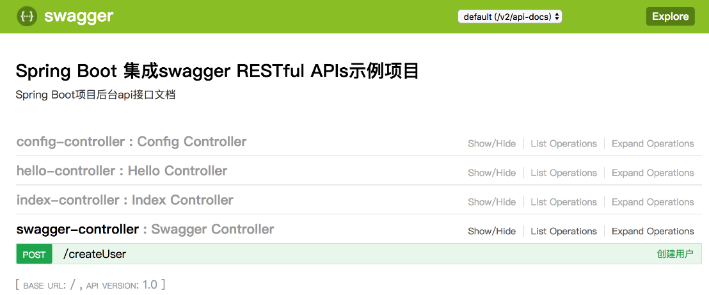

### 17.3　使用Swagger构建RESTful API

所谓RESTful，是指一种软件架构和设计风格，而不是标准，它提供了一组设计原则和约束条件，用于在客户端和服务器之间实现通信。遵循REST风格的架构就称为RESTful架构，资源是RESTful的核心。基于RESTful风格设计开发的软件更简洁，更易于实现缓存等机制。

基于RESTful风格开发的软件，通过URL就能很清楚地了解其需求和功能。使用RESTful架构开发的API就是RESTful API，RESTful API通常用于为iOS、Android客户端提供API数据接口，是目前被业界广泛使用的一种API格式。示例代码如下。

```python
com.mobin/api/v1/shanghai/subways   //获取上海地铁列表
```

在Spring Boot应用程序开发中，对外提供数据服务的有效方式是编写API接口，通过这些API接口可以很好地实现数据的交互。在模拟数据请求方面，除了大家熟知的LoadRunner和Postman等可视化工具外，Swagger也是一个不错的API框架。

Swagger是一个规范且完整的API框架，主要用于生成、描述、调用和可视化RESTful风格的Web服务。使用Swagger框架可以自动生成接口文档，从而有效地减少接口定义带来的沟通成本，提高软件的开发效率和质量。另外，Swagger还提供了各种语言插件，可以通过配置和少量代码来生成接口文档及测试界面。

在Spring Boot应用程序开发过程中，使用Swagger来构建RESTful API文档是一件美妙的事情。在使用Swagger提供的功能之前，需要先添加Swagger相关的依赖。如果是通过Maven方式构建的项目，则需要在pom.xml中加入如下依赖。

```python
<dependency>
    <groupId>io.springfox</groupId>
    <artifactId>springfox-swagger2</artifactId>
    <version>2.7.0</version>
</dependency>
<dependency>
    <groupId>io.springfox</groupId>
    <artifactId>springfox-swagger-ui</artifactId>
    <version>2.7.0</version>
</dependency>
```

如果是通过Gradle方式构建的项目，则Swagger依赖的脚本配置如下。

```python
compile('io.springfox:springfox-swagger2:2.7.0')
compile('io.springfox:springfox-swagger-ui:2.7.0')
compile('com.mangofactory:swagger-models:1.0.2')
```

Spring Boot有一套Web端拦截机制，如果配置Swagger发布的API文档界面，则需要将springfox-swagger-ui包添加到配置文件中。

当对Spring Boot和Swagger进行整合时，需要添加一个配置文件，通过配置可以指定在Spring Boot启动时扫描哪些Controller层的文件夹，另外还可以指定API文档中的标题和描述信息等。代码如下。

```python
@Configuration
@EnableSwagger2
class Swagger2Config {
      @Bean
      fun createRestApi(): Docket {
           return Docket(DocumentationType.SWAGGER_2)
                    .apiInfo(apiInfo())
                    .select()
                    .apis(RequestHandlerSelectors.basePackage("com.xzh.demo.springboot.controller"))
                    .paths(PathSelectors.any())
                    .build()
    }
    private fun apiInfo(): ApiInfo {
         return ApiInfoBuilder()
                  .title("Spring Boot 集成swagger RESTful APIs示例项目")
                  .description("Spring Boot项目后台api接口文档")
                  .version("1.0")
                  .build()
    }
}
```

如以上代码所示，通过@Configuration注解，Spring Boot框架在启动时会默认加载该类的相关配置，再通过@EnableSwagger2注解来启用Swagger2。具体来说，通过createRestApi函数创建Docket的Bean之后，apiInfo函数用来创建该API的基本信息，select()函数返回一个ApiSelectorBuilder实例，用来控制有哪些接口暴露给Swagger。

完成上述配置后，其实已经可以生成文档内容，但是这样的文档主要针对请求本身，并没有任何实际的作用。为此，还需要在Controller层的代码中使用@ApiImplicitParam注解来添加具体的参数说明，使用@ApiOperation注解来给API增加说明。例如，下面是一个创建用户的Contrller类。

```python
@RestController
class SwaggerController {
      companion object {
        internal var users: MutableMap<Int, User> = Collections.synchronizedMap (HashMap())
}
    //根据User对象创建用户
    @ApiOperation(value = "创建用户", notes = "根据User对象创建用户")
    @ApiImplicitParam(name = "user", value = "用户详细实体user", required = true, dataType = "User")
    @RequestMapping(value = "createUser", method = arrayOf(RequestMethod.POST))
    fun postUser(@RequestBody user: User): String {
         users[user.id] = user
         return "success"
    }
    //测试@ApiIgnore注解
    @ApiIgnore
    @RequestMapping(value = "/ignore", method = arrayOf(RequestMethod.GET))
    fun jsonTest(): String {
         return " 测试忽略接口!"
    }
}
```

在完成Contrller层API接口的编写工作之后，启动Spring Boot程序，在浏览器中输入“http://localhost:8080/swagger-ui.html”来访问API接口，如图17-11所示。


<center class="my_markdown"><b class="my_markdown">图17-11　使用Swagger进行程序调试</b></center>

Swagger通过注解来标识接口文档相关的内容，这些注解包括接口名、请求方法、参数和返回信息等内容。

+ @Api：修饰整个类，用来描述Controller的作用。
+ @ApiOperation：用于修饰类、方法或接口。
+ @ApiParam：用于描述单个参数信息。
+ @ApiModel：使用对象来接收参数。
+ @ApiProperty：使用对象接收参数时，描述对象的一个字段。
+ @ApiResponse：用于响应HTTP中的一个描述。
+ @ApiResponses：用于响应HTTP的整体描述。
+ @ApiIgnore：该注解用于忽略某个API或方法。
+ @ApiError ：发生错误返回的信息。
+ @ApiImplicitParam：用于修饰单个请求参数。
+ @ApiImplicitParams：用于修饰多个请求参数。

当然，除了使用Swagger提供的默认UI界面外，Swagger还支持自定义UI界面。

