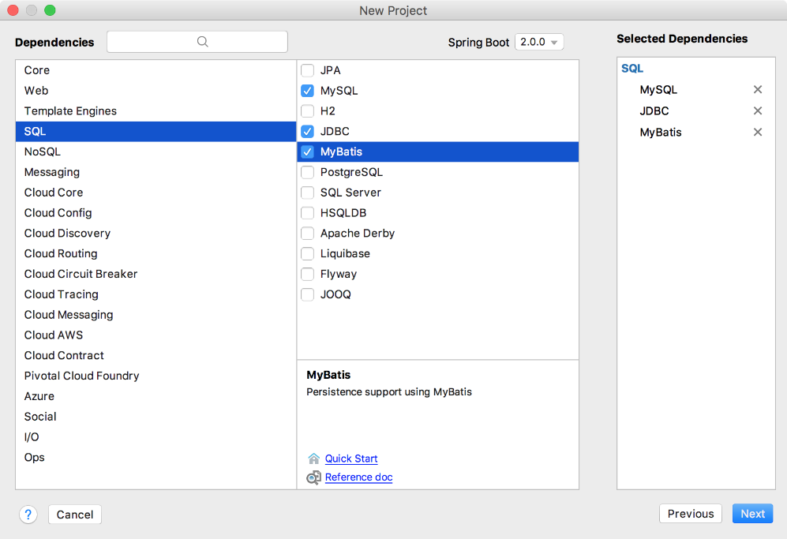
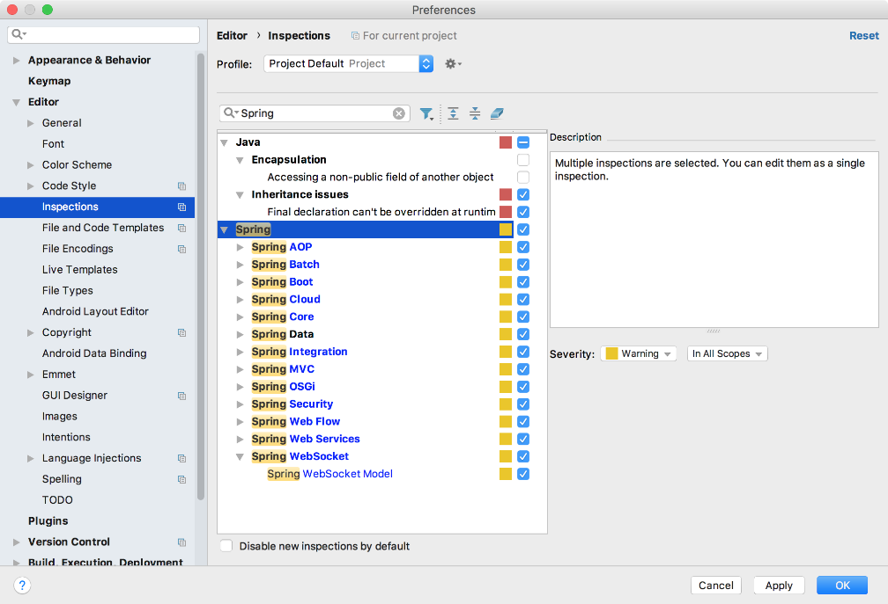

### 17.4　Spring Boot通过MyBatis整合MySQL数据库

MyBatis作为一款优秀的持久层框架，支持定制化SQL、存储过程以及高级映射，MyBatis省略了大量的JDBC数据库连接代码、手动参数设置以及结果集。MyBatis可以使用简单的XML或注解来配置和映射原生信息，将接口和 Java的POJO（Plain Old Java Object）映射成数据库中的记录。

MyBatis的前身就是大名鼎鼎的iBatis框架，2010年Apache组织将这个项目由Apache Software Foundation迁移到Google Code，而且改名为MyBatis。Mybatis的功能架构主要由以下3个部分组成。

+ API接口层：提供给外部使用的接口API，开发人员可以通过这些API来操作数据库。
+ 数据处理层：负责具体的SQL查找、SQL解析、SQL执行和结果映射处理等。
+ 基础支撑层：负责基础的功能支撑，包括连接管理、事务管理、配置加载和缓存处理，同时为上层的数据处理层提供基础支撑。

使用MyBatis之前需要先添加MyBatis相关的环境依赖。值得注意的是，作为一款持久层框架，在添加MyBatis环境时还需要添加某个数据库框架。代码如下。

```python
<dependencies>
     <dependency>
            <groupId>org.mybatis.spring.boot</groupId>
            <artifactId>mybatis-spring-boot-starter</artifactId>
            <version>1.3.2</version>
    </dependency>
    <dependency>
         <groupId>mysql</groupId>
         <artifactId>mysql-connector-java</artifactId>
         <version>5.1.38</version>
    </dependency>
</dependencies>
```

如果使用Gradle方式来管理依赖，则配置内容如下。

```python
dependencies {
    …//省略其他配置
    compile('org.mybatis.spring.boot:mybatis-spring-boot-starter:1.3.2')
    runtime('mysql:mysql-connector-java')
}
```

除了上面的添加方式之外，还可以在新建工程时就添加MyBatis相关环境的支持，如图17-12所示。当然，也可以到官网下载MyBatis的JAR包，然后手动添加依赖。


<center class="my_markdown"><b class="my_markdown">图17-12　选择持久化依赖</b></center>

然后，在MySQL数据库中使用SQL脚本新建数据库和数据表，推荐使用图形化工具方式来创建数据表。

```python
## 创建数据库
CREATE DATABASE db_mybatis;
USE db_mybatis;
## 创建测试表
CREATE TABLE t_user(
  id BIGINT NOT NULL PRIMARY KEY AUTO_INCREMENT,
  name VARCHAR(255) NOT NULL ,
  password VARCHAR(255) NOT NULL ,
  phone VARCHAR(255) NOT NULL
) ENGINE=INNODB AUTO_INCREMENT=1 DEFAULT CHARSET=utf8;
```

为了访问MySQL数据库，还需要在application.properties配置文件中添加数据源和JPA配置。代码如下。

```python
spring.datasource.driver-class-name=com.mysql.jdbc.Driver  //MySQL驱动程序
spring.datasource.url=jdbc:mysql://localhost:3306/jpa   //数据源URL
spring.datasource.username=root       //数据库用户名
spring.datasource.password=******   //密码
spring.jpa.show-sql= true   //运行时显示SQL语言
spring.jpa.hibernate.ddl-auto=update
```

Spring Boot提供application.properties和application.yml两种形式的工程配置文件，默认采用application.properties方式，不过application.yml方式更加简洁。

接下来，创建映射对象UserEntity，该类中的字段和数据库中数据表的字段内容对应。

```python
class UserEntity {
      var id: Int? = null
      var name: String? = null
      var password: String? = null
      var phone: String? = null
}
```

在Web应用程序开发中，表单操作是非常多的，如果使用JPA、JDBC那样的所谓BaseDao规范，代码框架将变得异常复杂。MyBatis通过XML集中配置的方式来优化SQL操作并通过Mapper接口来完成持久化DAO层的操作。

为UserEntity创建一个映射操作UserMapper接口并添加插入和查询操作，为后续单元测试提供验证。

```python
@Mapper
interface UserMapper {
    //查询操作
    @Select("SELECT * FROM T_USER WHERE PHONE = #{phone}")
    fun findUserByPhone(@Param("phone") phone: String): User
    //添加插入操作
    @Insert("INSERT INTO T_USER(NAME, PASSWORD, PHONE) VALUES(#{name}, #{password}, #{phone})")
    fun insert(@Param("name") name: String, @Param("password") password: String, @Param("phone") phone: String): Int
}
```

通过UserMapper的对外访问接口，可以使用Spring Boot提供的单元测试功能来验证MyBatis的正确性。

```python
@RunWith(SpringRunner::class)
@SpringBootTest
class MybatisTest {
      @Autowired
      private val userMapper: UserMapper? = null
      @Test
      fun test() {
        userMapper!!.insert("王五", "123", "12345678910")
        val u = userMapper.findUserByPhone("12345678910")
        Assert.assertEquals("李四", u.name)
    }
}
```

运行上面的测试代码，即可将对应的信息插入到MySQL数据库中。需要注意的是，如果在测试程序中出现@Autowired注解错误，请修改开发工具IntelliJ IDEA中对Spring Boot程序的代码检查级别，如图17-13所示。


<center class="my_markdown"><b class="my_markdown">图17-13　修改IntelliJ IDEA代码检查级别</b></center>

