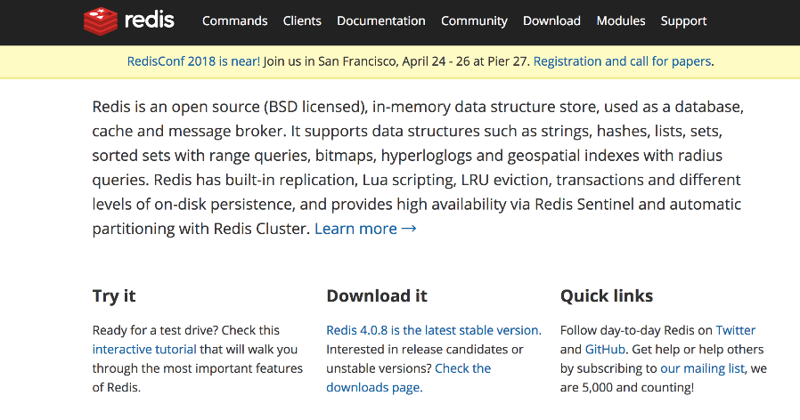
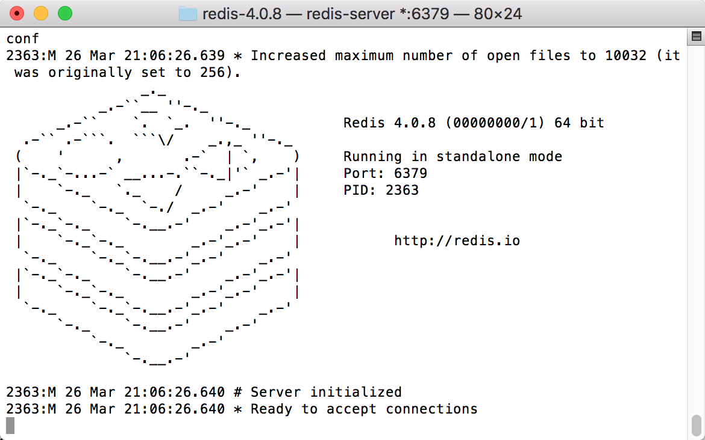
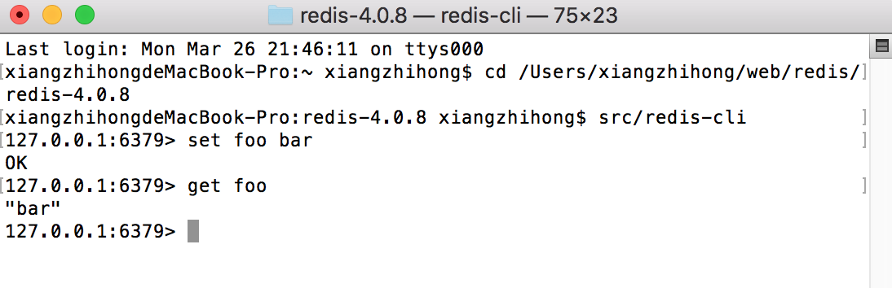

### 17.5.1　Redis简介

Redis是一个基于内存的日志型可持久化的缓存数据库，其官网如图17-14所示，保存形式为key-value格式，使用ANSIC编写，而且完全免费开源。与其他的key-value缓存产品一样，Redis具有以下3个特点。

+ Redis支持数据的持久化，可以将内存的数据保存在磁盘中，重启的时候可以再次加载进行使用。
+ Redis不仅支持简单的key-value类型数据，同时还支持对字符串、链表、集合、有序集合和HASH等数据结构的存储。
+ Redis支持数据备份，即master-slave模式的数据备份。


<center class="my_markdown"><b class="my_markdown">图17-14　Redis官网</b></center>

在Mac系统上，无须下载Redis即可使用。以下是从Redis的托管服务器下载Redis压缩包并解压的相关命令。

```python
wget http://download.redis.io/releases/redis-4.0.8.tar.gz
tar xzf redis-4.0.8.tar.gz
cd redis-4.0.8
make
```

使用Redis提供的服务之前，需要先启动Redis相关的服务，在Mac系统上启动Redis的命令如下，启动后如图17-15所示。


<center class="my_markdown"><b class="my_markdown">图17-15　安装并启动Redis</b></center>

```python
src/redis-server
```

然后，重新打开一个Redis客户端，使用以下的命令来连接Redis Server，如图17-16所示。

```python
src/redis-cli
redis> set foo bar
OK
redis> get foo
"bar"
```


<center class="my_markdown"><b class="my_markdown">图17-16　Redis客户端连接服务端</b></center>

对于Window系统环境，还可以从Redis托管在GitHub上的地址进行下载安装。同时，对于初学者，Redis还提供了在线体验功能，可以在线学习体验Redis的强大功能。

