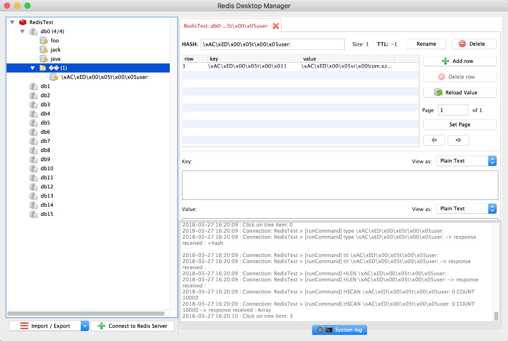

### 17.5.2　Spring Boot整合Redis

在Web应用程序开发中，合理利用Redis提供的缓存特性，可以有效地提升系统性能，特别是对于并发操作，可以有效地减少数据库的压力。

对于通过Maven方式构建的项目，需要在pom.xml文件中添加Redis依赖，依赖脚本配置如下。

```python
<dependency>
    <groupId>org.springframework.boot</groupId>
    <artifactId>spring-boot-starter-data-redis</artifactId>
</dependency>
```

通过Gradle方式构建的项目则需要在build.gradle文件中引入如下配置。

```python
compile('org.springframework.boot: spring-boot-starter-data-redis')
```

使用Redis之前，需要根据项目要求配置Redis的运行环境，打开Spring Boot项目的配置文件application.properties并添加如下配置信息。

```python
spring.redis.hostName=127.0.0.1
spring.redis.port=6379    
spring.redis.jedis.pool.max-active=8
spring.redis.jedis.pool.max-idle=8    
spring.redis.jedis.pool.min-idle=0
```

Redis常用的配置信息如下。

+ spring.redis.database：Redis数据库索引，默认为0。
+ spring.redis.hostName：Redis服务器地址。
+ spring.redis.port：Redis服务器连接端口。
+ spring.redis.jedis.pool.max-active：连接池最大连接数。
+ spring.redis.jedis.pool.max-wait：连接池等待阻塞的时间。
+ spring.redis.jedis.pool.max-idle：连接池最大空闲时间。
+ spring.redis.timeout：连接超时时间。

加入Redis依赖引用后，需要先启动Redis服务，否则程序运行时会报错。在Spring Boot中启用Redis非常简单，只需要在Application主类上添加注解@EnableCaching即可，之后在需要启用缓存的查询方法上添加@Cacheable注解。代码如下。

```python
@SpringBootApplication
@EnableCaching
public class DemoApplication implements CommandLineRunner{
    …
}
```

此处新建一个JUnit测试类并使用Redis 提供的StringRedisTemplate模板完成一个简单的新增操作。代码如下。

```python
@SpringBootTest
@RunWith(SpringJUnit4ClassRunner::class)
class RedisTest {
      @Autowired
      private val stringRedisTemplate: StringRedisTemplate? = null
      @Test
      fun save() {
      stringRedisTemplate!!.opsForValue().set("java", "hello java")
      Assert.assertEquals("hello java", stringRedisTemplate.opsForValue(). get("java"))
      println(stringRedisTemplate.keySerializer)
    }
}
```

在上面的例子中，StringRedisTemplate作为RedisTemplate，主要用于支持key-value为String的操作，而RedisTemplate主要封装对Redis的各种操作，它支持所有原生的API。

执行RedisTest测试类，然后可以使用Redis的桌面工具RDM来查看保存的数据，如图17-17所示。


<center class="my_markdown"><b class="my_markdown">图17-17　使用Redis桌面工具RDM查看数据</b></center>

需要注意的是，如果使用RedisTemplate来保存数据，则保存的数据是经过JDK的序列化对象。细心的读者可能会发现，使用RedisTemplate保存的数据的key和value都是乱码。出现这种现象的原因是Spring默认采用了SimpleKey这个类来生成Redis的key，消除这种现象的办法是新增缓存配置，指定Redis生成key的方式。代码如下。

```python
@Configuration
class CacheConfig : CachingConfigurerSupport() {
       @Autowired
       private val redisTemplate: RedisTemplate<*, *>? = null
       @Bean
       override fun cacheManager(): CacheManager {
        redisTemplate!!.keySerializer = GenericToStringSerializer (Any::class.java)
        val cacheManager = RedisCacheManager(redisTemplate)
        cacheManager.setDefaultExpiration(3600)
        cacheManager.setUsePrefix(true)
        …//省略其他配置
        return cacheManager
    }
}
```

示例中，keySerializer()用来设置key值的生成方式，GenericToStringSerializer()则是把Java对象转换为字符串进行存储的序列化方法。

除了提供数据持久化功能之外，Redis还能够实现轻量级消息队列服务功能。不过，在大型系统上，建议选择RabbitMQ、ActiveMQ等消息队列管理框架，毕竟Redis擅长的还是缓存和数据操作。

