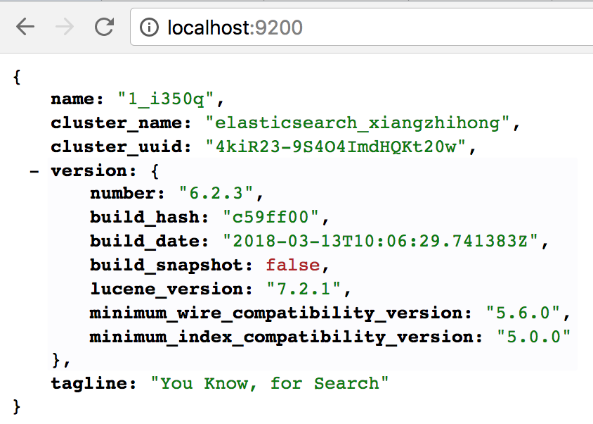
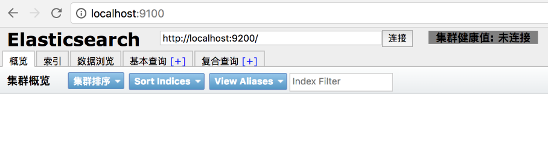

### 17.6.1　Elasticsearch简介

Elasticsearch（ES）是一个基于Lucene的高可扩展开源全文本搜索和分析工具，它允许以近实时的方式快速存储、搜索和分析大容量的数据。它不仅提供全文检索功能，还能提供高效的分布式数据存储、索引和搜索功能，可以完成对大数据的自动分片、自动负载索引并提供Restful Web的风格接口。

Elasticsearch具有以下几个特点。

+ 安装方便：不需要其他依赖，安装异常方便，只需修改几个参数就可以搭建一个集群。
+ JSON交互：输入/输出格式为JSON，不需要定义额外的Schema。
+ RESTful：几乎所有操作（索引、查询，甚至是配置）都可以通过HTTP接口来完成。
+ 分布式：节点对外表现对等，每个节点都可以当作入口，而且节点自动均衡。
+ 多租户：可根据不同的用途划分索引，同时支持多个索引操作。
+ 准实时：从文档索引到可以被检索只有轻微延时，在可接受范围之内。

在本机环境中运行Elasticsearch服务，需要先搭建Elasticsearch的相关运行环境。首先到官网下载对应的压缩包，解压后的文件目录结构内容如下。

+ bin：存放脚本。
+ config：存放配置文件目录。
+ modules：模块目录。
+ lib：依赖第三方库的目录。
+ plugins：存放第三方插件目录。

进入解压后的Elasticsearch目录，然后使用如下的命令启动Elasticsearch服务。

```python
sh ./bin/elasticsearch
```

出现started则表示启动成功，Elasticsearch默认监听端口为9200，在浏览器中输入“127.0.0.1:9200”可以看到Elasticsearch相关的信息，如图17-18所示。


<center class="my_markdown"><b class="my_markdown">图17-18　Elasticsearch版本信息</b></center>

同时，还可以通过集成elasticsearch-head插件来进行可视操作，以下是相关的操作命令。

```python
git clone git://github.com/mobz/elasticsearch-head.git
cd elasticsearch-head
npm install
npm run start
```

重启Elasticsearch服务，在浏览器中输入“http://localhost:9100”即可启动图形化操作界面，如图17-19所示。


<center class="my_markdown"><b class="my_markdown">图17-19　Elasticsearch图形化管理界面</b></center>

