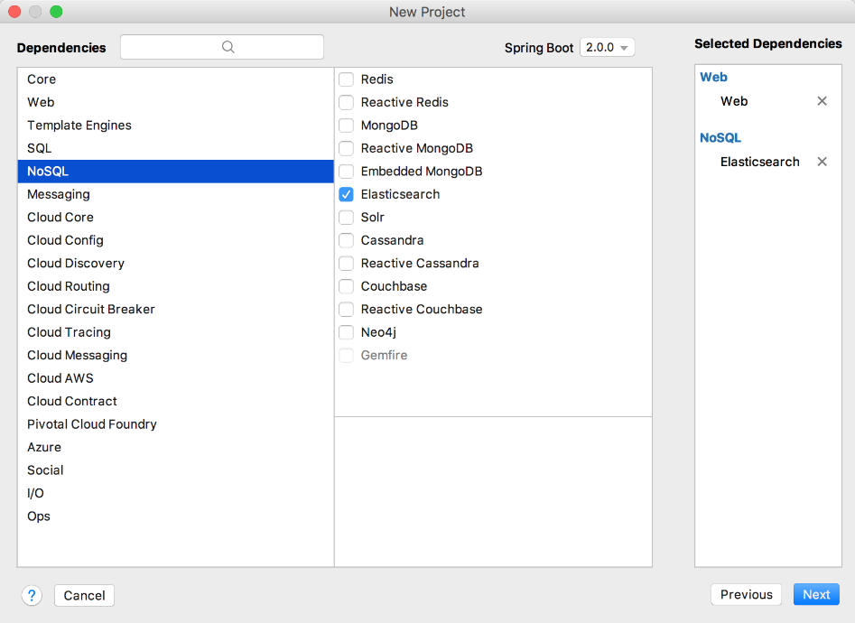
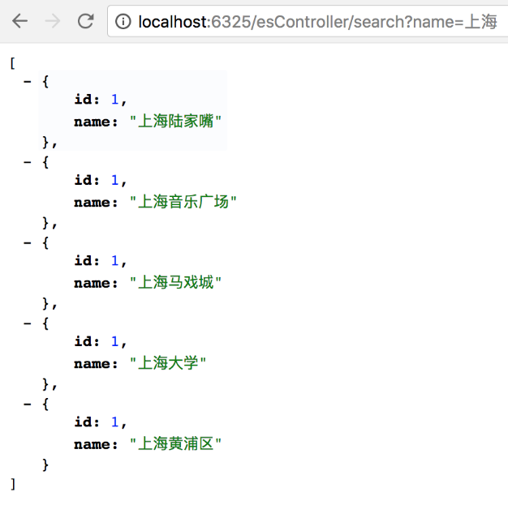

### 17.6.2　Spring Boot整合Elasticsearch

Spring Boot提供了多种方式连接Elasticsearch服务：RestAPI/Jest方式和Spring Data客户端方式。

这当中，使用Spring Data Elasticsearch方式接入Elasticsearch时需要注意版本的兼容问题，如表17-1所示。

<center class="my_markdown"><b class="my_markdown">表17-1　Spring Data Elasticsearch版本兼容表</b></center>

| Spring Boot版本(x) | Spring Data Elasticsearch(y) | Elasticsearch版本(z) |
| :-----  | :-----  | :-----  | :-----  | :-----  |
| x≤1.3.5 | y≤1.3.4 | z≤1.7.2 |
| x≥1.4.x | 2.0.0≤y<5.0.0 | 2.0.0≤y<5.0.0 |
| x≥2.0.0 | y≥5.0.0 | z≥5.0.0 |

在Spring Boot项目中使用Elasticsearch，需要先集成Elasticsearch开发库，对于使用Maven方式构建的项目，在pom.xml文件中添加如下依赖配置。

```python
<dependency>
    <groupId>org.springframework.boot</groupId>
    <artifactId>spring-boot-starter-data-elasticsearch</artifactId>
</dependency>
<dependency>
    <groupId>io.searchbox</groupId>
    <artifactId>jest</artifactId>
</dependency>
```

如果采用RestAPI/Jest方式连接Elasticsearch，还需要引入Jest库。如果使用Gradle方式构建项目，则build.gradle依赖配置如下。

```python
compile('org.springframework.boot:spring-boot-starter-data-elasticsearch')
compile('net.java.dev.jna:jna')
compile('io.searchbox:jest:5.3.3')
```

当然，作为Web应用项目基本的功能组成部分，还可以在项目新建时就添加Elasticsearch环境支持，如图17-20所示。

添加依赖以后，还需要在application.properties中增加Elasticsearch脚本配置，该配置会在Spring Boot初始化过程中使用到。

```python
#集群名，默认值: elasticsearch
spring.data.elasticsearch.cluster-name=elasticsearch  
#是否开启本地Elasticsearch服务  
spring.data.elasticsearch.local=true 
#开启 Elasticsearch 仓库   
spring.data.elasticsearch.repositories.enabled=true
```


<center class="my_markdown"><b class="my_markdown">图17-20　新建项目时选择Elasticsearch</b></center>

Elasticsearch的其他配置还有以下几点。

+ spring.data.elasticsearch.properties.path.home：索引存储位置。
+ spring.data.elasticsearch.properties.path.logs：日志存储位置。
+ spring.data.elasticsearch.properties.path.data：数据存储位置。
+ spring.data.elasticsearch.properties.transport.tcp.connect_timeout：连接超时。

JestClient是Elasticsearch的一个Java客户端，是一款基于RESTful的开源库，可以用它直接操作Elasticsearch。在本例中，先定义一个名为EsService的接口并添加保存和获取列表的方法。

```python
interface EsService {
     fun saveEntity(entity: EsEntity)
     fun saveEntity(entityList: List<EsEntity>)
     fun searchEntity(searchContent: String): List<EsEntity>
}
```

然后定义EsService的实现类EsServiceImpl，并使用JestClient直接操作Elasticsearch。代码如下。

```python
@Service
class EsServiceImpl : EsService {
    @Autowired
    private val jestClient: JestClient? = null
    override fun saveEntity(entity: EsEntity) {
        val index = Index.Builder(entity).index(INDEX_NAME).type(TYPE).build()
        try {
            jestClient!!.execute<DocumentResult>(index)
        } catch (e: IOException) {
             e.printStackTrace()
        }
    }
    override fun saveEntity(entityList: List<EsEntity>) {
        val bulk = Bulk.Builder()
        for (entity in entityList) {
             val index = Index.Builder(entity).index(INDEX_NAME).type(TYPE). build()
             bulk.addAction(index)
        }
        try {
            jestClient!!.execute<BulkResult>(bulk.build())
        } catch (e: IOException) {
              e.printStackTrace()
        }
    }
    override fun searchEntity(searchContent: String): List<EsEntity> {
         val searchSourceBuilder = SearchSourceBuilder()
         var list: List<EsEntity> = ArrayList()
         searchSourceBuilder.query(QueryBuilders.matchQuery("name", searchContent))
        val search = Search.Builder(searchSourceBuilder.toString())
                .addIndex(INDEX_NAME).addType(TYPE).build()
        try {
             val result = jestClient!!.execute<SearchResult>(search)
             list = result.getSourceAsObjectList(EsEntity::class.java)
        } catch (e: IOException) {
             e.printStackTrace()
        }
        return list
    }
    companion object {
        val INDEX_NAME = "index_entity"
        val TYPE = "tstype"
    }
}
```

需要注意的是，对于Service的实现类，需要使用@Service注解修饰，以标明该类是一个服务类。为了提供对外访问的功能，还需要添加一个Controller类，使用它提供的函数，就可以直接操作Service服务。

```python
@RestController
@RequestMapping("/esController")
class EsController {
    @Autowired
    internal var esService: EsService? = null
    //保存数据接口
    @RequestMapping(value = "/save", method = arrayOf(RequestMethod.GET))
    fun save(id: Int, name: String): String {
        if (id > 0 && StringUtils.isNotEmpty(name)) {
               val newEntity = EsEntity(id, name)
               val addList = ArrayList<EsEntity>()
               addList.add(newEntity)
               esService!!.saveEntity(addList)
               return "OK"
        } else {
               return "Bad input value"
        }
    }
    //获取保存的数据列表
    @RequestMapping(value = "/search", method = arrayOf(RequestMethod.GET))
    fun save(name: String): List<EsEntity>? {
        var entityList: List<EsEntity>? = null
        if (StringUtils.isNotEmpty(name)) {
               entityList = esService!!.searchEntity(name)
        }
        return entityList
    }
}
```

通过EsController类的save()，我们可以保存数据，然后通过search()获取这些数据。例如，在浏览器中输入如下请求地址来保存数据。

```python
http://localhost:6325/esController/save?id=1&name=上海大学
http://localhost:6325/esController/save?id=1&name=上海陆家嘴
http://localhost:6325/esController/save?id=1&name=上海音乐广场
http://localhost:6325/esController/save?id=1&name=上海黄浦区
http://localhost:6325/esController/save?id=1&name=上海马戏城
```

Elasticsearch默认会将数据保存到data目录下，在实际项目开发中，需要单独为Elasticsearch配置数据存储路径，否则升级时可能会产生数据被覆盖丢失的问题。

打开浏览器并输入“http://localhost:6325/esController/search?name=上海”即可进行全词搜索，如图17-21所示。


<center class="my_markdown"><b class="my_markdown">图17-21　Elasticsearch全词搜索实现</b></center>

Elasticsearch默认采用standard分词方式，该方式会将每个搜索的字符都作为一个term，凡是包含这些字符的记录都会被搜索出来。同时，作为一个具备实时分析能力的分布式搜索引擎，Elasticsearch可以扩展到上百台服务器，处理PB级的结构化或非结构化数据。

