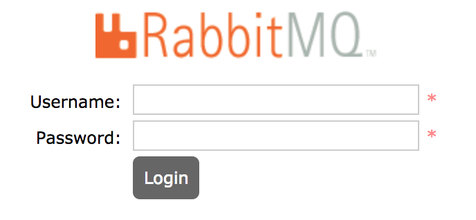
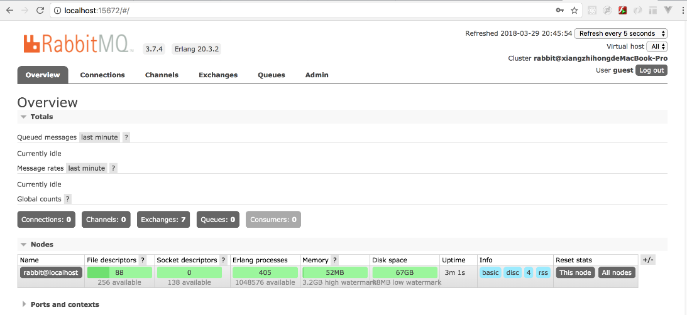

### 17.7.1　RabbitMQ简介

RabbitMQ是使用Erlang语言编写的实现了高级消息队列协议（AMQP）的开源消息代理软件，也可称为面向消息的中间件。它支持主流的Windows、Linux/UNIX、macOS操作系统和包括Java在内的多种编程语言。

AMQP（Advanced Message Queuing Protocol）是一个提供统一消息服务的应用层标准高级消息队列协议，它是应用层协议的一个开放标准，为面向消息的中间件而设计。基于此协议的客户端与消息中间件可以传递消息，而且不受不同中间件产品和不同开发语言等条件的限制。

与其他消息中间件相比，RabbitMQ具有以下几个特点。

+ 由Erlang语言开发，支持诸如AMQP、XMPP、SMTP、STOMP等消息协议。
+ 支持消息的持久化、负载均衡和集群，而且集群易于扩展。
+ 安装部署简单，上手容易，功能丰富且具有强大的社区支持。
+ 支持消息确认机制和灵活的消息分发机制。

RabbitMQ的安装过程异常简单，可以在RabbitMQ的官网下载对应的安装包。如果是macOS系统，还可以使用brew方式安装。代码如下。

```python
brew install rabbitmq
```

RabbitMQ的默认安装目录为“/usr/local/Cellar/rabbitmq/3.7.4”，如果要启动RabbitMQ，则可以在“/usr/local/Cellar/rabbitmq/3.7.4”目录中执行如下命令。

```python
sbin/rabbitmq-server
```

服务启动完毕后，在终端 “/usr/local/Cellar/rabbitmq/3.7.4”文件下执行如下的界面插件管理命令。

```python
sudo ./rabbitmq-plugins enable rabbitmq_management
```

在浏览器中输入“http://localhost:15672/”即可登录RabbitMQ图形化界面管理系统，如图17-22所示。


<center class="my_markdown"><b class="my_markdown">图17-22　RabbitMQ终端登录</b></center>

RabbitMQ默认的账号和密码都为guest，登录RabbitMQ即可通过图形化界面查看相关信息了，如图17-23所示。


<center class="my_markdown"><b class="my_markdown">图17-23　RabbitMQ可视化管理</b></center>

