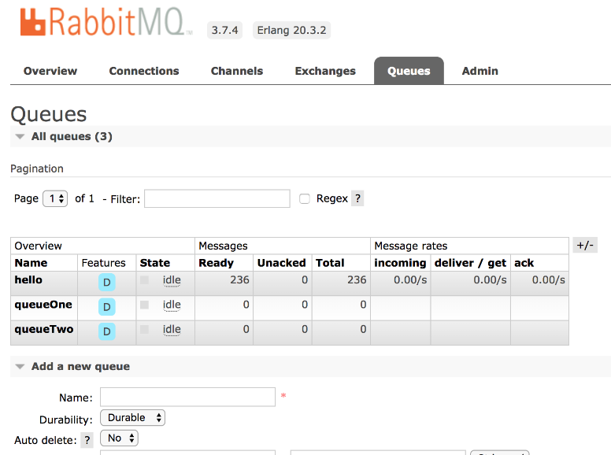

### 17.7.2　Spring Boot集成RabbitMQ

作为一个负责接收和转发消息的中间件，RabbitMQ主要由生产者、消费者和消息队列等几个部分组成。

+ 生产者：负责生产消息，即发送消息。
+ 消息队列：使用RabbitMQ提供的管道可以传输消息，队列本身没有任何限制，理论上可以存储任意多的消息。多个生产者可以使用一个消息队列发送消息，多个消费者也可以从一个队列中获取消息。
+ 消费者：负责消费队列中的消息，通常来说，消费者就是一个客户端程序，一个等待接收消息的线程。

在Spring Boot中集成RabbitMQ服务需要先添加spring-boot-starter-amqp库依赖。例如，下面是Maven方式的库依赖脚本。

```python
<dependency>
   <groupId>org.springframework.boot</groupId>
   <artifactId>spring-boot-starter-amqp</artifactId>
</dependency>
```

前面说过，RabbitMQ主要由生产者、消费者和消息队列组成。生产者负责生产消息并将消息发送到消息队列中，消费者则负责接收消息，会对消息队列进行实时监听。

此处，新建一个生产者Sender对象。

```python
@Component
class Sender {
      @Autowired
      private val rabbitTemplate: AmqpTemplate? = null
      fun send(content: String) {
        this.rabbitTemplate!!.convertAndSend("hello", content)
    }
}
```

生产者通过RabbitMQ提供的AmqpTemplate模板方法将消息发送出去并在消息队列中轮询，消费者则会监听消息队列的内容，当监听到需要的消息时就会进行某种处理。在Spring框架中，RabbitTemplate提供了发送消息和接收消息的所有方法，开发者只需要简单地配置一下即可。

```python
@Component
class Receiver {
    @RabbitListener(queues = arrayOf("hello"))
    fun process(content: String) {
        println("接收MQ消息 : $content")
    }
}
```

接下来，编写一个测试类，用于模拟生产者来生产消息。

```python
@SpringBootTest
@RunWith(SpringJUnit4ClassRunner.class)
public class RabbitMQTest {
     @Autowired
     private Sender sender;
     @Test
     public void send (){
        for (int i=0; i< 1000;i++) {
            sender.send("发送消息："+i);
        }
    }
}
```

运行测试用例之前，还需要在application.properties配置文件中添加服务器端的相关配置，以便RabbitMQ收集与消息相关的内容。

```python
# RabbitMQ的服务器地址
spring.rabbitmq.host= localhost
#端口号
spring.rabbitmq.port=5672
#用户名
spring.rabbitmq.username= guest
#密码
spring.rabbitmq.password= guest
```

此时，启动本地的RabbitMQ服务，运行测试用例RabbitMQTest，打开浏览器并输入“http://localhost:15672/”，单击【Queues】选项即可获取消息队列的详细信息，然后对消息进行二次处理，如图17-24所示。


<center class="my_markdown"><b class="my_markdown">图17-24　RabbitMQ消息监控管理</b></center>

除了RabbitMQ，Kafka也是项目开发中被用得较多的MQ组件，它具有高写入速度、高可靠性和高容量等诸多优点，而且提供极强的海量数据分析服务，是大型互联网架构中不可多得的产品。

