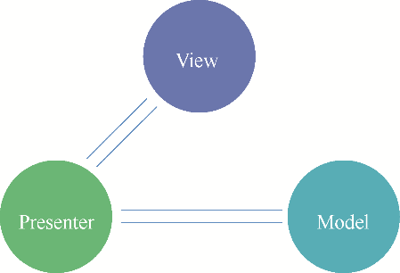

### 18.2.2　MVP

MVP从经典的MVC模式演变而来，解决了很多MVC模式的缺点。与MVC模式相比，MVP模式中的View层并不会直接使用Model层，它们之间的通信改用Presenter来实现。所有的传递操作都发生在Presenter内部，而在MVC模式中View层会直接从Model层读取数据而不需要通过Controller层。MVP软件架构模式如图18-3所示。

<b class="my_markdown">图18-3　MVP软件架构模式</b>

在MVP模式中，Presenter把Model层和View层进行了完全分离，主要的程序逻辑在Presenter中得以实现。而且，Presenter与具体的View是没有直接关联的，它们之间主要通过接口的方式来进行交互，从而使得在需要变更View的时候可以保持Presenter的独立，达到代码复用的目的。理解MVP模式需要注意以下4个要素。

+ View：负责绘制UI元素，与用户进行交互等工作。
+ View interface：View实现接口，是View与Presenter进行交互的桥梁，用于降低耦合，方便进行单元测试。
+ Model：负责存储、检索和操纵数据的模型类。
+ Presenter：View与Model交互的桥梁，负责处理与用户交互的逻辑实现。

对于Android应用开发来说，MVP的Model层相对于MVC是一样的，而Activity和Fragment不再具有Controller层的职责，而是纯粹的View层，所有与用户事件相关的操作则交由Presenter层进行处理。

虽然MVP模式能很好地解决MVC模式存在的问题，但它仍然存在诸多缺陷。MVP将视图的渲染工作放到Presenter中，最终造成视图和Presenter的交互过于频繁，一旦视图需要变更，Presenter就会进行相应的变更操作。

