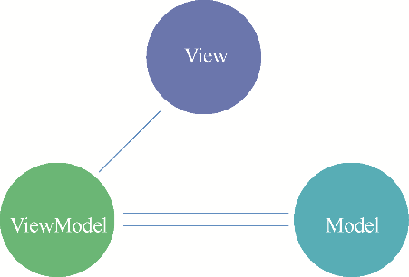

### 18.2.3　MVVM

MVVM是由微软提出的一种软件架构模式，它是MVP模式和WPF结合而成的一种新型的架构模式，是MVP模式的一种优化改进方案。MVVM模式将软件系统分为View、Model和ViewModel这3个部分，其中View和Model之间没有任何联系，主要通过ViewModel进行信息交互。由于Model和ViewModel之间的交互是双向的，因此View的数据变化会同时触发数据源的修改，进而反映到对应的View上，其软件架构模式如图18-4所示。

<b class="my_markdown">图18-4　MVVM软件架构模式</b>

与MVP模式相比，MVVM提出了数据绑定、依赖属性和路由事件等新的概念，来完成与View层的交互。具体来说，View层的Activity通过DataBinding生成Binding实例，并把这个实例传递给ViewModel层，ViewModel层通过自身与Binding实例的绑定，从而实现View中Layout与ViewModel的双向绑定。

虽然MVVM的ViewModel带来了一些效率上的提升，但数据绑定也使得Bug很难被调试；数据双向绑定也不利于代码的重用和后期维护。因此，在开发架构的选择上应根据项目的实际情况进行择优选择，而不是武断地认为MVVM就一定比MVC好。

