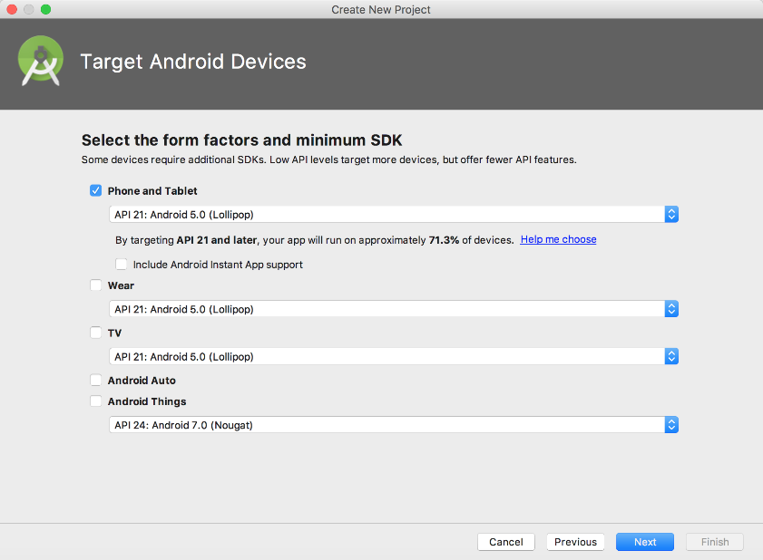

### 18.3.1　新建Android项目

打开Android Studio，依次选择【File】→【New Project】→【Android Project】来新建一个Android项目，注意勾选【Include Kotlin support】选项，如图18-5所示。

Android Studio在3.0版本默认集成对Kotlin的支持，如果是3.0以下的版本，则可以通过手动安装Kotlin插件的方式来集成Kotlin开发环境，图18-6所示的操作为选择Android项目支持的运行环境。

<b class="my_markdown">图18-5　使用Android Studio新建Android项目</b>

<b class="my_markdown">图18-6　选择Android项目支持的运行环境</b>

