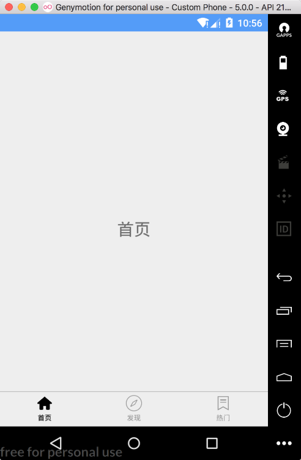
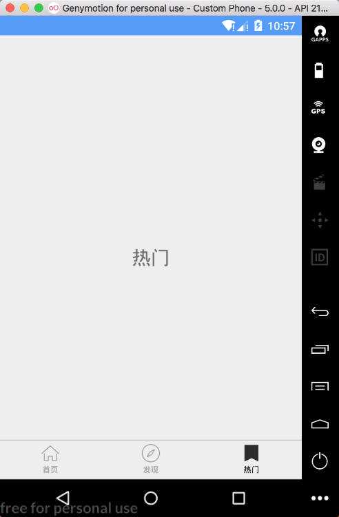

### 18.3.3　编写主页面

如果不进行任何修改，则Android应用程序默认的主页面为MainActivity，该类是App启动的第一个窗口页面。对于本示例项目来说，主页面主要由首页、发现和热点几个模块构成。

```python
class MainActivity : AppCompatActivity() {
    private val mTitles = arrayOf("首页", "发现", "热门")
    // 未被选中的图标
    private val mIconUnSelectIds = intArrayOf(R.mipmap.ic_home_normal, R.mipmap. ic_discovery_normal, R.mipmap.ic_hot_normal)
    // 被选中的图标
    private val mIconSelectIds = intArrayOf(R.mipmap.ic_home_selected, R.mipmap. ic_discovery_selected, R.mipmap.ic_hot_selected)
    private val mTabEntities = ArrayList<CustomTabEntity>()
    private var mHomeFragment: HomeFragment? = null  //首页
    private var mDiscoveryFragment: DiscoveryFragment? = null  //发现
    private var mHotFragment: HotFragment? = null  //热门
    private var mIndex = 0
    override fun onCreate(savedInstanceState: Bundle?) {
        super.onCreate(savedInstanceState)
        setContentView(R.layout.activity_main)
        initTab()
    }
    //初始化Tab视图
    private fun initTab() {
        (0 until mTitles.size)
                .mapTo(mTabEntities) { TabEntity(mTitles[it], mIconSelectIds[it], mIconUnSelectIds[it]) }
        //为Tab赋值
        tab_layout.setTabData(mTabEntities)
        tab_layout.setOnTabSelectListener(object : OnTabSelectListener {
            override fun onTabSelect(position: Int) {
                switchFragment(position)
            }
            override fun onTabReselect(position: Int) {
            }
        })
    }
    //切换Fragment
    private fun switchFragment(position: Int) {
        val transaction = supportFragmentManager.beginTransaction()
        hideFragments(transaction)
        when (position) {
            0 // 首页
            -> mHomeFragment?.let {
                transaction.show(it)
            } ?: HomeFragment.getInstance().let {
                mHomeFragment = it
                transaction.add(R.id.fl_container, it, "home")
            }
           …//省略发现和热点模块切换逻辑
        }
        mIndex = position
        tab_layout.currentTab = mIndex
        transaction.commitAllowingStateLoss()
    }
    //隐藏界面
    private fun hideFragments(transaction: FragmentTransaction) {
        mHomeFragment?.let { transaction.hide(it) }
        mDiscoveryFragment?.let { transaction.hide(it) }
        mHotFragment?.let { transaction.hide(it) }
    }
}
```

可以发现，MainActivity类的实现并不复杂，首先在onCreate()函数中初始化Tab视图，分别对应首页（HomeFragment）、发现（DiscoveryFragment）和热门（HotFragment）3个Fragment页面，然后为3个Fragment切换添加事件监听，在单击某个Fragment后就会切换到对应的页面视图，其中，MainActivity页面所涉及的布局文件activity_main的代码如下。

```python
<?xml version="1.0" encoding="utf-8"?>
<RelativeLayout xmlns:android="http://schemas.android.com/apk/res/android"
    xmlns:app="http://schemas.android.com/apk/res-auto"
    android:layout_width="match_parent"
    android:layout_height="match_parent">
    <FrameLayout
        android:id="@+id/fl_container"
        android:layout_width="match_parent"
        android:layout_height="match_parent" />
    <com.flyco.tablayout.CommonTabLayout
        android:id="@+id/tab_layout"
        android:layout_width="match_parent"
        android:layout_height="50dp"
        android:layout_alignParentBottom="true"
        android:background="@color/color_translucent"
        app:tl_divider_color="@color/color_black"
        app:tl_iconHeight="23dp"
        app:tl_iconWidth="23dp"
        app:tl_indicator_color="@color/colorPrimary"
        app:tl_indicator_height="0dp"
        app:tl_textSelectColor="@color/color_black"
        app:tl_textUnselectColor="@color/color_gray"
        app:tl_underline_color="#DDDDDD"
        app:tl_underline_height="1dp" />
</RelativeLayout>
```

代码中，Tab视图的子页面使用Fragment进行实现。代码如下。

```python
class HotFragment : Fragment() {
    companion object {
        fun getInstance(): Hot1Fragment {
            val fragment = Hot1Fragment()
            val bundle = Bundle()
            fragment.arguments = bundle
            return fragment
        }
    }
    …//省略其他代码
}
```

执行Android程序，可以看到如图18-7所示的运行效果。



<center class="my_markdown"><b class="my_markdown">图18-7　Android视频应用主页面</b></center>

