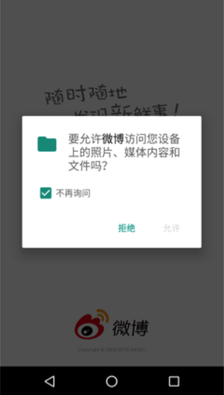

### 18.3.4　Android 6.0权限适配

众所周知，在Android 6.0版本之前，应用的所有运行权限都是在安装时一次性授予的。但是从Android 6.0版本（API 23）开始，为了简化安装流程并方便用户进行权限控制，Android系统修改了权限控制策略。也就是说，对于一些敏感的权限需要用户在应用运行时向其授予权限，如果授权不通过则不能运行，这和iOS的权限控制如出一辙，如图18-8所示。

Android 6.0将权限分为普通权限和敏感（危险）权限两种类型。普通权限不会泄露用户隐私，也不会导致手机安全问题，不需要动态申请，只需要在AndroidManifest配置文件中列出来即可，系统会自动赋给应用相关的权限。而敏感权限可能会涉及用户的隐私、存储数据等私密信息，为了起到警示的作用，往往需要进行动态授权。同时，为了兼容Android 6.0以下的版本，通常还需要在AndroidManifest中将敏感权限罗列出来。

在适配Android 6.0权限时，对于敏感权限的适配应遵循一个原则，那就是实时检查，因为权限随时可能被回收。例如，用户在设置里人为取消某一敏感权限，在下次启动App的时候仍然需要重新授权。在授权被取消或者授权不成功的情况下，系统会显示授权提示对话框，该授权对话框是可以根据实际需求进行定制的。

对于Android 6.0系统来说，适配权限操作也异常简单。首先检查系统是否存在该权限，进而进行权限申请，如果用户同意授权，则继续进行相关操作；否则授权失败，弹出失败提示框。下面是文件读写权限的相关实例。




<center class="my_markdown"><b class="my_markdown">图18-8　Android动态权限申请</b></center>

```python
private fun initPermissions() {
        if (Build.VERSION.SDK_INT >= 23){
            val hasPermission = ContextCompat.checkSelfPermission(application, Manifest.permission.READ_EXTERNAL_STORAGE)
            if (hasPermission == PackageManager.PERMISSION_GRANTED) {            
            //用户同意授权，执行文件读取操作
            } else {
                //若没有授权，会弹出一个对话框
                ActivityCompat.requestPermissions(this, arrayOf(Manifest.permission.READ_EXTERNAL_STORAGE), 1)
            }
        }
    }
/**
*权限回调方法
*/
    override fun onRequestPermissionsResult(requestCode: Int, permissions: Array<String>, grantResults: IntArray) {
        if(requestCode==1){
if(permissions[0].equals(Manifest.permission.READ_EXTERNAL_STORAGE)&&grantResults[0]==PackageManager.PERMISSION_GRANTED){
                //用户同意授权，执行文件读取操作
            }else{
                //若用户不同意授权，直接暴力退出应用，或进行相关操作
                finish();
            }
        }
    }
```

前面的示例代码中，只需要在Activity的onCreate()函数中调用initPermissions()函数进行权限检测，进而通过用户的授权行为进行处理即可。我们可以通过系统提供的onRequest PermissionsResult()回调函数对用户的授权行为进行检查。

虽然上面的方式可以实现权限适配需求，但是当一个页面涉及多个权限问题的时候就比较烦琐，需要逐一地进行权限申请。因此，对权限系统进行二次封装成为必须要做的工作。通常情况下我们将它封装在BaseActivity中，在其他Activity继承BaseActivity后，只需要添加所需的权限即可。

