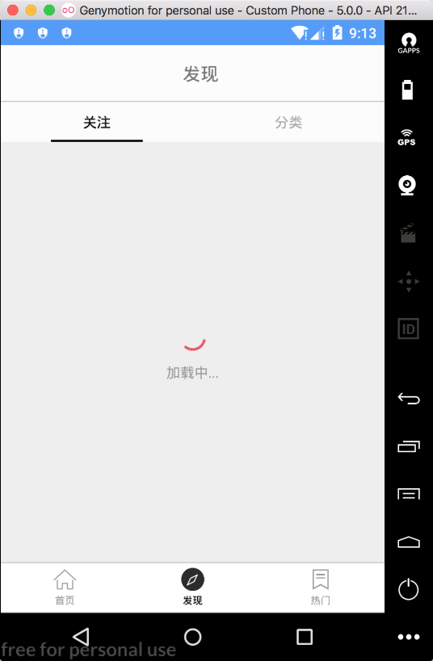
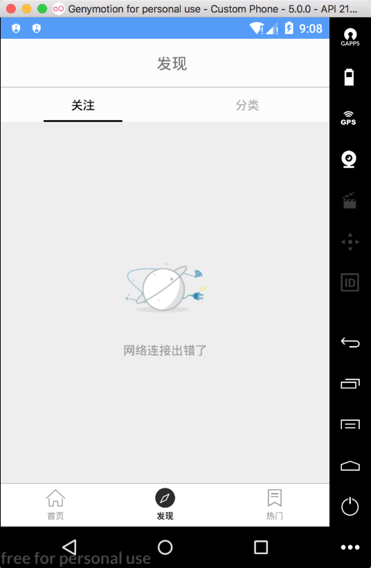

### 18.4.3　自定义状态控制控件

众所周知，Android的视图是由多个基本的控件组成的。但是在Android应用的开发过程中，系统提供的控件并不能满足实际开发中所有的业务需求，此时就需要根据业务需求自定义Android控件。

Android将自定义控件分为自定义ViewGroup控件和自定义View控件，其中，自定义ViewGroup控件需要继承ViewGroup、LinearLayout等已有的容器控件，自定义View控件则需要继承View、TextView等子控件。而从自定义控件的实现方式来说，Android自定义控件又可以分为组合自定义控件、继承自定义控件等几类。

ViewGroup作为所有控件的父控件，可以包含多个View子控件。之所以能够包含和管理View子控件，是因为它实现了ViewParent和ViewManager两个接口。通常，自定义View控件时，需要重写诸如onMeasure()、onLayout()和onDraw()等函数。根据具体的业务需求，自定义控件可简单、可复杂，如图18-9所示，是实现状态监控的自定义View控件。



<center class="my_markdown"><b class="my_markdown">图18-9　自定义视图状态实现效果</b></center>

显然，本应用要实现的效果是比较简单的。仔细分析可以发现，该自定义控件主要由多个不同的状态构成，而不同的状态又对应着不同的Android布局文件。

```python
val STATUS_CONTENT = 0x00   //显示内容
val STATUS_LOADING = 0x01   //加载
val STATUS_EMPTY = 0x02     //空状态
val STATUS_ERROR = 0x03     //错误
val STATUS_NO_NETWORK = 0x04   //无网状态
```

上述代码描述的是本自定义控件的几种具体表现状态。通常，实现自定义View控件时，需要根据实际情况提供某些自定义的属性，以方便调用者直接在布局文件中使用，自定义属性位于res/values/attrs文件中。代码如下。

```python
<declare-styleable name="MultipleStatusView">
        <attr name="loadingView" format="reference"/>
        <attr name="errorView" format="reference"/>
        <attr name="emptyView" format="reference"/>
        <attr name="noNetworkView" format="reference"/>
        <attr name="contentView" format="reference"/>
</declare-styleable>
```

然后，在构造方法中通过TypedArray获取定义的属性，如果系统提供了合适的View，则直接使用；否则需要自己定义View。代码如下。

```python
TypedArray a = context.obtainStyledAttributes(attrs, R.styleable. MultipleStatusView, defStyleAttr, 0);
// empty_view视图      
mEmptyViewResId = a.getResourceId(R.styleable.MultipleStatusView_emptyView, R.layout.empty_view);
// error_view视图
mErrorViewResId = a.getResourceId(R.styleable.MultipleStatusView_errorView, R.layout.error_view);
// loading_view视图
mLoadingViewResId = a.getResourceId(R.styleable.MultipleStatusView_loadingView, R.layout.loading_view);
// no_network_view视图
mNoNetworkViewResId = a.getResourceId(R.styleable.MultipleStatusView_ noNetworkView, R.layout.no_network_view);
//内容填充视图
mContentViewResId = a.getResourceId(R.styleable.MultipleStatusView_contentView, NULL_RESOURCE_ID);
a.recycle();
```

最后，提供状态视图对外调用的函数，当需要处理某一状态时，只需要调用对应的函数即可。下面是加载函数的代码。

```python
fun showLoading(view: View, layoutParams: ViewGroup.LayoutParams) {
if (null == mLoadingView) {
    mLoadingView = view
    mOtherIds.add(mLoadingView!!.id)
    addView(mLoadingView, 0, layoutParams)
  }
    showViewById(mLoadingView!!.id)
}
```

当然，本应用实现的自定义控件是一种比较简单的情况。更多的情况是，自定义一些复杂的Android控件时还会涉及Android基础理论等知识。

