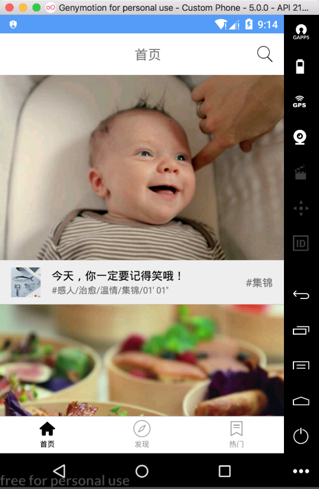

### 18.4.4　首页模块开发

在Android开发中，Activity（或Fragment）的首要职责是加载应用布局和初始化用户界面，接受来自用户的操作请求，进而作出响应。然而，在传统的MVC模式中，Activity不仅承担着View的功能，还承担着Controller的职责，随着界面和逻辑复杂度的增加，势必带来View层代码结构的混乱，使其变得庞大臃肿。

因此，本视频应用选择MVP模式作为基础开发框架，同时结合时下流行的RxJava/ RxAndroid与Retrofit技术进行项目开发。如图18-10所示，首页主要由一个列表页面组成并提供搜索页面入口。使用MVP开发首页模块，会涉及4个元素：HomeModel、HomeContract、HomePresenter和HomeFragment。


<center class="my_markdown"><b class="my_markdown">图18-10　首页实现效果</b></center>

这当中，HomeModel用于操作数据的请求和存储，其核心代码如下。

```python
class HomeModel{
    //获取首页数据
    fun requestHomeData(num:Int):Observable<HomeBean>{
        return RetrofitManager.service.getFirstHomeData(num)
                .compose(SchedulerUtils.ioToMain())
    }
    //加载更多
    fun loadMoreData(url:String):Observable<HomeBean>{
        return RetrofitManager.service.getMoreHomeData(url)
                .compose(SchedulerUtils.ioToMain())
    }
}
```

其次，需要定义一个View interface，用于处理View与Presenter之间的数据交互，该接口的核心代码如下。

```python
interface HomeContract{
    interface View : IBaseView {
        //设置第一次请求的数据
        fun setHomeData(homeBean: HomeBean)
        //设置加载更多的数据
        fun setMoreData(itemList:ArrayList<HomeBean.Issue.Item>)
        //显示错误信息
        fun showError(msg: String,errorCode:Int)
    }
    interface Presenter : IPresenter<View> {
        //获取首页精选数据
        fun requestHomeData(num: Int)
        //加载更多数据
        fun loadMoreData()
    }
}
```

Presenter作为View与Model交互的桥梁，主要用于处理网络请求以及与用户交互的逻辑实现。

```python
class HomePresenter : BasePresenter<HomeContract.View>(), HomeContract.Presenter {
    private var homeBean: HomeBean? = null
    private var nextPageUrl: String? = null
    private val homeModel: HomeModel by lazy {
        HomeModel()
    }
    /**
     * 获取首页数据
     */
    override fun requestHomeData(num: Int) {
        checkViewAttached()
        val disposable = homeModel.requestHomeData(num)
                .flatMap({ homeBean ->
                   …//省略不符合条件的过滤细节
                })
                .subscribe({ homeBean ->
                    mRootView?.apply {
                        …//省略具体的代码细节
                    }
                }, { t ->
                    mRootView?.apply {
                        …//错误异常处理
                    }
                })
        addSubscription(disposable)
    }
    /**
     * 加载更多
     */
    override fun loadMoreData() {
        …//省略具体实现细节
    }
}
```

因为HomePresenter将网络返回数据传递给了HomeContract接口，所以View层只需要实现HomeContract的相关接口即可获得HomePresenter层的数据，进而渲染对应的界面。HomeFragment的代码如下。

```python
class HomeFragment : BaseFragment(), HomeContract.View {
    private val mPresenter by lazy { HomePresenter() }
    private var num: Int = 1
    private var mAdapter: HomeAdapter? = null
    private var loadingMore = false
    private var isRefresh = false
    companion object {
        fun getInstance(): HomeFragment {
            val fragment = HomeFragment()
            val bundle = Bundle()
            fragment.arguments = bundle
            return fragment
        }
    }
    init {
        mPresenter.attachView(this)
    }
    override fun getLayoutId(): Int {
        return R.layout.fragment_home
    }
    override fun lazyLoad() {
        mPresenter.requestHomeData(num)
    }
    override fun initView() {
        …//省略具体实现
    }
    override fun setHomeData(homeBean: HomeBean) {
        mAdapter = HomeAdapter(activity, homeBean.issueList[0].itemList)
        recyclerView.adapter = mAdapter
        recyclerView.itemAnimator = DefaultItemAnimator()
    }
    override fun setMoreData(itemList: ArrayList<Item>) {
        loadingMore = false
        mAdapter?.addItemData(itemList)
    }
    //显示错误信息
    override fun showError(msg: String, errorCode: Int) {
        showToast(msg)
        if (errorCode == ErrorStatus.NETWORK_ERROR) {
            mMultipleStatusView?.showNoNetwork()
        } else {
            mMultipleStatusView?.showError()
        }
    }
    //显示加载视图
    override fun showLoading() {
        if (!isRefresh) {
            isRefresh = false
            mMultipleStatusView?.showLoading()
        }
    }
    //隐藏加载动画
    override fun dismissLoading() {
        refreshLayout.isRefreshing=false
    }
    override fun onDestroy() {
        super.onDestroy()
        mPresenter.detachView()
    } 
}
```

可以发现，按照MVP模式的分层思路，Android项目模块内部的层级划分是相当清楚的。而且MVP模式通过将复杂的业务逻辑交由Presenter实现，有效地解决了View代码臃肿的问题，提高了页面渲染的效率。

