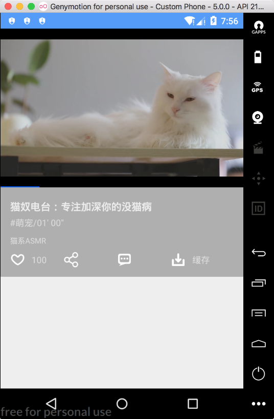

### 18.4.5　视频详情页面开发

视频详情页面是本视频应用项目的核心模块，该页面主要由视频播放窗口和视频描述信息等内容构成，实现效果如图18-11所示。


<center class="my_markdown"><b class="my_markdown">图18-11　视频详情页面实现效果</b></center>

和首页模块一样，视频模块的代码主要由Contract、Presenter、Model和View共4个部分组成，其中Contract的接口定义函数如下。

```python
interface VideoDetailContract {
    interface View : IBaseView {
        //设置视频播放源
        fun setVideo(url: String)
        //设置视频信息
        fun setVideoInfo(itemInfo: Item)
        //设置背景
        fun setBackground(url: String)
        //设置错误信息
        fun setErrorMsg(errorMsg: String)
    }
    interface Presenter : IPresenter<View> {
        //加载视频信息
        fun loadVideoInfo(itemInfo: Item)
    }
}
```

因为视频的相关信息可以从上一个页面获取并通过Intent传递给详情页面，所以此处无须定义Model，只需要在Presenter中处理具体的业务逻辑即可，Presenter的具体实现内容如下。

```python
class VideoDetailPresenter : BasePresenter<VideoDetailContract.View>(), 
VideoDetailContract.Presenter {
    /**
     * 加载视频
     */
    override fun loadVideoInfo(itemInfo: Item) {
        val playInfo = itemInfo.data?.playInfo
        val netType = NetworkUtil.isWifi(MyApplication.context)
        // 检测是否绑定 View
        checkViewAttached()
        if (playInfo!!.size > 1) {
            // WiFi环境下选择高清的视频
            if (netType) {
                for (i in playInfo) {
                    if (i.type == "high") {
                        val playUrl = i.url
                        mRootView?.setVideo(playUrl)
                        break
                    }
                }
            } else {
                //否则就选标清的视频
                for (i in playInfo) {
                    if (i.type == "normal") {
                        val playUrl = i.url
                        mRootView?.setVideo(playUrl)
                        break
                    }
                }
            }
        } else {
            mRootView?.setVideo(itemInfo.data.playUrl)
        }
        mRootView?.setVideoInfo(itemInfo)
    }
}
```

GSYVideoPlayer播放器提供了丰富的API，使用时也是极其方便，如果没有特殊的需求，则使用默认的设置即可。具体使用时，只需要提供视频的数据源，然后调用启动函数即可。

```python
class VideoDetailActivity : AppCompatActivity(), VideoDetailContract.View {
    private val mPresenter by lazy { VideoDetailPresenter() }
    private lateinit var itemData: Item
    private var orientationUtils: OrientationUtils? = null
    private var isPlay: Boolean = false
    private var isPause: Boolean = false
    override fun onCreate(savedInstanceState: Bundle?) {
        super.onCreate(savedInstanceState)
        setContentView(R.layout.activity_video_detail)
        initView()
    }
    //初始化，mPresenter绑定界面
    init {
        mPresenter.attachView(this)
    }
    private fun initView() {
        itemData = intent.getSerializableExtra(Constants.BUNDLE_VIDEO_DATA) as Item
        initVideoViewConfig() 
    }
    private fun initVideoViewConfig() {
       //省略其他GSYVideoPlayer配置
    }
//使用GSYVideoPlayer播放视频文件
    override fun setVideo(url: String) {
        mVideoView.setUp(url, false, "")
        mVideoView.startPlayLogic()
    }
    //省略其他函数及代码
}
```

这当中，VideoDetailActivity涉及的布局文件activity_video_detail.xml的核心内容如下。

```python
<com.shuyu.gsyvideoplayer.video.StandardGSYVideoPlayer
   android:id="@+id/mVideoView"
   android:layout_width="match_parent"
   android:layout_height="250dp"
   android:background="@color/color_black" />
```

