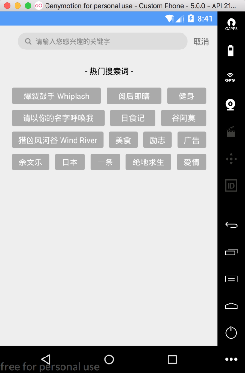
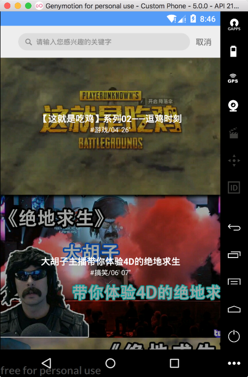

### 18.4.6　搜索功能的实现

当前，移动端已经成为搜索的重要入口。作为移动产品的重要组成部分，搜索占据着越来越重要的地位。搜索入口通常位于首页的醒目位置，通过该入口进而跳转到搜索主页面。图18-12所示是本应用的搜索主页面效果，该功能主要由热门搜索词和热门搜索结果页面构成。



<center class="my_markdown"><b class="my_markdown">图18-12　搜索功能实现效果</b></center>

如图18-12所示的热词搜索功能，可以通过自定义控件来实现，也可以使用Google提供的FlexboxLayout布局控件。FlexboxLayout是Google开发的Android视图伸缩布局方案，它的实现方式和CSS的Flexbox类似。FlexboxLayout可以看作是一种升级版的LinearLayout布局，它们都是容器控件，两者的区别主要在于FlexboxLayout可以实现自动换行的功能，使用FlexboxLayout布局之前需要先添加依赖包。

```python
implementation 'com.google.android:flexbox:0.3.1'
```

作为一个父容器，只需要向FlexboxLayout容器中添加子Item布局即可。下面是FlexboxLayout的简单使用实例。

```python
<com.google.android.flexbox.FlexboxLayout
    xmlns:android="http://schemas.android.com/apk/res/android"
    xmlns:app="http://schemas.android.com/apk/res-auto"
    android:layout_width="match_parent"
    android:layout_height="match_parent"
    app:flexWrap="wrap"
    app:alignItems="center"
    app:alignContent="flex_start"
    app:flexDirection="row"
    app:justifyContent="flex_start">
    <TextView
        android:layout_width="wrap_content"
        android:layout_height="40dp"
        android:text="程序员"
        android:gravity="center"
        android:background="@drawable/label_bg_shape"/>
    <TextView
        android:layout_width="wrap_content"
        android:layout_height="40dp"
        android:text="Kotlin实战"
        android:gravity="center"
        android:background="@drawable/label_bg_shape"/>
</com.google.android.flexbox.FlexboxLayout>
```

然而，通常情况下FlexboxLayout的子布局并不是在布局文件中被写死的，而是需要动态添加。此时，在使用FlexboxLayout布局之前需要对FlexboxLayout的某些属性进行设置，这些属性通常包括FlexboxLayout布局属性和子控件的属性。代码如下。

```python
val flexBoxLayoutManager = FlexboxLayoutManager(this)
flexBoxLayoutManager.flexWrap = FlexWrap.WRAP
flexBoxLayoutManager.flexDirection = FlexDirection.ROW
flexBoxLayoutManager.alignItems = AlignItems.CENTER
flexBoxLayoutManager.justifyContent = JustifyContent.FLEX_START
```

对于本Android视频应用来说，热门搜索词的内容并不是写死的，而是根据用户的习惯从网络上获取的，因此我们选择通过“RecyclerView+Adapter”的方式来实现该效果。

```python
val mSearchKeywordsAdapter = SearchKeywordsAdapter(this, string, R.layout.item_ search_text)
//将设置好的属性绑定到具体的视图
mRecyclerView_hot.layoutManager = flexBoxLayoutManager
mRecyclerView_hot.adapter = mSearchKeywordsAdapter
```

而适配器SearchKeywordsAdapter的实现也比较简单，直接调用bindData填充页面即可。之所以能实现文本的换行效果，是因为我们对RecyclerView使用了FlexboxLayoutManager。

```python
class SearchKeywordsAdapter(mContext: Context, mList: ArrayList<String>, layoutId: Int) :
        BasicAdapter<String>(mContext, mList, layoutId) {
    var mOnTagItemClick: ((tag: String) -> Unit)? = null
    fun setOnTagItemClickListener(onTagItemClickListener: (tag: String) -> Unit) {
        this.mOnTagItemClick = onTagItemClickListener
    }
    override fun bindData(holder: ViewHolder, data: String, position: Int) {
        holder.setText(R.id.tv_keyword, data)
        val params = holder.getView<TextView>(R.id.tv_keyword).layoutParams
        if (params is FlexboxLayoutManager.LayoutParams) {
            params.flexGrow = 1.0f
        }
        holder.setOnItemClickListener(object : View.OnClickListener {
            override fun onClick(v: View?) {
                mOnTagItemClick?.invoke(data)
            }
        })
    }
}
```

单击某个具体的标签或者手动输入搜索关键字后，通过Presenter向接口请求相关数据并将返回的数据以列表的形式显示出来。

到此，本视频应用项目的核心功能已经开发完成，当然还有一些辅助性的功能开发这里并未涉及。功能开发的完成并不意味着整个项目的结束，往往还需要对App进行测试和打包上线等操作。

