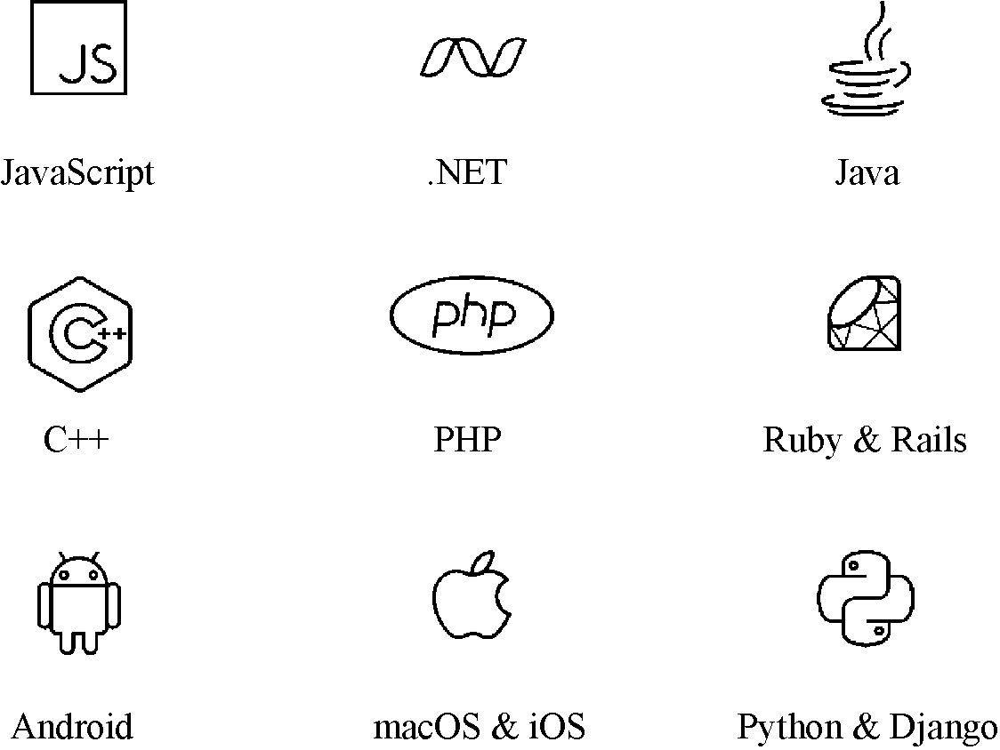
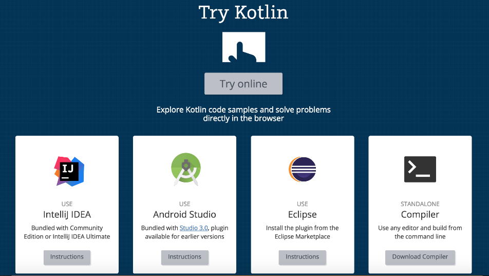

### 1.1　Kotlin发展史

Kotlin 是由 JetBrains 开发的针对 JVM、Android 和浏览器的静态编程语言，目前，在 Apache 组织的许可下已经开源。使用 Kotlin，开发者可以很方便地开发移动 Android 应用、服务器程序和 JavaScript 程序。Kotlin 可以将代码编译成 Java 字节码，也可以编译成JavaScript，以便在没有 JVM 的设备上运行。

Kotlin 来源于一个岛屿的名字，这个小岛位于俄罗斯的圣彼得堡附近。之所以要命名为 Kotlin，是因为 Kotlin 的主要开发工作就是由位于圣彼得堡的分公司团队完成的。

在纯命令式编程时代，Sun 公司创造了 Java 和标准库，但一直以来 Sun 都没有为 Java 提供一款好用的 IDE。在这样的局面下，IBM 适时地推出了一款名为 Eclipse 的 IDE，它成为对抗 Sun 公司的利器。

近十几年来，Eclipse 凭借着开源和可扩展平台（OSGi），战胜了一个又一个对手（JBuilder、NetBeans等），奠定了 Java 标准开发环境的地位。然而，就像所有成功的产品一样，Eclipse 一路荣光走来的同时也遇到了一系列的问题。所谓船大调头难，近年来，在JetBrains 公司一系列产品的冲击下，Eclipse 的市场份额正在慢慢下降。

作为目前广受欢迎的 IDE 提供商，JetBrains 向开发者提供主流的软件开发环境：JavaScript、

.NET 和 Java 等，如图1-1所示。这些 IDE 几乎覆盖了目前主流的编程语言。

在开发 Kotlin 之前，JetBrains 团队一直使用 Java 来创建他们的 IDE 并进行业务逻辑开发。之所以开发 Kotlin，是因为 JetBrains 的工程师们在使用 Java 开发应用程序的过程中发现了大量的问题。为了提升开发效率，同时解决使用 Java 开发带来的问题，在借鉴了 Scala、Groovy 等语言后，他们决定开发一款致力于解决 Java 问题的编程语言 Kotlin。

<b class="my_markdown">图1-1　JetBrains支持的编程环境</b>

JetBrains 深谙开发者的需求和痛处，在孜孜不倦地为开发者提供实用、高效的 IDE 的同时，也为开发者提供全新的编程语言以解决目前的技术问题。Kotlin 的开发环境如图1-2所示。

<b class="my_markdown">图1-2　Kotlin支持的开发环境</b>

作为一门全新的编程语言，从项目创建到 1.2 版本，Kotlin 共经历了 6 年的发展，其发展历史大致如下。

+ 2010 年，JetBrains 着手开发 Kotlin 项目。
+ 2011 年 7 月，JetBrains 发布 Kotlin 项目。
+ 2012 年 2 月，JetBrains 在 Apache 2 许可证下开源 Kotlin 项目源码。
+ 2016 年 2 月，JetBrains 发布第一个稳定版本 Kotlin 1.0 并许诺保持向后兼容。
+ 2017 年 3 月，Kotlin 1.1 版本发布，正式支持 JavaScript，同时新增了诸多新功能和特性。
+ 2017 年 5 月，Google I/O 大会上，Google 官方确定支持 Kotlin 语言。
+ 2017 年 11 月，Kotlin 1.1.5 发布，相比 Kotlin 1.0 版本，Kotlin 有关的代码数目从 210 万行增长到 1000 多万行，对外提供的 API 越来越多，使用场景也越来越多。
+ 2017 年 12 月，Kotlin 1.2 版本发布，除了性能上的明显提升，1.2 版本的一个重要特性就是增加了多平台代码重用的能力。

