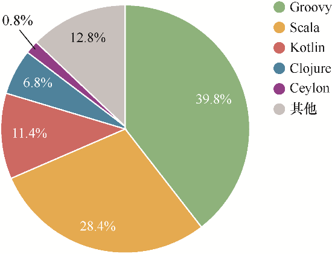

### 1.3.1　JVM语系生态

在这个程序复杂的编程语言时代，很多人大谈特谈 Java 语言，殊不知 JVM（Java虚拟机缩写）才是 Java 生态的核心。JVM 是一个优秀的VM 环境，在这个基础上诞生了很多优秀的编程语言（如 Groovy、Scala 和 Kotlin 等），它们都声称要“变革Java”，Kotlin 就是其中的一个。

在设计之初，JVM 只是为了支持 Java 编程，然而，随着时间的推移，越来越多的语言开始运行在 JVM 之上。在最新的 JVM 语系排名中（Java 除外），Kotlin 的市场份额仅次于 Groovy 和 Scala，再加上近年来 Google 对 Kotlin 的大力推动，Kotlin 的发展潜力势必不可小觑，如图1-3所示。

<b class="my_markdown">图1-3　JVM 语系使用率占比</b>

下面简要介绍 JVM 语言家族的几个明星语言，为大家学习 Kotlin 提供一些参考。

#### 1．Groovy

作为一款基于 JVM 开发的敏捷语言，Groovy 结合了 Python、Smalltalk 和 Ruby 等语言的强大特性，同时 Groovy 代码能够与 Java 代码实现很好的融合。由于它运行在 JVM 之上，因此 Groovy 还可以使用其他 JVM 语系语言编写的库。

#### 2．Scala

Scala 是一门多范式的静态类型编程语言，它混合了面向对象编程（OOP）和函数式编程（FP）的诸多特点。这意味着 Scala 程序能够被编写成许多不同的风格：纯函数式风格、非纯函数式风格或混合式风格。同时，使用 Scala 编写的代码可以编译成 Java 字节码，方便运行于 JVM 之上，并可以调用现有的 Java 类库。

#### 3．Kotlin

Kotlin 是由 JetBrains 团队开发的静态类型编程语言，作为 JVM 语系的重要成员，Kotlin 除了可以运行在 JVM 环境上之外，还可以绕过JVM 直接编译成机器码供系统运行。与其他语言相比，Kotlin 借鉴了很多 Java 的语法规则和思想，对于熟悉 Java 环境的开发者来说是非常容易上手的。JetBrains 推荐以循序渐进的方式来开发项目，这就意味着允许项目中同时存在 Java 和 Kotlin 代码文件，而且允许 Java 和 Kotlin 之间的互调。这使得 Java 开发者可以很方便地在已有项目中引入 Kotlin，从而循序渐进地完成 Java 向 Kotlin 的过渡。

