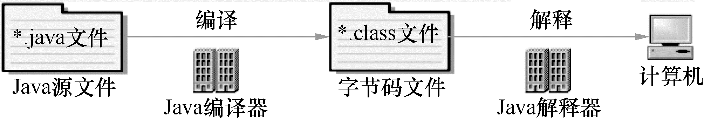
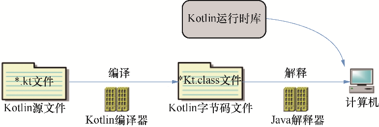

### 1.3.3　Kotlin 应用程序运行过程

想要了解 Kotlin 应用程序的运行过程，需要先了解 Java 应用程序的运行过程。

对于 Java 应用程序而言，首先由 Java 编译器将 Java 源文件（.java 文件）编译成为字节码文件（.class 文件），这个过程可以通过 JDK 提供的 javac 命令来完成；当需要运行 Java 字节码文件时，由 Java 虚拟机中的解释器将字节码解释成为机器码后执行，这个过程通常由JRE 提供的 Java 命令行来完成，如图1-5所示。

与 Java 程序的运行过程类似，Kotlin 应用程序的运行过程如图 1-6 所示。首先由 Kotlin 编译器将 Kotlin 源文件编译成为字节码文件（* Kt.class 文件），注意，这个过程中文件名会发生变化，会增加 Kt 后缀。编译过程可以通过 Kotlin 编译器提供的 kotlinc 命令来完成。当运行 Kotlin 字节码文件时，由 Java 解释器将字节码解释成为机器码去执行，这个过程也是通过 Java 命令完成的，但需要 Kotlin 运行时库支持才能正常运行。

<b class="my_markdown">图1-5　Java应用程序执行过程</b>

<b class="my_markdown">图1-6　Kotlin 应用程序执行过程</b>

