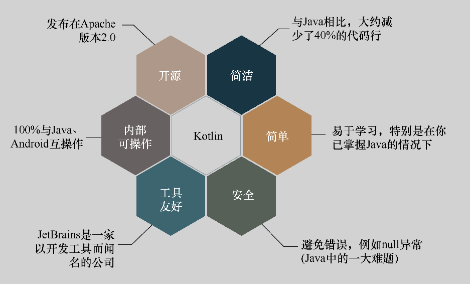

### 1.4　为什么使用Kotlin

如今，在软件开发领域，除了现在比较热门的人工智能技术和大数据技术之外，移动开发依然是受到大家关注的领域分支，而移动开发中非常重要的一门技术就是 Android 开发。Java 作为 Android 开发的官方标准语言，其语法的设计思想还停留在纯命令式语言时代，在函数式语言的大背景下，Java 显得有点落伍。虽然随着 Java 8 和 Java 9 版本的发布，Java 也在向函数式语言靠近，但是 Java 8 和 Java 9 的市场份额并不高，很多项目还停留在 Java 6 的时代。特别是对于 Android 开发者来说，想体验函数式编程的优势似乎太过遥远。所以，使用 Kotlin 成为一个不错的选择。

作为一款明星语言，在被 Android 官方宣布为支持语言之前，Kotlin 早已是 Android 开发中的热门话题了，很多开源的项目都使用 Kotlin 开发。也正是基于这些原因，在 2017 年的 Google I/O 大会上，Google 将 Kotlin 列为 Android 开发的官方支持语言。在最近TIOBE 的热门编程语言排行榜中，它一度进入编程语言前 50 名，在 Github 上也获得了很高的关注度。相信随着版本的持续发布和性能的优化，Kotlin 一定会走得更远。

在创造 Kotlin 的过程中，其作者从很多编程语言那里获得了灵感，比如 Java、Scala、Groovy，可以说是博采众长。使用 Kotlin 编写程序，不仅编译运行速度快，而且实现相同功能的代码量远远小于 Java。

使用 Kotlin 主要有以下优势。

#### 1．跨平台开发能力

因为 Kotlin 是基于 JVM 开发的，所以它同时具备了 Android 开发、Web 浏览器开发和原生 Native 开发的能力。在原生 Native 开发方面，目前 Kotlin 官方在 Github 上开源了 Native 的源码。在 Web 开发方面，Kotlin 可以结合 Spring 框架使用，也可以编译生成JavaScript 模块，便于在一些 JavaScript 的虚拟机上编译运行。

#### 2．开源

20 世纪 80 年代，自由软件运动拉开序幕，开源软件为软件行业的快速发展提供了源源不断的动力。众人拾柴火焰高，对于一门新技术、新语言，开源可以帮助开发者更快速地发现 Bug，从而利用开源的力量更快地推动新技术的发展。在开源领域方面，Java 就是一个很好的例子，从语言标准到 Core API、虚拟机、开发者工具，都能找到开放的影子。

#### 3．空指针安全

在使用 Java 编程的过程中，大家聊得最多的话题莫过于如何避免空指针异常（NullPointerException）。针对空指针问题，Kotlin 有专门的语法来避免。

#### 4．完全兼容 Java

Kotlin 能够和 Java 达到 100% 互通，也就是说，使用 Kotlin，依旧可以调用 Java 已有的代码或库，也可以同时使用 Java 和 Kotlin 来混合编写代码。同时，为了方便项目的过渡，JetBrains 提供的开发工具可以很简单地实现 Java 代码到 Kotlin 的转换。

#### 5．语言简洁，学习成本低

Kotlin 语法简洁直观，看上去非常像 Scala，但更简单易学。同时，Kotlin 使用了大量的语法糖，使得代码更加简洁。Kotlin 并不遵循特定的编程规范，它借鉴了函数式风格和面向对象风格的诸多优点。

#### 6．支持 Lambda 表达式

函数式编程是软件技术的发展方向，而 Lambda 是函数式编程的基础内容，因此，在 Java 8 版本中加入 Lambda 表达式本身是符合技术发展方向的。引入 Lambda，一个直观的改进是，不用再写大量的匿名内部类。事实上，还有更多由函数式编程本身特性带来的性能。比如，代码的可读性会更好、高阶函数引入了函数组合的概念等。

除此之外，因为 Lambda 的引入，集合操作也得到了极大的改善，比如引入 Stream API，把 map、reduce、filter 这样的基本函数式编程概念与 Java 集合结合起来。在大多数情况下，Java 程序员在处理集合时，可以告别繁杂的 for、while、if 等逻辑语句。

不过，使用 Lambda 表达式并非只有好处，根据 C# 之父 Anders Hejlsberg 所说，未来的编程语言将逐渐融合各自的特性，而不会只存在单纯的声明式语言或者函数编程语言。

#### 7．类型推断

使用 Kotlin 编程，开发人员不必为每个变量明确指定类型，编译器可以在编译的时候推导出某个参数的数据类型，从而使得代码更为简洁。Java 在 Java 8 版本中也推出这一功能。

#### 8．支持自定义的 DSL

DSL（Domain-Specific Language），中文含义是领域特定语言，指的是专注于特定问题领域的计算机语言。不同于通用的计算机语言，领域特定语言只用于某些特定的领域。

DSL 语言能让开发者以一种更优雅、更简洁的方式来表达和解决领域问题。例如，Gradle 就是一种用 Groovy 定义的 DSL。Kotlin 的Lambda 系统使其成为创建 DSL 的理想选择。

#### 9．IDE 环境的支持

作为 JetBrains 旗下的产品，JetBrains 旗下众多的 IDE 可以为 Kotlin 开发提供无缝支持，并相互协作，协同发展。

可以用图 1-7 来大致总结 Kotlin 的主要优势。

<b class="my_markdown">图1-7　使用 Kotlin 的主要优势</b>

正是因为 Kotlin 的这些优势，在 2017 年的 Google I/O 大会上，Google 将 Kotlin 列为 Android 开发的第一语言。在旧金山举行的第一届 Kotlin 专题会议上，Kotlin 官方宣布将会在 1.2 版本中添加支持 iOS 开发的功能。这难道是要成为全栈语言的节奏吗？

