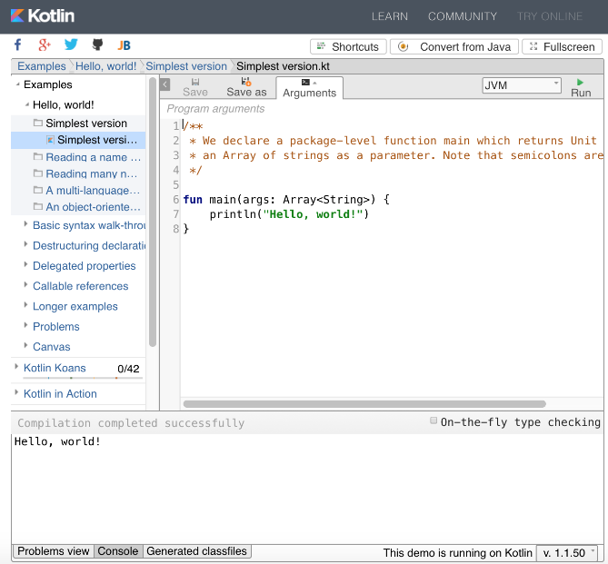
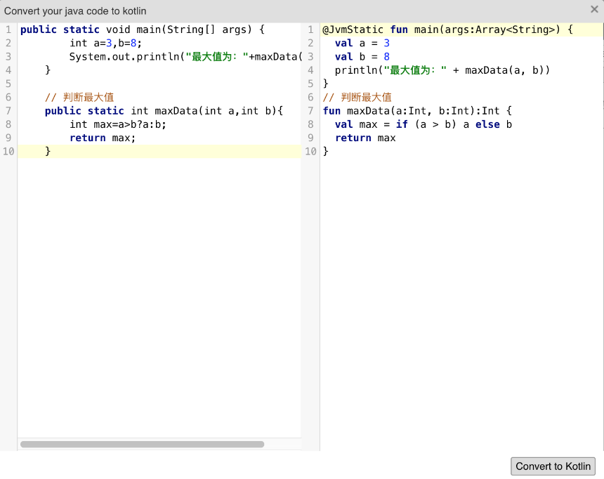
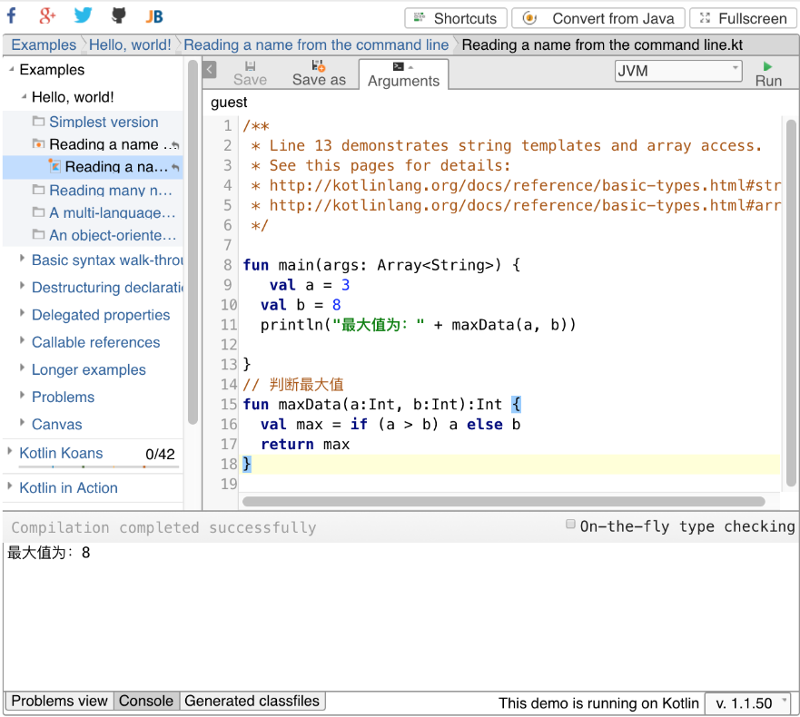

### 2.1　Kotlin在线运行

很多使用过Java或者其他编程语言的读者都知道，学习这些语言之前，必须搭建好相关的开发和编译环境，这让很多初学者摸不着头脑，甚至可能会放弃学习。不过，Kotlin提供的在线运行环境有效地解决了初学者入门的问题，使用官方提供的在线运行环境，开发者不需要进行任何配置就可以在线运行和测试Kotlin代码。

读者可以在线体验Kotlin语言的魅力，运行效果如图2-1所示。


<center class="my_markdown"><b class="my_markdown">图2-1　Kotlin在线运行体验</b></center>

Kotlin提供的在线运行环境可以说异常强大。在这个页面左侧，官方为初学者提供了大量实用的例子，单击左边的某个示例代码，然后单击右上角的【Run】按钮就会看到运行结果了。

除此之外，初学者还可以通过【Run】按钮前面的下拉列表框来选择运行环境，并且使用页面右下角的下拉列表框来选择Kotlin代码的版本。为了让不熟悉Kotlin语法的初学者尽快上手，在线运行环境还提供了Convert from Java的功能。下面我们举一个例子，首先准备一段代码，用来求数组的最大值。

```python
public class Main {  
    public static void main(String[] args) {  
         int a=3,b=8;  
         System.out.println("最大值为："+maxData(a,b));  
    }  
    //判断最大值  
    public static int maxData(int a,int b){  
         int max=a>b?a:b;  
         return max;  
    }  
}
```

现在将Java代码复制到窗口左边的文本框中，然后单击【Convert to Kotlin】按钮，后台系统就会将Java代码转换成Kotlin代码了，如图2-2所示。然后将转换后的Kotlin代码复制到图2-3的区域中，单击【Run】按钮即可看到运行结果，执行结果如图2-3所示。


<center class="my_markdown"><b class="my_markdown">图2-2　Java代码转换为Kotlin代码</b></center>


<center class="my_markdown"><b class="my_markdown">图2-3　执行转换后的代码运行结果</b></center>

当然，这种方式只是为了辅助初学者学习Kotlin，如果想要更深入地学习Kotlin相关的知识并使用Kotlin进行项目开发，还是建议读者从基础语法开始学习。

