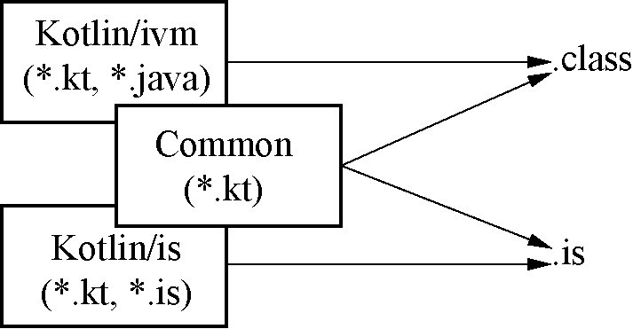

### 2.3.1　多平台支持

多平台是Kotlin 1.2中的一个全新实验性功能，允许开发者使用相同的代码库来构建不同平台下的应用程序。这些平台包括Kotlin-JVM、JavaScript和Android移动客户端。在这个多平台项目中，主要有3种模块。

通用（common）模块：包含可以在多个平台运行的公共代码，以及不附带依赖于平台的API实现的声明。

平台（platform）模块：包含特定平台的通用模块与平台相关声明的实现，以及其他平台相关代码。

常规（regular）模块：针对特定平台，既可以是平台模块的某些依赖，也可以是依赖的平台模块。

通用模块只能依赖于其他常见的模块和库，而且通用模块仅包含Kotlin代码，不能有任何其他语言的代码。平台模块可以依赖给定平台的任何可用模块和库（包括用于JVM和JavaScript库中的Java库），其中Kotlin多平台项目复用模型如图2-4所示。

<b class="my_markdown">图2-4　Kotlin多平台项目复用模型</b>

编译通用模块将生成一个特殊的元数据文件，该文件包含所有通用模块的声明。编译平台模块则包含平台模块代码以及它为通用模块生成的特定于目标平台的代码（如JVM字节码或JavaScript代码）。

