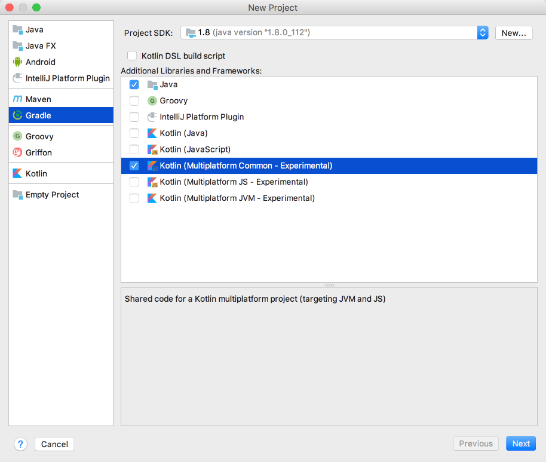
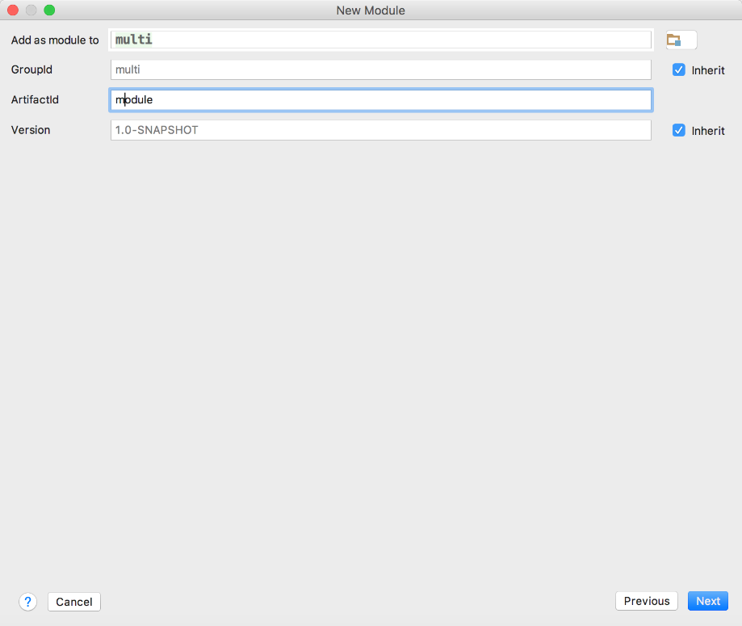

### 2.3.2　多平台环境搭建

从Kotlin 1.2版本开始，多平台项目必须用Gradle来进行构建，而不支持其他构建方式。具体来说，在IntelliJ IDEA中依次选择【File】→【New Project】→【Gradle】→【Kotlin (Multiplatform…】，新建一个Gradle多平台项目，如图2-5所示。

如果需要添加其他模块，可以在项目上单击右键来添加，如图2-6所示。

如果使用手动的方式搭建多平台项目，可以参考以下步骤。


<center class="my_markdown"><b class="my_markdown">图2-5　使用Gradle构建多平台项目</b></center>


<center class="my_markdown"><b class="my_markdown">图2-6　为多平台项目添加Module</b></center>

（1）将Kotlin Gradle插件添加到buildscript脚本路径中，例如classpath "org.jetbrains.kotlin: kotlin-gradle-plugin:$ kotlin_version"。

（2）将kotlin-platform-common插件应用于通用模块中。

（3）将kotlin-stdlib-common相关性添加到公共模块中。

（4）将kotlin-platform-jvm和kotlin-platform-js插件应用到JVM和JavaScript的平台模块中。

（5）expectedBy从平台模块向通用模块添加范围从属关系。

以下是公共模块build.gradle的完整配置脚本。

```python
buildscript {
    ext.kotlin_version = '1.2.20'
    repositories {
        mavenCentral()
    }
    dependencies {
        classpath "org.jetbrains.kotlin:kotlin-gradle-plugin:$kotlin_version"
    }
}
apply plugin: 'kotlin-platform-common'
repositories {
    mavenCentral()
}
dependencies {
    compile "org.jetbrains.kotlin:kotlin-stdlib-common:$kotlin_version"
    testCompile "org.jetbrains.kotlin:kotlin-test-common:$kotlin_version"
}
```

以JVM平台模块为例，下面是一个JVM模块的build.gradle配置文件，需要特别注意配置中的expectedBy行。

```python
buildscript {
    ext.kotlin_version = '1.2.20'
    repositories {
        mavenCentral()
    }
    dependencies {
        classpath "org.jetbrains.kotlin:kotlin-gradle-plugin:$kotlin_version"
    }
}
apply plugin: 'kotlin-platform-jvm'
repositories {
    mavenCentral()
}
dependencies {
    compile "org.jetbrains.kotlin:kotlin-stdlib:$kotlin_version"
    expectedBy project(":")   //依赖关系
    testCompile "junit:junit:4.12"
    testCompile "org.jetbrains.kotlin:kotlin-test-junit:$kotlin_version"
    testCompile "org.jetbrains.kotlin:kotlin-test:$kotlin_version"
}
```

