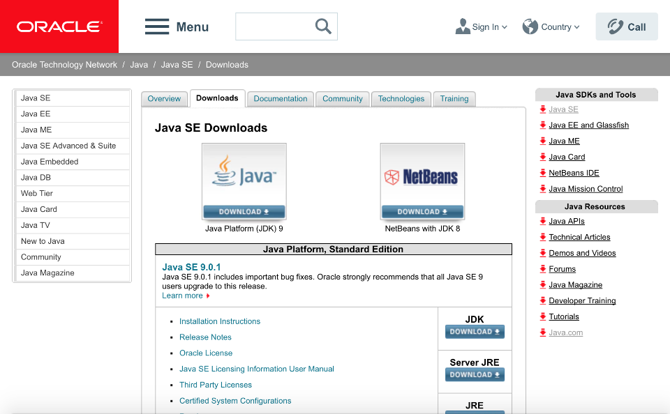
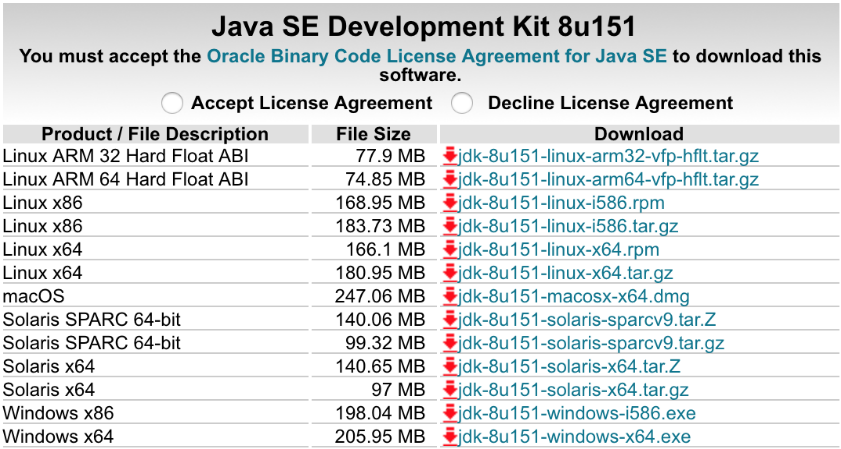
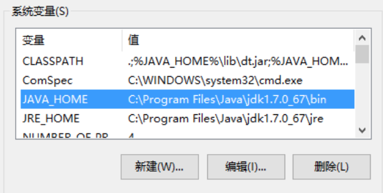
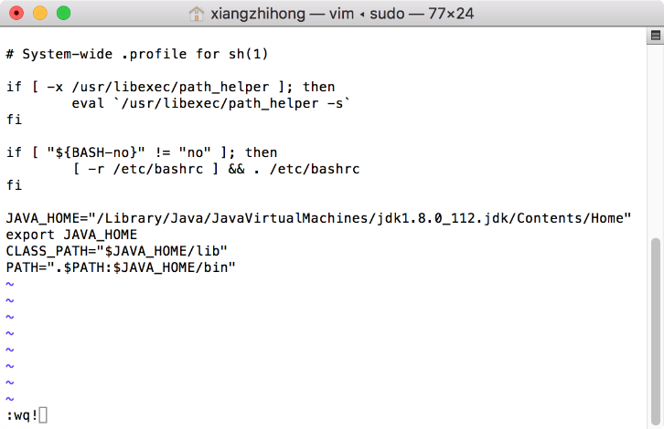
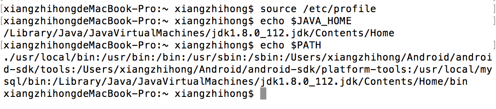

### 3.1.1　安装与配置JDK环境

打开Java官网主页，如图3-1所示，选择对应的JDK版本下载。

Java提供了很多版本，此处选择Java SE 1.8版本进行下载，JDK下载列表如图3-2所示，根据操作系统版本，选择对应的版本下载即可。

下载完成之后，单击安装即可，安装过程很简单，这里不再详述。安装完成后，需要配置相应的环境变量，主要是PATH和CLASSPATH，其中PATH环境变量指向JDK的bin目录，JAVA_HOME环境变量指向JDK的根目录，如图3-3所示。在Windows 10系统中，右键单击【此电脑】选择【属性】，然后依次单击【高级系统设置】→【环境变量】，打开环境变量设置框。


<center class="my_markdown"><b class="my_markdown">图3-1　Java下载主页面</b></center>


<center class="my_markdown"><b class="my_markdown">图3-2　JDK下载列表</b></center>


<center class="my_markdown"><b class="my_markdown">图3-3　Windows系统Java环境变量配置</b></center>

相较于Windows系统下Java环境变量的配置，macOS系统下的环境变量配置就复杂许多。默认情况下，Mac环境下的JDK安装在/Library/Java/JavaVirtualMachines/jdk1.8.0_112.jdk/ Contents/Home中，可以在终端使用命令/usr/libexec/java_home –V来查看。

根据安装的JDK版本不同，目录中dk1.8.0_112.jdk的部分也会有所不同，虽然Mac系统默认安装了JDK 1.6版本，但实际开发过程中，会使用更高的版本来进行开发。知道JDK的安装路径后，就可以设置JAVA_HOME和CLASSPATH环境变量了，打开终端输入如下命令。

```python
sudo vim /etc/profile
```

输入密码后按回车键，如果出现E325错误警告，则输入“E”并按回车键。按下字母“i”，显示insert，进入输入模式。在输入模式下，进行如下配置。

```python
JAVA_HOME="/Library/Java/JavaVirtualMachines/jdk1.8.0_112.jdk/Contents/Home"
export JAVA_HOME
CLASS_PATH="$JAVA_HOME/lib"
PATH=".$PATH:$JAVA_HOME/bin"
```

添加完后，按下【Esc】键退出输入模式，再输入“:wq!”保存并退出vim模式。执行命令如图3-4所示。


<center class="my_markdown"><b class="my_markdown">图3-4　在Mac上配置Java环境变量</b></center>

为了检查环境变量是否配置成功，可以使用下面的命令来查看。

```python
echo $JAVA_HOME 
echo $PATH
```

如果配置正确，则输入上面的命令后会输出如图3-5所示的路径。


<center class="my_markdown"><b class="my_markdown">图3-5　检查Java环境变量</b></center>

