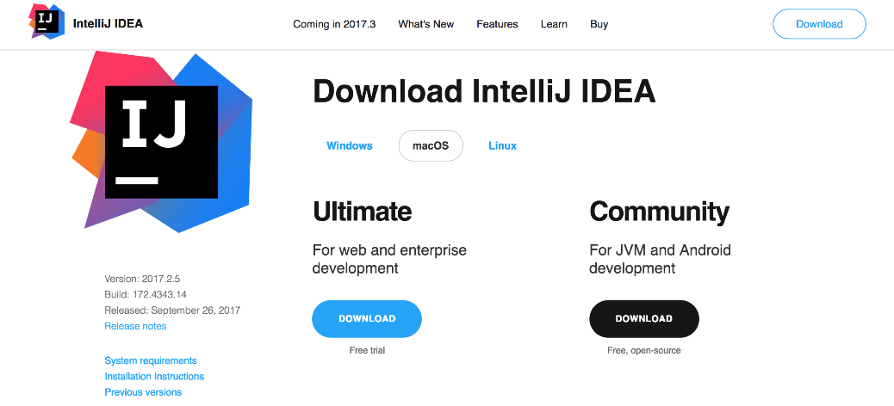
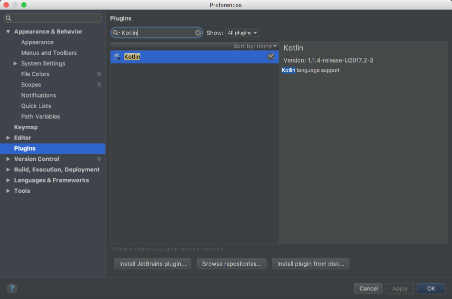
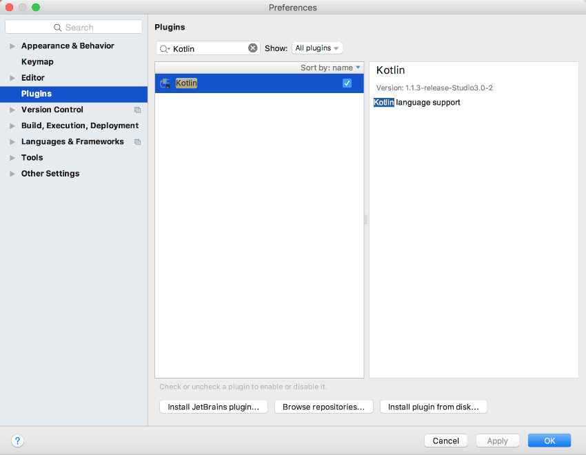
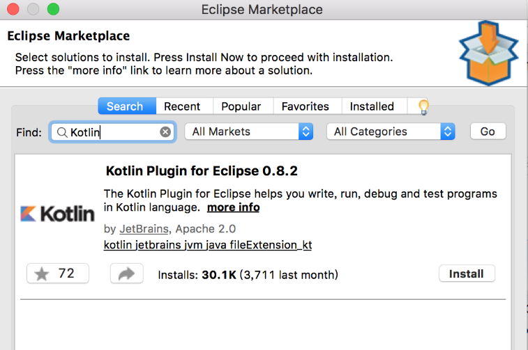
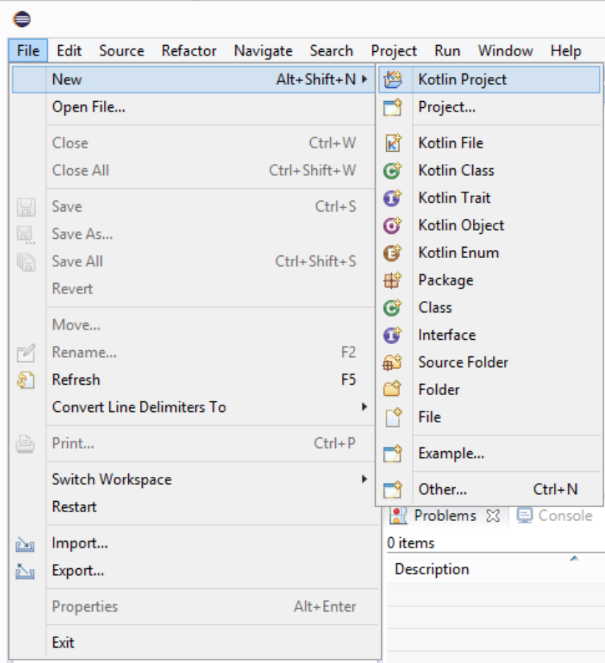

### 3.1.2　安装与配置IDE

目前，支持Kotlin开发的IDE主要有3种：IntelliJ Idea、Android Studio和Eclipse。IntelliJ IDEA作为JetBrains旗下的产品，早早地就添加了对Kotlin的支持；而Android Studio作为IntelliJ IDEA系列的产品，也在最近的版本中集成了Kotlin的相关环境；对于Eclipse用户来说，想要体验Kotlin可以通过插件的方式来集成相关环境。

IntelliJ IDEA作为目前广受欢迎的Java IDE，在智能代码助手、代码自动提示、J2EE支持等方面都异常强大，被业界公认为是一款优秀的Java开发工具。使用浏览器打开JetBrains的官网，选择IntelliJ IDEA并打开，下载对应版本的IntelliJ IDEA即可。IntelliJ IDEA分为两个版本：社区版（Community）和商业版（Ultimate）。社区版免费、开源，但功能较少；商业版功能多，需要付费，但可以试用30天。建议大家选择Ultimate版本进行下载，下载界面如图3-6所示。

<b class="my_markdown">图3-6　下载IntelliJ IDEA</b>

IntelliJ IDEA支持Kotlin的最低版本是2016，如果读者本地的IntelliJ IDEA版本低于2016，但是又想体验Kotlin，那么只需要安装一个Kotlin插件即可。在【Plugins】中搜索Kotlin插件，如图3-7所示，然后安装插件，之后重启计算机即可。

<b class="my_markdown">图3-7　在IntelliJ IDEA中安装Kotlin插件</b>

Android Studio从3.0版本开始集成了Kotlin环境支持，开发者可以很容易地使用Android Studio开发Android应用。如果读者的Android Studio还停留在3.0以下版本，也不用担心，可以使用Kotlin插件来解决问题。

在Android Studio中安装Kotlin插件的方式和在IntelliJ IDEA中安装插件的方式类似，如图3-8所示。

<b class="my_markdown">图3-8　在Android Studio中安装Kotlin插件</b>

除了IntelliJ IDEA和Android Studio之外，Eclipse也支持Kotlin开发，下面重点介绍Eclipse集成Kotlin环境。

首先到Eclipse官网下载对应的版本，安装完成之后，依次选择【Help】→【Eclipse Marketplace】，然后在搜索框输入“Kotlin”并搜索，如图3-9所示。

<b class="my_markdown">图3-9　搜索Kotlin插件并安装</b>

当然，如果读者的Kotlin版本过低，还可以进行更新。

插件安装完成之后，就可以使用Eclipse来开发Kotlin应用程序了，如图3-10所示。

<b class="my_markdown">图3-10　在Eclipse中创建Kotlin项目</b>

到此，Kotlin所依赖的集成开发环境就搭建完成了，接下来就让我们一起进入Kotlin的编码之旅吧。

