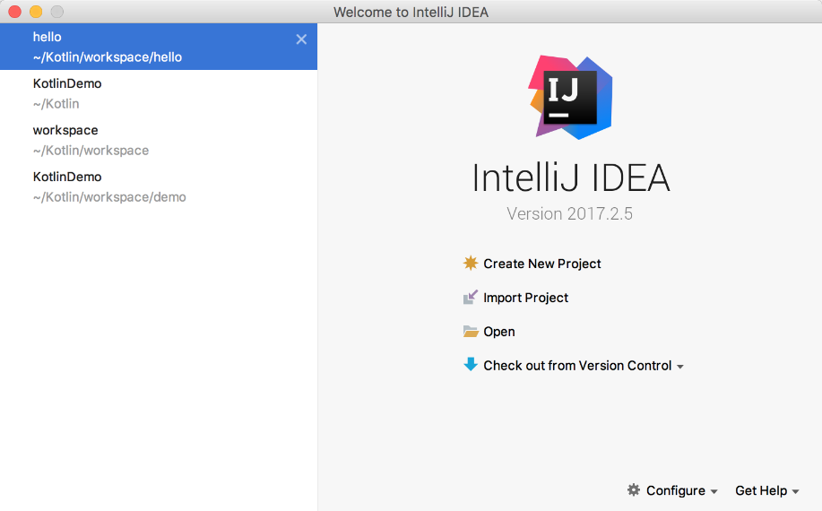
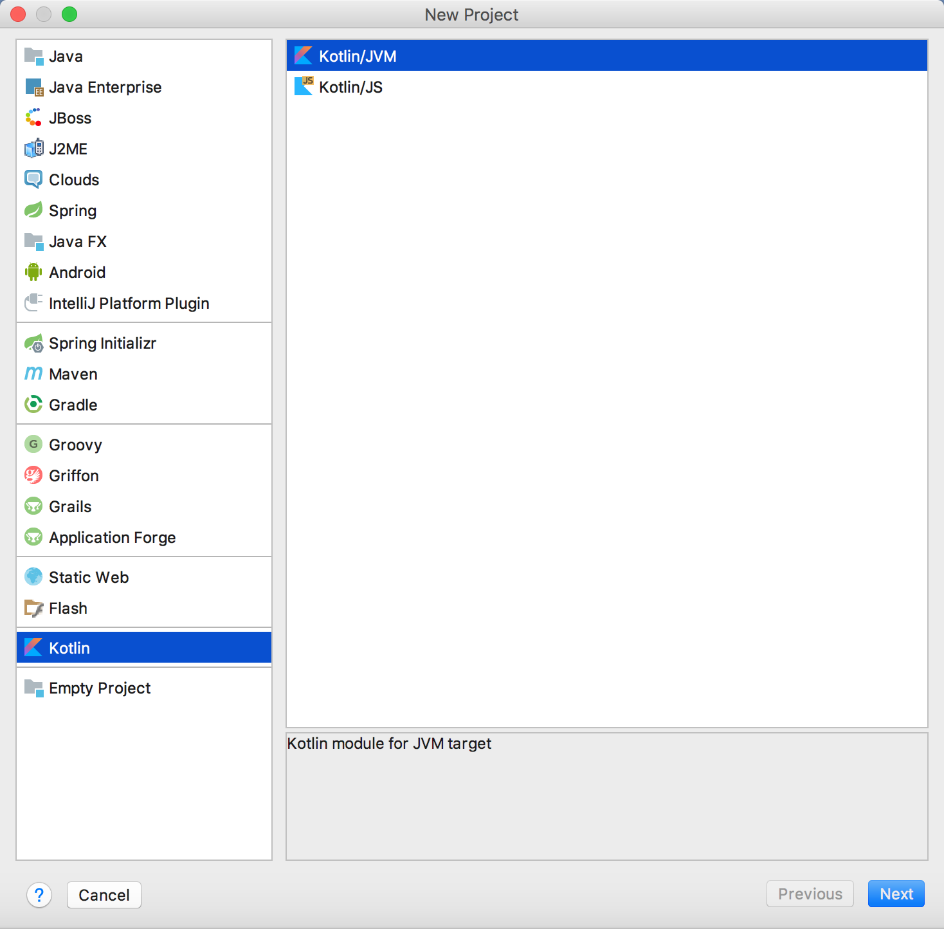
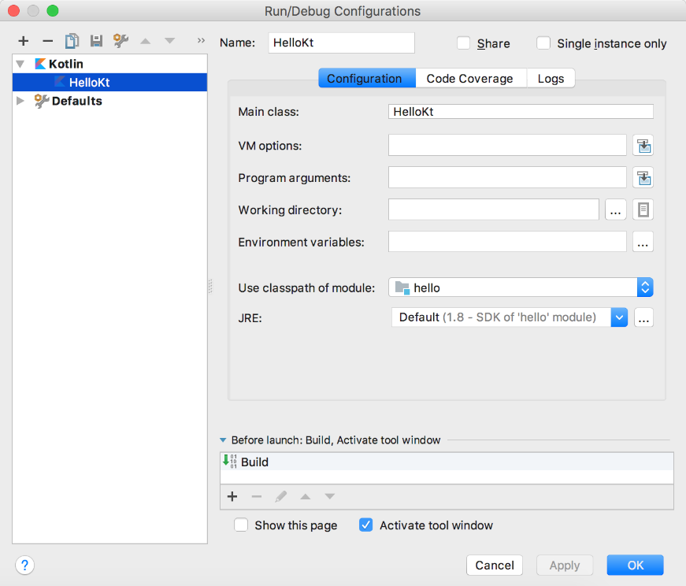

### 3.2.1　IntelliJ IDEA开发环境

IntelliJ IDEA作为目前很受欢迎的Java IDE，也是目前为止对Kotlin支持较好的一款工具。

打开IntelliJ IDEA，首先显示的是如图3-11所示的欢迎界面。然后，我们选择【Create New Project】选项来创建一个新的项目，单击【Next】按钮，在【New Project】窗口的左侧导航栏中选择【Kotlin】，在窗口的右侧列表中有两个选项：【Kotlin/JVM】和【Kotlin/JS】，如图3-12所示。Kotlin/JVM选项会将Kotlin源代码编译成.class文件，Kotlin/JS会将Kotlin源代码编译成JavaScript代码供浏览器解析运行。这两者的区别在于，使用Kotlin/JVM方式编写Kotlin的代码时既可以使用Kotlin原生的API，也可以使用JDK提供的API；而选择Kotlin/JS方式编写的Kotlin代码只能使用Kotlin提供的原生API。


<center class="my_markdown"><b class="my_markdown">图3-11　IntelliJ IDEA欢迎界面</b></center>


<center class="my_markdown"><b class="my_markdown">图3-12　使用IntelliJ IDEA创建Kotlin项目</b></center>

新建一个项目后，src文件默认是空的。学习一门新语言时，大家喜欢以一个“Hello,World!”来开启新语言的学习旅程。在src目录上单击鼠标右键，依次选择【New】→【Kotlin File/Class】菜单项来新建一个Kotlin文件，在程序中输出“Hello,World！”。

```python
fun main(args: Array<String>) {  
    println("hello,world!")  
}
```

单击右上角的【Run/Debug Configurations】窗口，可以打开IntelliJ IDEA的运行配置功能，如图3-13所示。

在这个面板中，【Main class】是运行时的主类，它是必须配置的，【JRE】是Kotlin运行时需要的环境，单击【OK】按钮，完成配置。

如果选择的是“Kotlin/JS“方式，则按照项目创建的过程创建即可。需要注意的是，按照这种方式新建的Kotlin文件，只能调用Kotlin原生的API，而不能调用JDK的API。


<center class="my_markdown"><b class="my_markdown">图3-13　IntelliJ IDEA运行配置窗口</b></center>

