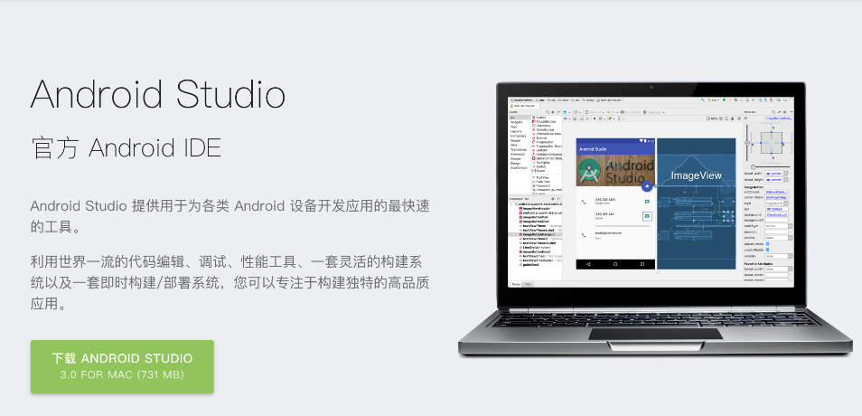
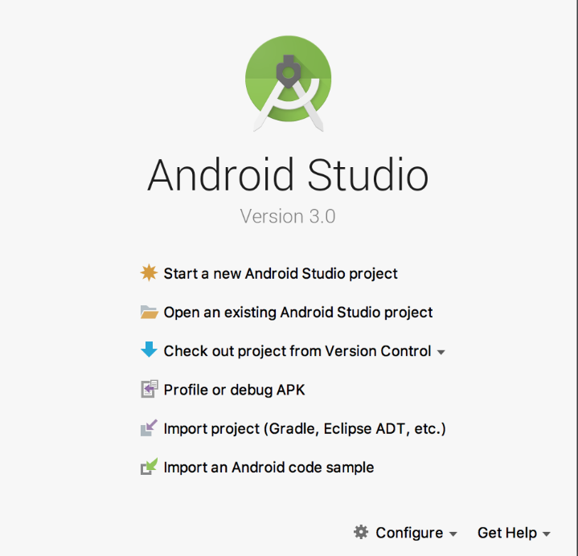
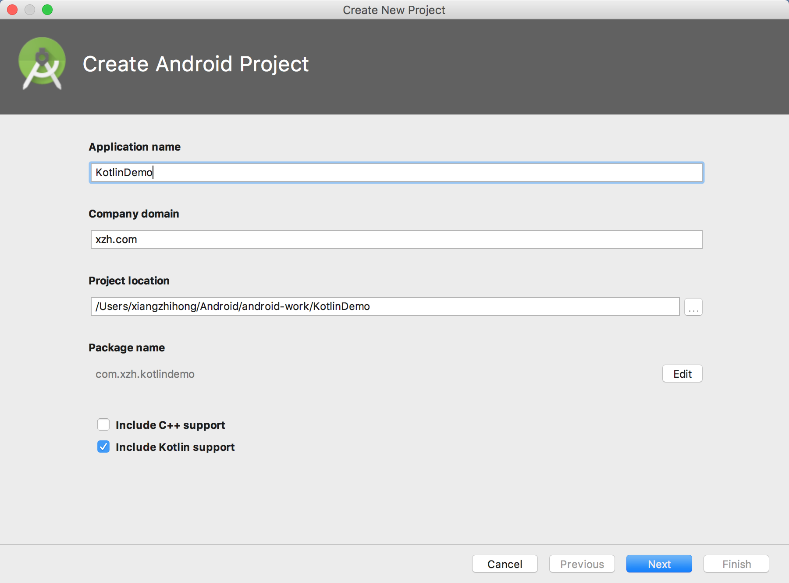
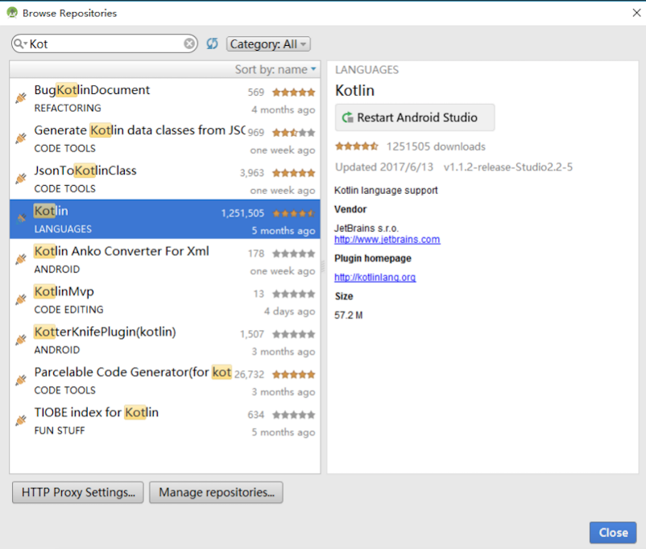
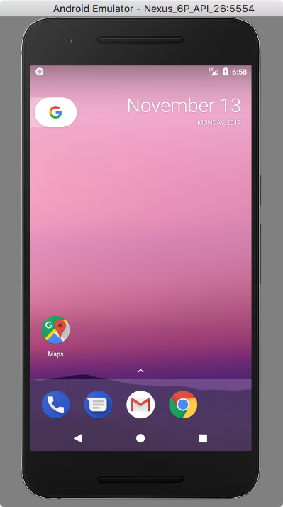
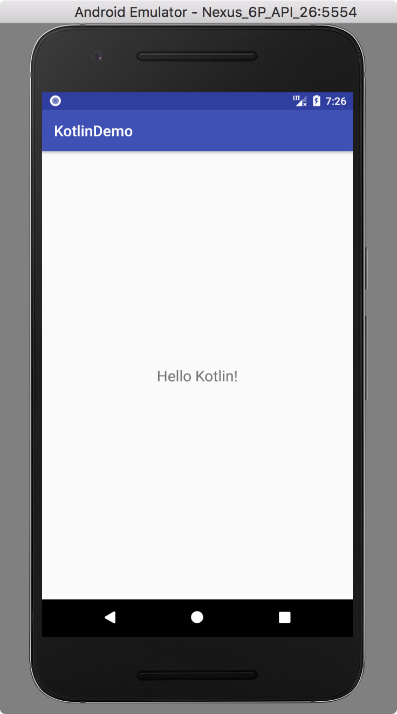

### 3.2.2　Android Studio集成开发环境

自从Google将Kotlin列为Android开发的第一语言后，Kotlin可以说是声名鹊起，再加上Jake Wharton发表推特文章称已正式加入Google的Android框架团队，从事Kotlin方面的开发工作，这无疑为Google Android Framework Team增添一大助力，同时也吸引着更多的开发者加入Kotlin开发阵营。而在移动Android应用开发上，各大公司纷纷试水Kotlin，甚至在一些创业项目里面90%的代码都使用Kotlin来编写。

现在开发Android移动应用，Android Studio是很好的选择，Eclipse已经退出了历史舞台。Android Studio 3.0已经默认添加对Kotlin的支持，即使在老版本的Android Studio 2.x中，也可以通过集成Kotlin插件的方式来实现。读者可以打开Android Studio的主页面或者使用国内的镜像地址下载，Android Studio官方主页如图3-14所示。

目前，Android Studio支持Windows、macOS和Linux三大主流系统版本，读者根据实际情况，选择合适的版本下载安装。

安装完成后，启动Android Studio，选择【Start a new Android Studio project】选项创建一个新的Android工程，如图3-15所示。


<center class="my_markdown"><b class="my_markdown">图3-14　Android Studio官方主页</b></center>


<center class="my_markdown"><b class="my_markdown">图3-15　Android Studio欢迎界面</b></center>

使用Android Studio创建Kotlin项目的时候，需要选中【Include Kotlin support】来添加对Kotlin相关环境的支持，然后单击【Next】按钮来完成项目的创建，如图3-16所示。如果读者依然使用的是Android Studio 2.x版本，可以通过如下的方式来添加Kotlin环境支持。

首先，打开Android Studio，依次选择【Setting】→【Plugins】→【Browse Repositories】，搜索Kotlin插件来安装，如图3-17所示。

然后，在工程的build.gradle文件的buildscript中添加如下配置。

```python
buildscript {
ext.kotlin_version = '1.1.51'
…//省略其他配置
}
```


<center class="my_markdown"><b class="my_markdown">图3-16　在Android Studio 3.0版本中添加Kotlin环境支持</b></center>


<center class="my_markdown"><b class="my_markdown">图3-17　在Android Studio 2.x版本中安装Kotlin插件</b></center>

在工程的App层次的build.gradle脚本文件中添加如下配置。

```python
apply plugin: 'kotlin-android'
apply plugin: 'kotlin-android-extensions'
…  //省略其他配置
dependencies {
        classpath "org.jetbrains.kotlin:kotlin-gradle-plugin:$kotlin_version"
    }
```

除了手动配置方式之外，还可以借助Kotlin插件来实现一键添加Kotlin环境配置。在Android Studio的工具栏上依次选择【Tools】→【Kotlin】→【Configure Kotlin in Project】即可完成Kotlin环境的配置。

创建项目的时候，系统默认建立一个MainActivity的文件类，该类既是Android App主窗口类，也是程序的启动入口，代码如下。

```python
class MainActivity : AppCompatActivity() {  
      override fun onCreate(savedInstanceState: Bundle?) {  
            super.onCreate(savedInstanceState)  
            setContentView(R.layout.activity_main)  
     }  
}
```

功能编写完成后就可以运行了，既可以选择在真机上运行，也可以选择使用模拟器运行。如果使用模拟器运行，需要先启动一个AVD（Android模拟器），然后单击工具栏中的运行按钮即可看到项目的运行效果，如图3-18所示。




<center class="my_markdown"><b class="my_markdown">图3-18　使用模拟器运行项目</b></center>

