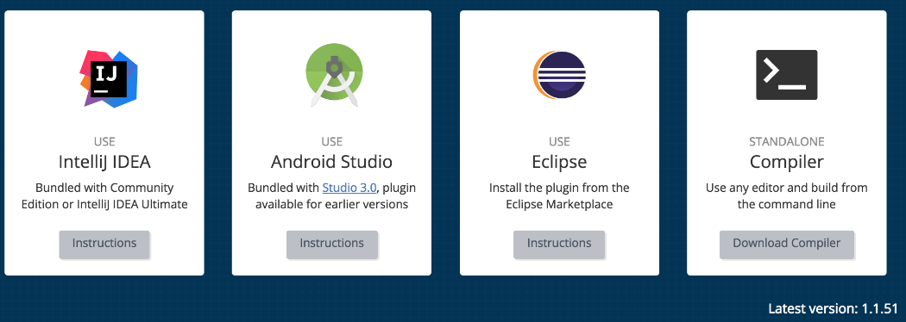
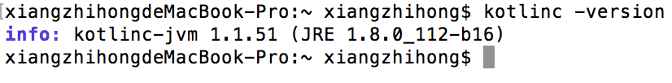

### 3.3.1　命令行方式编译运行Kotlin

使用命令行方式编译运行Kotlin，首先需要下载一个编译器，Kotlin为每个release都分配了一个独立的编译器版本。读者可以打开Kotlin官网。将页面滚动到如图3-19所示的位置，单击【Download Compiler】按钮即可下载对应的编译器。


<center class="my_markdown"><b class="my_markdown">图3-19　Kotlin支持的IDE及编译器下载</b></center>

Kotlin提供了多种方式来配置编译器，例如下载二进制压缩包、从源代码编译、在macOS环境下使用brew命令方式安装等，不过比较简单方便的还是二进制压缩包方式。在该页面找到如图3-20所示的文字链接，或者直接使用链接来下载对应的二进制压缩包。


<center class="my_markdown"><b class="my_markdown">图3-20　下载二进制压缩包</b></center>

下载完成后，将二进制压缩包解压到合适的位置，如/Users/×××/Kotlin文件夹下，那么Kotlin编译器的根目录就是/Users/×××/Kotlin/kotlinc。为了在任何位置都可以使用Kotlin编译器，还可以将编译器的根目录路径添加到系统的环境变量中。然后，在控制终端输入“kotlinc –version”命令，如果打印版本信息，则说明编译器配置正确。例如，下面是macOS系统下的Kotlin环境变量配置。

```python
export KOTLIN_HOME=/Users/×××/Kotlin/kotlinc   //×××改为用户名
export PATH=${PATH}:${KOTLIN_HOME}/bin
```

在Mac系统上查看，版本信息如图3-21所示。


<center class="my_markdown"><b class="my_markdown">图3-21　Mac系统上查看Kotlin版本信息</b></center>

如果读者使用Homebrew的方式来安装Kotlin，则可以使用如下的命令。

```python
brew update
brew install kotlin
```

接下来，创建一个名为Hello.kt的文件并输入以下代码。

```python
fun main(args: Array<String>) {
         println("Hello,Kotlin!")
    }
```

Kotlin编译器提供了一个kotlinc命令行，kotlinc命令的作用和javac命令类似，是将源代码编译为class字节码文件。接下来使用kotlinc命令编译Hello.kt文件，命令如下。

```python
kotlinc hello.kt
```

命令执行完成之后，会在该目录下生成一个HelloKt.class和一个META-INF文件，其中，HelloKt.class就是字节码文件，如果使用Java命令来运行HelloKt字节码文件，结果会报NoClassDefFoundError错误。根据官网的介绍，需要使用如下的命令来运行字节码文件。

```python
kotlin HelloKt
```

或许读者有个疑问，为什么直接使用java HelloKt命令会报错呢？这是因为Kotlin代码中的println函数是定义在依赖库中的，所以，要在Java中使用命令来调用Kotlin原生的API，就必须添加依赖库。

那么，要想使用Java命令调用Kotlin代码需要怎么做呢？建议开发者使用命令先将Kotlin源码编译成可运行的JAR包，然后再执行调用命令。Kotlin编译器的kotlinc命令提供了一个-include-runtime命令行参数，可在编译时引用Kotlin需要的依赖库，命令如下。

```python
kotlinc Hello.kt -include-runtime -d Hello.jar
```

使用上面的命令编译Kotlin源代码后，会在该目录下生成一个Hello.jar文件，在上面的命令中涉及两个命令行参数。

+ -include-runtime：使编译生成的包中包含Kotlin标准库，从而在没有Kotlin库的Java机器上也能运行。
+ -d: 用来设置编译输出的名称，既可以是class或JAR文件，也可以是目录。

然后使用命令java -jar hello.jar，即输出字符串“Hello,Kotlin!”。除此之外，如果生成的JAR包需要供其他Kotlin程序使用，则无须包含Kotlin的运行库。采用这种方式，请确保它被调用时运行在classpath环境上。

```python
//编译Kotlin代码成JAR库，该包不含Kotlin运行时类库
kotlinc Hello.kt -d Hello.jar
//被其他程序调用时，需要在路径中提供编译时的Kotlin运行时库
kotlin -classpath Hello.jar HelloKt
```

需要注意的是，使用Java命令的classpath参数时，需要指明搜索class文件的路径，多个路径用分号分割，如果使用的是JAR包，则一定要精确到JAR包的名称。

到此，我们再来看一下Kotlin的完整编译流程：Kotlin源码通过Kotlin编译器编译生成.class文件，生成的.class文件会被打包，然后使用应用类型的标准流程运行应用程序。一个简单的编译流程如图3-22所示。


<center class="my_markdown"><b class="my_markdown">图3-22　Kotlin编译流程</b></center>

使用Kotlin编译器编译代码需要依赖Kotlin的运行时库，它包含了Kotlin的标准类库和对Java标准库的扩展。

