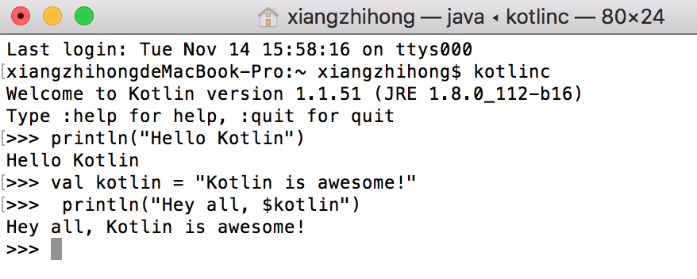

### 3.3.2　运行Kotlin REPL

REPL（Read-Eval-Print Loop）环境是Kotlin自带的交互式编程命令行，其实就是一个控制台环境，其作用和Android Studio自带的Terminal命令行窗口差不多。在终端上执行kotlinc命令，可以直接进入REPL环境。

新版本的IntelliJ IDEA以及Android Studio，已经内置了对REPL的支持，可以在工具栏上依次单击【Tools】→【Kotlin】→【Kotlin REPL】来打开REPL窗口，如图3-23所示。

<b class="my_markdown">图3-23　Kotlin REPL窗口</b>

某些情况下，我们并不希望直接使用IDEA内置的Kotlin REPL环境，这时候，独立使用Kotlin REPL命令行是再合适不过的选择。在REPL环境中，每输入一行Kotlin代码，就会在REPL控制台中输出相关的结果，如图3-24所示。

<b class="my_markdown">图3-24　在REPL窗口中执行Kotlin代码</b>

Kotlin REPL提供了诸多有用的命令，退出REPL可以使用“:quit”命令，也可以使用“System.exit(0)”；使用“:load”命令可以装载Kotlin文件。

