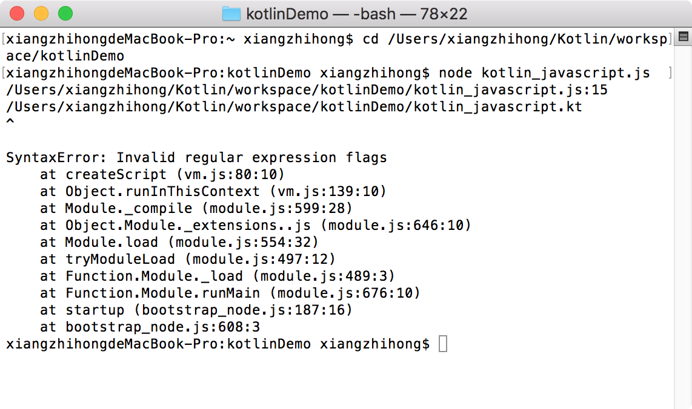
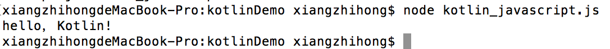

### 3.3.4　在Node.js中运行Kotlin

谈到JavaScript，就不得不提到Node.js。Node.js是一个基于Chrome V8 引擎的JavaScript运行环境，Node.js的优点在于完全异步的I/O模型。异步I/O模型极大地提高了Web服务的并发性。配合Node.js环境，JavaScript具备了和PHP、Java EE等同的地位，时下流行的Node微服务技术就是基于Node技术开发的。

要在Node.js中运行JavaScript程序，首先需要Node.js环境的支持。Node.js环境的搭建非常简单，读者可以到Node.js的官网下载。安装完成后，在终端输入命令“node –v”，如果正确输出版本信息，则说明Node.js安装成功。

使用Node.js提供的命令可以执行JavaScript脚本文件，例如，使用命令“node kotlin_ javascript.js”执行JavaScript脚本，如图3-25所示。


<center class="my_markdown"><b class="my_markdown">图3-25　在Node.js环境中运行JavaScript报错</b></center>

很明显，这个异常是由于没有添加Kotlin依赖库导致的。在前端框架中，引用第三方库时需要使用require函数，在JavaScript中引用Kotlin库可以使用如下方式。

```python
var kotlin = require("kotlin");
```

现在打开kotlin_javascript.js文件并在代码的最前面添加引用代码声明。同时，为了保证命令能正确运行，需要在项目文件夹目录下安装Kotlin依赖（即node_modules），安装命令如下。

```python
npm install kotlin
```

npm是Node.js中的一个包管理工具，用来解决Node.js的代码部署问题。Kotlin依赖安装完成后，再次执行“node kotlin_javascript.js”命令，就可以正确输出字符串了，如图3-26所示。


<center class="my_markdown"><b class="my_markdown">图3-26　在Node.js环境中运行JavaScript</b></center>

