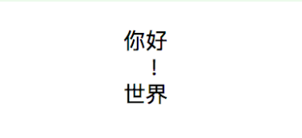

### 4.3.5　字符串

在Kotlin中，字符串类型使用String表示。字符串定义后是不可变的，它由单个字符组成，可以通过索引来访问某个元素：s[i]。当然，也可以使用for循环来迭代字符串。

```python
for (c in str) {
      println(c)
}
```

Kotlin的字符串主要分为两种：普通字符串和原生字符串。

#### 1．普通字符串

这种字符串和Java类似，可以在其中加上转义符(如\n)，转义符采用传统的反斜杠方式。

```python
val s = "你好\n世界"
```

#### 2．原生字符串

这种字符串使用3个引号（"""）分界符括起来，内部没有转义并且可以包含换行和任何其他字符。

```python
var s3 = """
         你好
          ！
         世界
         """
    println(s3)
```

运行上面的代码，使用原生字符串包裹的内容会按原始格式输出，运行结果如图4-1所示。


<center class="my_markdown"><b class="my_markdown">图4-1　原生字符串按原始格式输出</b></center>

#### 3．字符串模板

Kotlin的字符串还有一项重要的功能，就是提供了字符串模板。所谓字符串模板，就是在字符串中添加若干个占位符，而占位符的具体内容会在使用时指定。

模板表达式以美元符（\$）开头，外加一个变量名，如“i = $i”中的“$i”就是一个占位符，其中“i”表示变量。

```python
val i = 10
val r = "i = $i"    //得到 "i = 10"
val s = "abc"
val str = "$s.length is ${s.length}"    //计算得到 "abc.length is 3"
```

原生字符串和转义字符串内部都支持模板，如果需要在原生字符串中表示\$字符，则可以使用${表达式}语法。代码如下。

```python
val price = """${'$'}9.99"""
```

