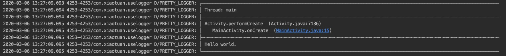
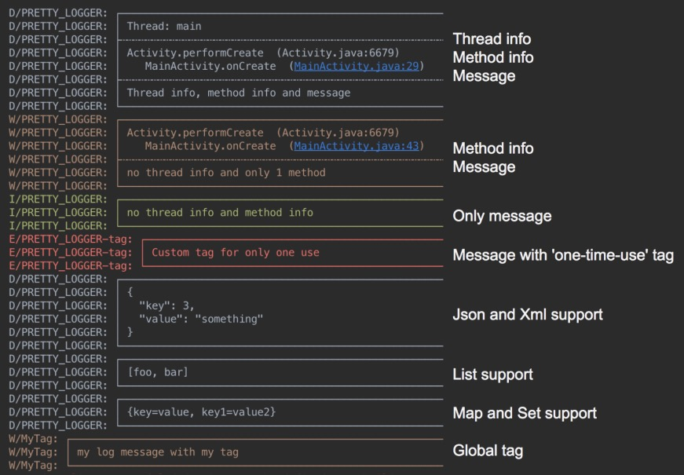
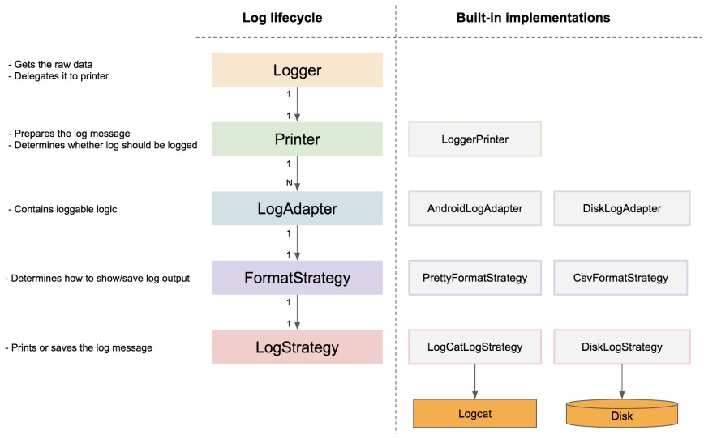
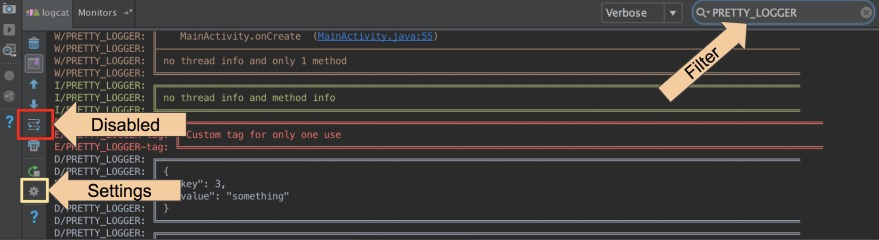

<center><font size="5"><b>logger框架</b></font></center>

[toc]

####1. 框架简介

简单、漂亮和实用的Android日志框架。

#### 2. Github地址

<https://github.com/orhanobut/logger>

#### 3. 配置build.gradle

在项目目录下的 `gradle.properties` 文件中添加如下代码：

```
LOGGER_VERSION = 2.2.0
```

在 `app` 目录下的 `build.gradle` 文件中添加如下代码：

```
dependencies {
    ......
    implementation "com.orhanobut:logger:${LOGGER_VERSION}"
}
```

#### 4. 使用方法

> 可以使用 `PRETTY_LOGGER` TAG来过虑logger输出的日志。

##### 4.1 初始化

在项目 `Application` 类的 `onCreate()`方法中初始化logger：

```Java
Logger.addLogAdapter(new AndroidLogAdapter());
```

##### 4.2 简单使用

```Java
Logger.d("Hello world.");
```

输出如下：



其他输出样式如下所示：



##### 4.3 其他使用方法

```Java
Logger.d("debug");
Logger.e("error");
Logger.w("warning");
Logger.v("verbose");
Logger.i("information");
Logger.wtf("What a Terrible Failure");
```

#####4.4 支持格式化字符串的日志：

```Java
Logger.d("hello %s", "world");
```

#####4.5 支持打印集合日志（只支持调试模式下）：

```Java
Logger.d(MAP);
Logger.d(SET);
Logger.d(LIST);
Logger.d(ARRAY);
```

#####4.6 支持打印Json和Xml数据的日志（在debug level下输出）：

```Java
Logger.json(JSON_CONTENT);
Logger.xml(XML_CONTENT);
```

##### 4.7 高级用法

```Java
FormatStrategy formatStrategy = PrettyFormatStrategy.newBuilder()
  .showThreadInfo(false)  // （可选）（是否显示线程信息，默认显示）
  .methodCount(0)         // （可选）（显示方法的行数，默认显示2行）
  .methodOffset(7)        // （可选）（设置调用堆栈的函数偏移值，0的话则从打印该Log的函数开始输出堆栈信息，默认是0）
  .logStrategy(customLog) // 可选）更改要打印的日志策略。 默认LogCat
  .tag("My custom tag")   //（可选）每个日志的全局标记。 默认PRETTY_LOGGER
  .build();

Logger.addLogAdapter(new AndroidLogAdapter(formatStrategy));
```

#####4.8 是否启用日志：

```Java
Logger.addLogAdapter(new AndroidLogAdapter() {
    @Override
    public boolean isLoggable(int priority, @Nullable String tag) {
        return BuildConfig.DEBUG;
    }
});
```

##### 4.9 保存日志到文件

```Java
Logger.addLogAdapter(new DiskLogAdapter());
```

添加自定义TAG到CSV格式样式中：

```Java
FormatStrategy formatStrategy = CsvFormatStrategy.newBuilder()
  .tag("custom")
  .build();
  
Logger.addLogAdapter(new DiskLogAdapter(formatStrategy));
```

##### 4.10 工作原理



##### 4.12 其他

+ Use filter for a better result. PRETTY_LOGGER or your custom tag
+ Make sure that wrap option is disabled
+ You can alse simplity output by changing settings



+ Timber Integration

```Java
// Set methodOffset to 5 in order to hide internal method calls
Timber.plant(new Timber.DebugTree() {
  @Override protected void log(int priority, String tag, String message, Throwable t) {
    Logger.log(priority, tag, message, t);
  }
});
```

