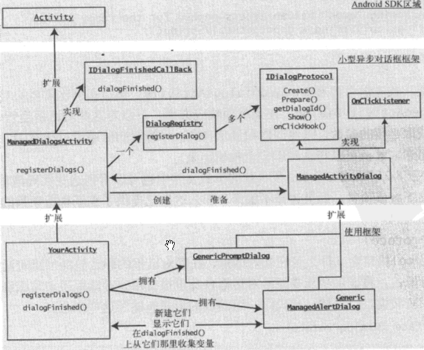

[toc]

### 1. 理解托管对话框协议

托管对话框协议的主要目的在于，如果多次调用一个对话框，则重用该对话框。这类似于在 Java 中使用对象池。托管对话框协议包含以下步骤。

（1）为想要创建和使用的每个对话框分配唯一 ID。假设其中一个对话框标记为 1.

（2）告诉Android 显示名为 1 的对话框。

（3）Android 检查当前活动是否已有标记为 1 的对话框。如果存在，Android 将显示它，而不会重新创建它。在显示对话框之前，Android 调用 onPrepareDialog() 函数来清除其内容。

（4）如果对话框不存在，Android 通过传递对话框 ID 来调用 onCreateDialog 方法。

（5）程序员需要重写 onCreateDialog 方法。必须使用提醒对话框生成掐创建对话框并将其返回。

（6）Android 显示对话框。

（7）对话框在其按钮被单击时调用回调方法。

### 2. 将非托管对话框重新转换为托管对话框

我们将按照上面列出的步骤重新实现提醒对话框。首先在给定活动的上下文中为此对话框定义唯一 ID：

```java
// unique dialog id
private static final int DIALOG_ALERT_ID = 1;
```

此 ID 可用于执行以下操作来响应菜单项：

```java
someactivity.showDialog(this.DIALOG_ALERT_ID);
```

Android SDK 方法 showDialog 触发对 onCreateDialog() 方法的调用，它不会多次调用 onCreateDialog()。但调用此方法时，我们需要创建对话框并将其返回给 Android。Android 然后将创建的对话框保存在内部，以供重用。下面是根据唯一 ID 创建对话框的示例代码：

```java
public class SomeActivity extends Activity {
    ......
    @Override
    protected Dialog onCreateDialog(int id) {
        switch (id) {
            case DIALOG_ALERT_ID:
                return createAlertDialog();
        }
        return null;
    }
    
    private Dialog createAlertDialog() {
        AlertDialog.Builder builder = new AlertDialog.Builder(this);
        builder.setTitle("Alert");
        builder.setMessage("some message");
        EmptyOnClickListener emptyListener = new EmptyOnClickListener();
        builder.setPositiveButton("OK", emptyListener);
        AlertDialog ad = builder.create();
        return ad;
    }
    
}
```

因为对话框仅创建一次，如果希望在每次显示对话框时更改对话框的某些内容，则需要一种机制来实现。可以通过 onPrepareDialog() 回调方法来实现：

```java
@Override
protected void onPrepareDialog(int id, Dialog dialog) {
    switch (id) {
        case DIALOG_ALERT_ID:
            prepareAlertDialog(dialog);
    }
}

private void prepareAlertDialog(Dialog d) {
    AlertDialog ad = (AlertDialog)d;
    // change something about this dialog
}
```

现在可以响应对话框回调了，但是托管对话框协议还需要更多工作来实现。查看托管对话框协议之后，我们决定对该协议进行抽象，并以某种方式对其重新布置以实现以下两个目标。

+ 将对话框的识别和创建移到 Activity 类以外。

+ 将对话框的创建和响应集中到一个专门的对话框类中。

### 3. 简化托管对话框协议

你能已经注意到，托管提醒对话框的使用非常烦乱，并影响了主线代码简洁性。如果将此协议抽象为更简单的协议，那么新协议可能类似于以下方面。

（1）使用 new 创建想要的对话框的实例，将其保存为局部变量。将此对话框命名为 dialog1。

（2）使用 dialog1.show() 显示对话框。

（3）在活动中实现方法 dialogFinished()。

（4）在 dialogFinished() 方法中，从 dialog1 中读取特性，比如 dialog1.getValue1()。

采用此方案，显示托管提醒对话框的代码结构可能类似于：

```java
... class MyActivity ...
{
    // new dialog
    ManagedAlertDialog mad = new ManagedAlertDialog("message", ..., ...);
    
    ... some menu method
    if (item.getItemId() == R.id.your_menu_id) {
        // show dialog
        mad.show();
    }
    ...
    // access the mad dialog for internals if you want
    dialogFinished() {
        ...
        // use values from dialog
        mad.getA();
        mad.getB();
    }
}
```

这种方法的明显优势如下。

+ 无需分配或记住任意的对话框 ID。
+ 无需在主线活动代码中包含对话框创建代码。
+ 可以直接使用派生的对话框对象访问值。

图8-3进一步演示了这一架构。



<center>图8-3 简单的托管对话框框架</center>

下面代码演示了此框架的应用。

**代码清单8-8** 托管对话框协议的抽象

```java
public class MainActivity extends ManagedDialogsActivity {
    // dialog 1
    private GenericManagedAlertDialog gmad = new GenericManagedAlertDialog(this, 1, "InitialValue");
    
    // dialog 2
    private GenericPromptDialog gmpd = new GenericPromptDialog(this, 2, "InitialValue");
    
    // menu items to start the dialogs
    if (item.getItemId() == R.id.your_menu_id) {
        gmad.show();
    } else if (item.getItemId() == R.id.your_menu_id2) {
        gmpd.show();
    }
    
    // dealing with call backs
    public void dialogFinished(ManagedActivityDialog dialog, int buttonId) {
        if (dialog.getDialogId() == gmpd.getDialogId()) {
            // Assuming "gmpd" has an access method for the reply string
            String replyString = gmpd.getReplyString();
        }
    }
}
```

#### 3.1 IDialogProtocol

IDialogProtocol 接口定义什么是托管对话框。托管对话框的职责包括创建对话框，以及在每次需要显示它时进行准备。

```java
public interface IDialogProtocol {
    public Dialog create();
    public void prepare(Dialog dialog);
    public int getDialogId();
    public void show();
    public void onClickHook(int buttonId);
}
```

#### 3.2 ManagedActivityDialog

抽象类 ManagedActivityDialog 提供了希望实现 IDialogProtocol 接口的所有对话框类的通用实现。

**代码清单8-9** ManagedActivityDialog 类

```java
public abstract class ManagedActivityDialog implements IDialogProtocol, android.content.DialogInterface.OnClickListener {
    private ManagedDialogsActivity activity;
    private int mDialogId;
    
    public ManagedActivityDialog(ManagedDialogsActivity a, int dialogId) {
        mActivity = a;
        mDialogId = dialogId;
    }
    
    public int getDialogId() {
        return mDialogId;
    }
    
    public void show() {
        mActivity.showDialog(mDialogId);
    }
    
    public void onClick(DialogInterface v, int buttonId) {
        onClickHook(buttonId);
        this.mActivity.dialogFinished(this, buttonId);
    }
}
```

#### 3.3 DialogRegistry

DialogRegistry 类负责两件事。它保存对话框 ID 与实际的对话框实例之间的映射。它还负责使用 ID 到对象的映射，将一般的 onCreate 和 onPrepare 调用转换为特定对话框。ManagedDialogsActivity 使用 DialogRegistry 类作为存储库来注册新对话框。

**代码清单8-10**  DialogRegistry 类

```java
public class DialogRegistry {
    SparseArray<IDialogProtocol> idsToDialogs = new SparseArray();
    
    public void registerDialog(IDialogProtocol dialog) {
        idsToDialogs.put(dialog.getDialogId(), dialog);
    }
    
    public Dialog create(int id) {
        IDialogProtocol dp = idsToDialogs.get(id);
        if (dp == null) return null;
        
        return dp.create();
    }
    
    public void prepare(Dialog dialog, int id) {
        IDialogProtocol dp = idsToDialogs.get(id);
        if (dp == null) {
            throw new RuntimeException("Dialog id is not registered: " + id);
        }
        dp.prepare(dialog);
    }
}
```

#### 3.4 ManagedDialogsActivity

ManagedDialogsActivity 类充当着支持托管对话框的活动的基类。它拥有一个 DialogsRegistry 实例，用于跟踪 IDialogProtocol 接口所标识的托管对话框。它支持派生活动通过 registerDialogs() 函数注册它们的对话框。

**代码清单8-11** ManagedDialogsActivity 类

```java
public class ManagedDialogActivity extends Activity implements IDialogFinishedCallBack {
    // A registry for managed dialogs
    private DialogRegistry dr = new DialogRegistry();
    
    public void onCreate(Bundle savedInstanceState) {
        super.onCreate(savedInstanceState);
        this.registerDialogs();
    }
    
    protected void registerDialogs() {
        // does nothing 
        // have the derived classes override this method
        // to register their dialogs
        // example;
        // registerDialog(this.DIALOG_ALERT_ID_3, gmad);
    }
    
    public void registerDialog(IDialogProtocol dialog) {
        this.dr.registerDialog(dialog);
    }
    
    @Override
    protected Dialog onCreateDialog(int id) {
        return this.dr.create(id);
    }
    
    @Override
    protected void onPrepareDialog(int id, Dialog dialog) {
        this.dr.prepare(dialog, id);
    }
    
    public void dialogFinished(ManagedActivityDialog dialog, int buttonId) {
        // nothing to do
        // have derived classes override this
    }
}
```

#### 3.5 IDialogFinishedCallBack

**代码清单8-12** IDialogFinishedCallBack 接口

```java
public interface IDialogFinishedCallBack {
    public static int OK_BUTTON = -1;
    public static int CANCEL_BUTTON = -2;
    public void dialogFinished(ManagedActivityDialog dialog, int buttonId);
}
```

#### 3.6 GenericManagedAlertDialog

GenericManagedAlertDialog 是提醒对话框的实现，它扩展了 ManagedActivityDialog。

**代码清单8-13** GenericManagedAlertDialog 类

```java
public class GenericManagedAlertDialog extends ManagedActivityDialog {
    private String alertMessage = null;
    private Context ctx = null;
    
    public GenericManagedAlertDialog(ManagedDialogsActivity inActivity, int dialogId, String initialMessage) {
        super(inActivity, dialogId);
        alertMessage = initialMessage;
        ctx = inActivity;
    }
    
    public Dialog create() {
        AlertDialog.Builder builder = new AlertDialog.Builder(ctx);
        builder.setTitle("Alert");
        builder.setMessage(alertMessage);
        builder.setPositiveButton("Ok", this);
        AlertDialog ad = builder.create();
        return ad;
    }
    
    public void prepare(Dialog dialog) {
        AlertDialog ad = (AlertDialog)dialog;
        ad.setMessage(alertMessage);
    }
    
    public void setAlertMessage(String inAlertMessage) {
        alertMessage = inAlertMessage;
    }
    
    public void onClickHook(int buttonId) {
        // nothing to do
        // no local variables to set
    }
}
```

#### 3.7 GenericPromptDialog

**代码清单8-14** GenericPromptDialog 类

```java
public class GenericPromptDialog extends ManagedActivityDialog {
    private String mPromptMessage = null;
    private View promptView = null;
    String promptValue = null;
    
    private Context ctx = null;
    
    public GenericPromptDialog(ManagedDialogsActivity inActivity, int dialogId, String promptMessage) {
        super(inActivity, dialogId);
        mPromptMessage = promptMesage;
        ctx = inActivity;
    }
    
    public Dialog create() {
        LayoutInflater li = LayoutInflater.from(ctx);
        promptView = li.inflate(R.layout.promptdialog, null);
        AlertDialog.Builder builder = new AlertDialog.Builder(ctx);
        builder.setTitle("prompt");
        builder.setView(promptView);
        builder.setPositiveButton("OK", this);
        builder.setNegativeButton("Cancel", this);
        AlertDialog ad = builder.create();
        return ad;
    }
    
    public void prepare(Dialog dialog) {
        // nothing for now
    }
    
    public void onClickHook(int buttonId) {
        if (buttonId == DialogInterface.BUTTON1) {
            // ok button
            String promptValue = getEnteredText();
        }
    }
    
    private String getEnteredText() {
        EditText et = (EditText)promptView.findView(R.id.editText_prompt);
        String enteredText = et.getText().toString();
        Log.d("xx", enteredText);
        return enteredText;
    }
}
```

