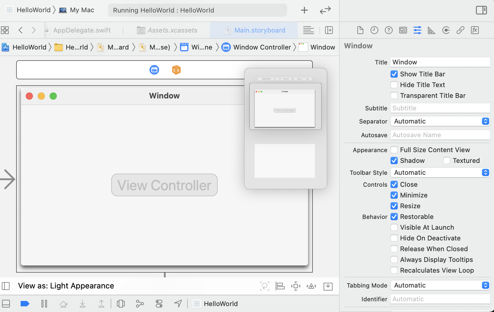

### 1. AppDelegate.swift

下面具体看一下 ApplicationDelegate 类的代码：

```swift
import Cocoa

@main
class AppDelegate: NSObject, NSApplicationDelegate {

    func applicationDidFinishLaunching(_ aNotification: Notification) {
        // Insert code here to initialize your application
    }

    func applicationWillTerminate(_ aNotification: Notification) {
        // Insert code here to tear down your application
    }

}
```

`applicationDidFinishLaunching` 中可以做一些应用启动前的初始化处理，`applicationWillTerminate` 中可以做一些应用退出的全局性数据区和资源的清理和释放。

### 2. Main.storyboard

点击 Window 窗口，切换到它的属性面板去，其中 title 字段可以修改 Window 的标题。选中 Title Bar 表示 Window 是带有顶部标题的，取消选中，窗口顶部的标题会消失。还有一个关键的提示，选中 Visible At Launch 表示应用启动时窗口自动显示，取消选中，再运行 HelloWorld 工程，应用启动窗口就不见了，只显示顶部的菜单。



可以通过代码让它再次出现，在 AppDelegate 的 `applicationDidFinishLaunching` 中调用 makeKeyAndOrderFront 的方法：

```swift
func applicationDidFinishLaunching(_ aNotification: Notification) {
    // Insert code here to initialize your application
    NSApplication.shared.keyWindow?.makeKeyAndOrderFront(self);
}
```

> 注意：在以 storyboard 方法创建的工程，`Visible At Launch` 选项已经没有作用了。

### 3. info.plist

+ Icon file：可以在这个字段输入 icns 格式的文件作为 AppIcon 图标。AppIcon 现在一般通过 Assets.xcassets 设置，因此指定 Icon file 的方式很少使用了。
+ Bundle identifier：应用的唯一标识字符串。
+ Bundle versions string, short：应用对外发布的版本号。
+ Bundle version：应用的内部版本号。提交到 Mac App Store 等待审核中的版本，如果发现 bug，可以撤下来重新提交，这时候 Bundle versions string, short 版本号保持不变，只需要让 Bundle version 版本号递增即可。
+ Main nib file base name：指定应用启动时加载的 xib 文件名。
+ Principal class：NSApplication。

### 4. target

Target 定义了编译发布的单个产品需要的源文件、配置参数、依赖库、部署系统版本环境和签名文件等。

（1）General。除了可以通过 plist 文件修改应用的配置信息字段外，还可以选择 target 进入 General 面板来修改 plist 文件中的部分字段。Deployment Info 部分的 Deployment Target 设置应用支持的最低 macOS 系统版本。

（2）Capabilities。Capabilities 面板中列出的是应用测试和发布前需要关注的功能开关，应用用到什么相关功能就勾选它。

重点关注一下 App Sandbox，苹果公司现在要求上架 Mac App Store 的应用必须使用沙盒，所以发布到商店的应用必须选择打开。

如果应用要访问服务器的接口，就必须打开 Outgoing Connections。Hardware 里面必须选择打开 Printing，否则审核不通过。

如果你需要让用户选择访问本地的文件，File Access 部分的 User Selected File 必须选择读/写权限。

（3）Info。Info 面板中的内容与点击工程结构导航区中的 info.plist 文件看到的内容一致。

点击 Principal class 增加一行 Application Category，对 Application Category 可以选择一个应用的分类，要提交到 Mac App Store 就必须有分类。

（4）Build Settings。发布前必须正确设置 signing。Code Signing Identity 为证书，Provisioning Profile 为应用的签名信息。

