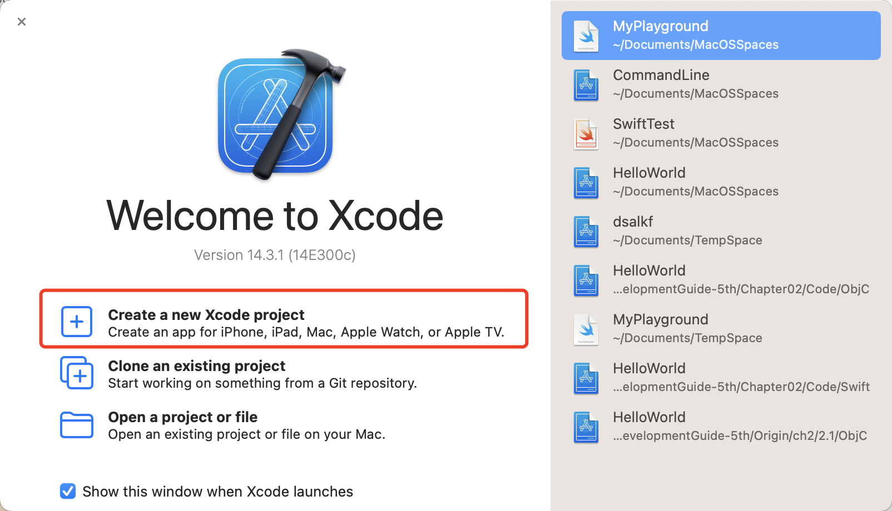
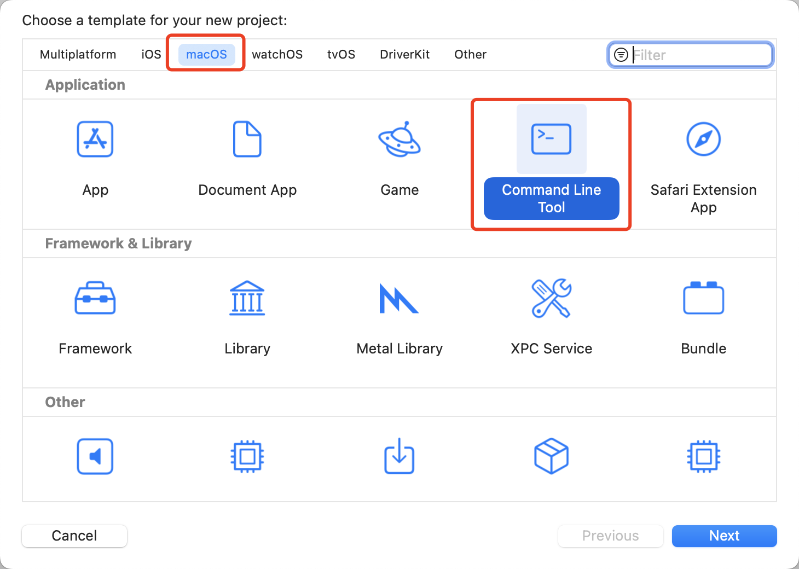
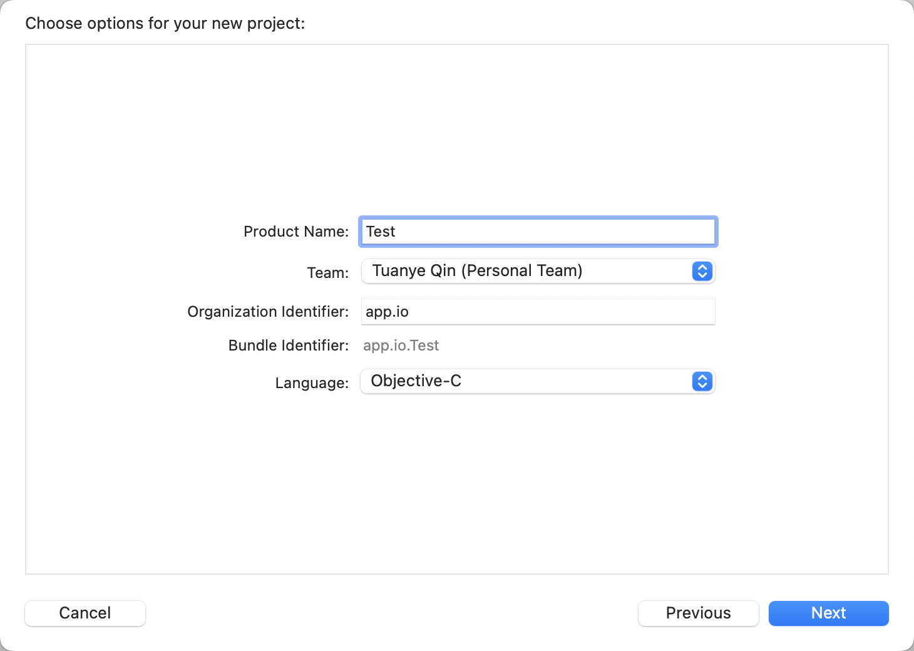
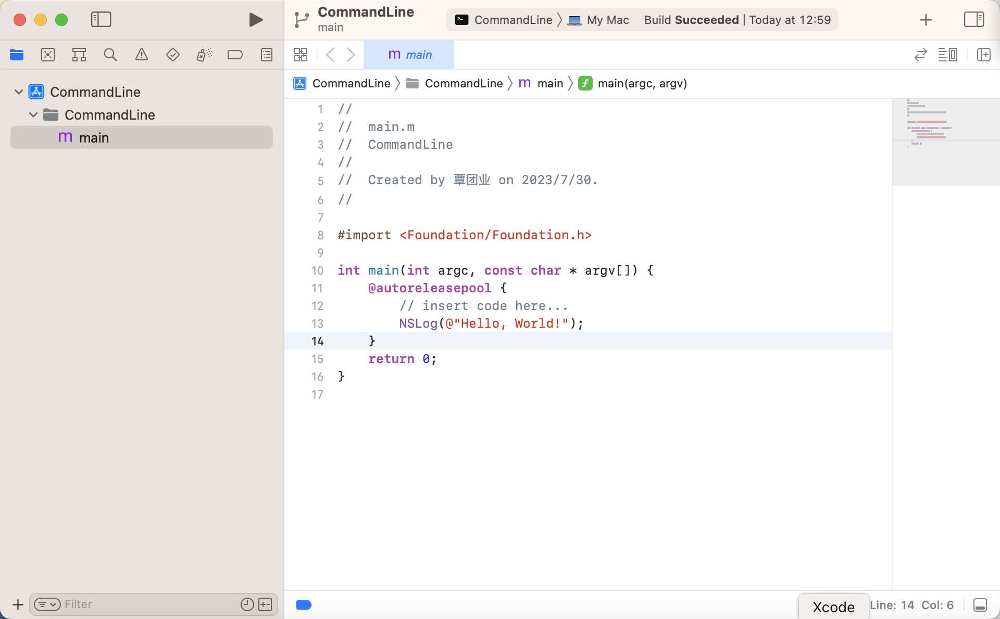

1.   启动 `Xcode` 程序，然后单击左下角的 `Create a new Xcode project` 选项。

     

2.   此时会弹出一个选择新工程模板对话框，选择 `macOS` 下面的 `Command Line Tool` 模板。

     

3.   在弹出的工程信息对话框中，在 `Product Name` 中输入工程名，在 `Organization Identifier` 中输入公司标识，在 `Language` 中选择 `Objective-C`，然后点击 `next` 按钮。

     

4.   可以看到 `XCode` 自动生成如下代码：

     

>   提示：`Objective-C` 源文件使用 `.m` 作为文件名的扩展名，`Xcode` 可以编译的文件扩展名如下所示：
>
>   `.c`：`C` 语言源文件
>
>   `.cc` 或 `.cpp`：`C++` 语言源文件
>
>   `.h`：头文件
>
>   `.m`：`Objective-C` 源文件
>
>   `.mm`：`Objective-C++` 源文件
>
>   `.pl`：`Perl` 源文件
>
>   `.o`：已经编译的文件