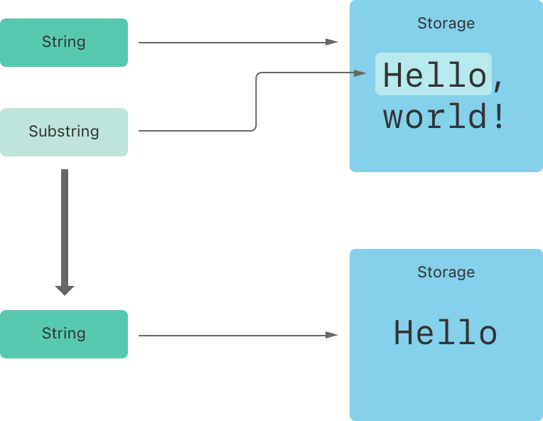

当您从字符串中获取子字符串时——例如，使用下标或类似 `prefix(_:)` 的方法——结果是 `Substring` 的实例，而不是另一个字符串。 Swift 中的子字符串具有与字符串大部分相同的方法，这意味着您可以像处理字符串一样处理子字符串。 但是，与字符串不同的是，您在对字符串执行操作时仅会在很短的时间内使用子字符串。 当您准备好将结果存储更长时间时，您可以将子字符串转换为 String 的实例。 例如：

```swift
let greeting = "Hello, world!"
let index = greeting.firstIndex(of: ",") ?? greeting.endIndex
let beginning = greeting[..<index]
// beginning is "Hello"

// Convert the result to a String for long-term storage.
let newString = String(beginning)
```

与字符串一样，每个子字符串都有一个内存区域，其中存储组成子字符串的字符。字符串和子字符串的区别在于，作为性能优化，子字符串可以重用用于存储原始字符串的部分内存，或用于存储另一个子字符串的部分内存。（字符串具有类似的优化，但如果两个字符串共享内存，则它们是相等的。）这种性能优化意味着您不必支付复制内存的性能成本，直到您修改字符串或子字符串。如上所述，子字符串不适合长期存储——因为它们重用了原始字符串的存储，只要使用其任何子字符串，就必须将整个原始字符串保存在内存中。

在上面的示例中，`greeting` 是一个字符串，这意味着它有一个内存区域，其中存储了组成该字符串的字符。因为 `beginning` 是 `greeting` 的子串，所以它重用了使用 `greeting` 的内存。相反，`newString` 是一个字符串——当它从子字符串创建时，它有自己的存储空间。下图显示了这些关系：

