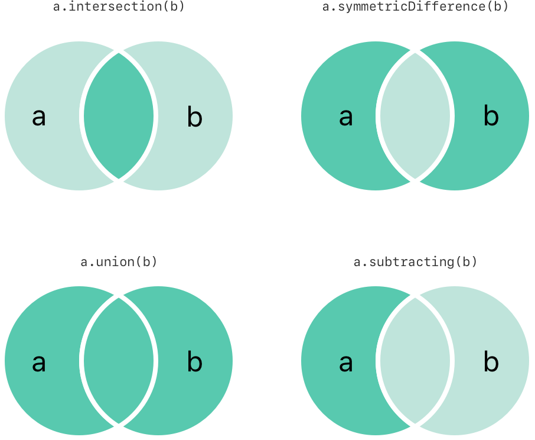

[toc]

你可以有效地执行基本的集合操作，例如将两个集合组合在一起，确定两个集合有哪些共同值，或确定两个集合是否包含全部、部分或不包含相同的值。

### 1. 基本集合运算

下图描绘了两个集合 `a` 和 `b` 以及由阴影区域标识的各种集合运算的结果。



+   使用 `intersection(_:)` 方法创建一个新集，其中仅包含两个集共有的值。
+   使用 `symmetricDifference(_:)` 方法创建一个新集，其中包含任一集中的值，但不能同时包含两个集中的值。
+   使用 `union(_:)` 方法创建一个包含两个集中所有值的新集。
+   使用 `subtracting(_:)` 方法创建一个新集，其中的值不在指定集中。

```swift
let oddDigits: Set = [1, 3, 5, 7, 9]
let evenDigits: Set = [0, 2, 4, 6, 8]
let singleDigitPrimeNumbers: Set = [2, 3, 5, 7]

oddDigits.union(evenDigits).sorted()
// [0, 1, 2, 3, 4, 5, 6, 7, 8, 9]
oddDigits.intersection(evenDigits).sorted()
// []
oddDigits.subtracting(singleDigitPrimeNumbers).sorted()
// [1, 9]
oddDigits.symmetricDifference(singleDigitPrimeNumbers).sorted()
// [1, 2, 9]
```

### 2. 设置成员资格和平等

下图描绘了三个集合 `a` 、`b` 和 `c`，其中重叠区域表示集合之间共享的元素。`a` 集合是 `b` 集合的超集，因为 `a` 包含 `b` 中的所有元素。相反，集合 `b` 是集合 `a` 的子集，因为 `b` 中的所有元素也在包含在 `a` 中。集合 `b` 和 集合 `c` 彼此不相交，因为它们没有共同的 `c` 元素。


+   使用 "等于"（`==`）运算符来确定两个集合是否包含所有相同的值。
+   使用 `isSubset(of:)` 方法确定集合的所有值是否都包含在指定集合中。
+   使用 `isSuperset(of:)` 方法确定集合是否包含指定结合中的所有值。
+   使用 `isStrictSubSet(of:)` 或 `isStrictSuperset(of:)` 方法确定一个结合是子集还是超集，但不等于指定的集合。
+   使用 `isDisjoint(with:) ` 方法确定两个集合是否没有共同值。

```swift
let houseAnimals: Set = ["🐶", "🐱"]
let farmAnimals: Set = ["🐮", "🐔", "🐑", "🐶", "🐱"]
let cityAnimals: Set = ["🐦", "🐭"]


houseAnimals.isSubset(of: farmAnimals)
// true
farmAnimals.isSuperset(of: houseAnimals)
// true
farmAnimals.isDisjoint(with: cityAnimals)
// true
```

