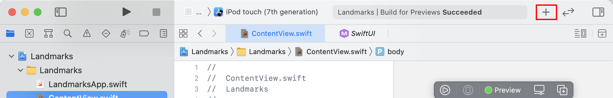
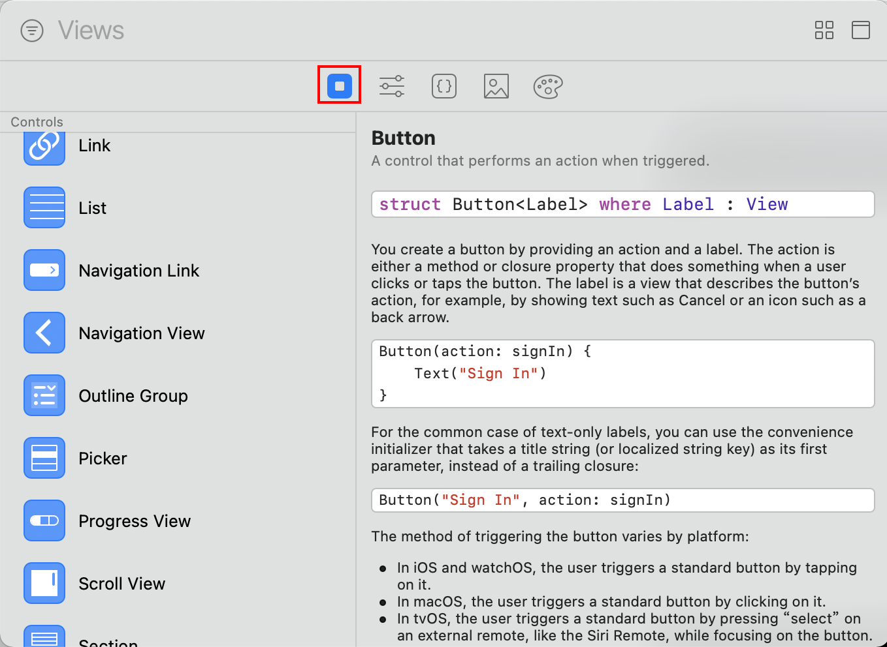
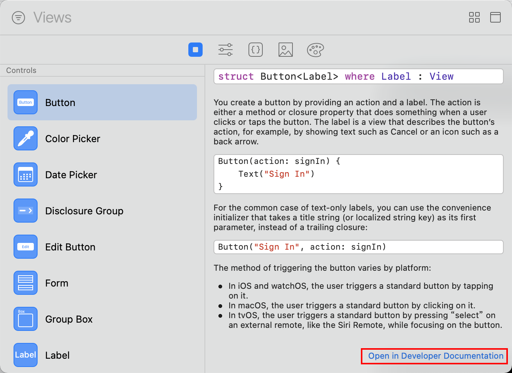
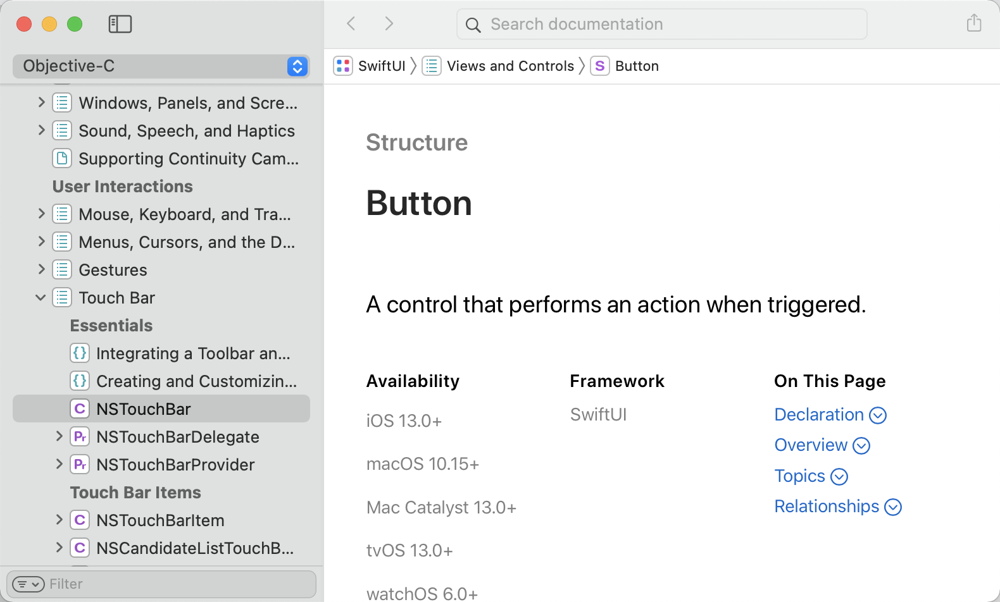

1. 点击 Xcode 界面上的 `+` 按钮。

    

2. 在弹出的对话框中选择 "show the Views library"。

    

3. 在 `Controls` 列表中的点击要使用的控件，可以在右边看到该控件的简单使用介绍。如果需要查看详细的使用说明，可以拖动右边视图到底部，然后点击 `Open in Developer Documentation` 按钮。

    

4. 这样将会弹出 Xcode 的帮助文档对话框。

    

