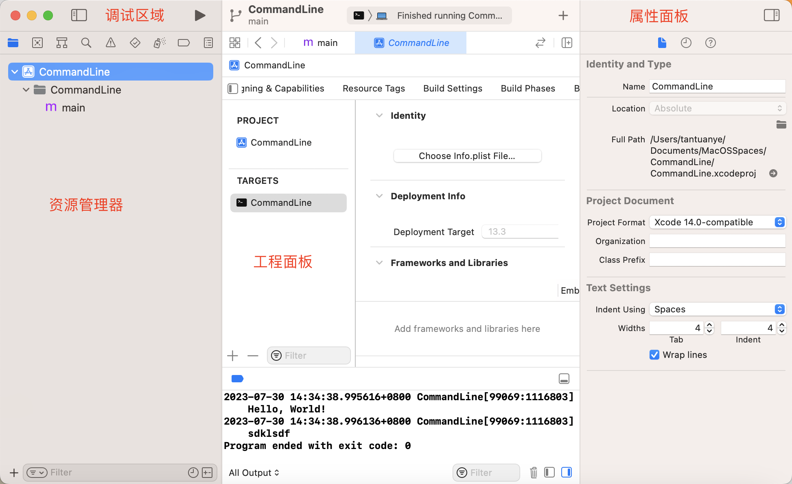
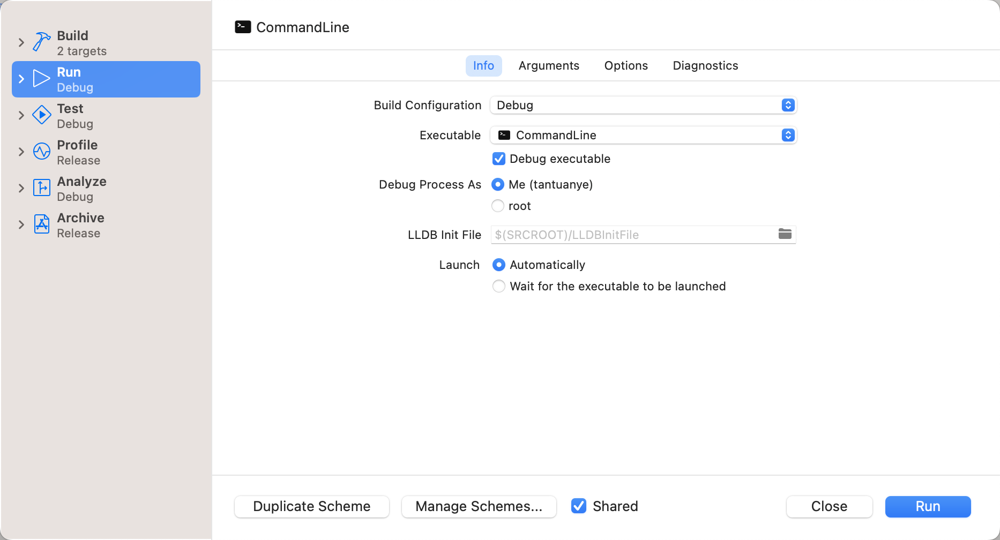
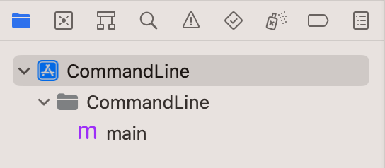
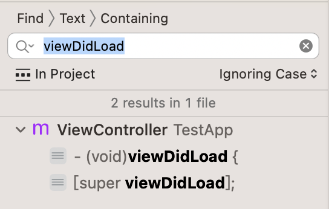
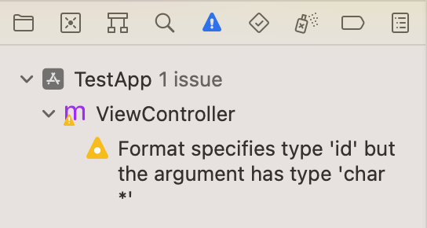
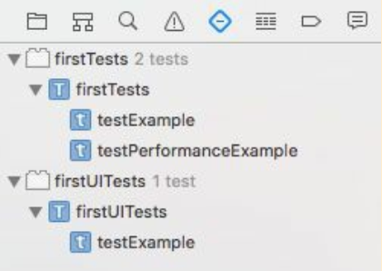
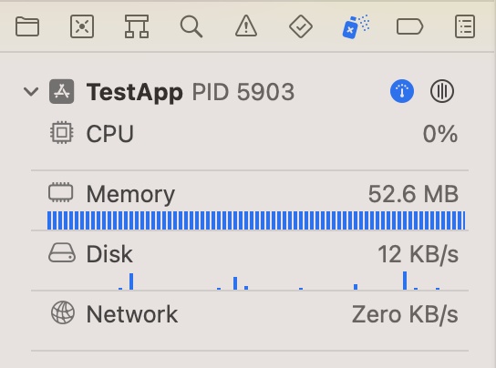
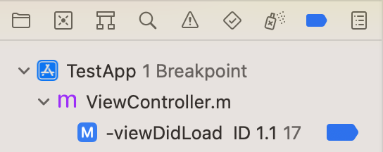
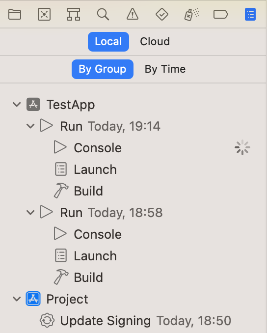
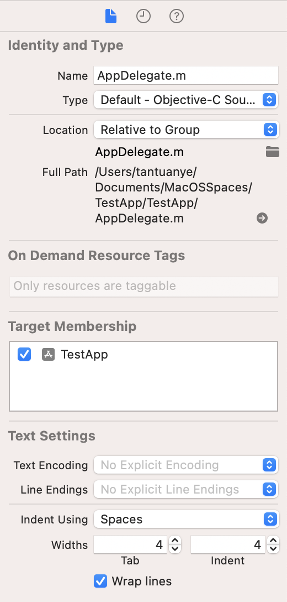

[toc]

### 1. 基本面板

### 1. 调试工具栏

调试工具栏最左边右边的是 `run` 运行按钮 ，单击它可以打开模拟器来运行项目。停止按钮是 。

另外，当按住 <kbd>Option</kbd> 键的同时单击运行按钮，会弹出更多的运行选项。

### 2. 导航面板

在导航区域包含了多个导航类型，例如选择第一个图标后会显示项目导航面板，即显示当前项目的构成文件。

单击第 2 个图标  会显示符号导航面板，将显示当前项目中包含的类、方法和属性。

单击第 3 个图标  后会显示搜索导航面板，在此可以输入将要搜素的关键字，按回车键后将会显示搜索结果。

单击第 4 个图标  后会显示问题导航面板，如果当前项目存在错误或警告，则会在此面板中显示出来。

单击第 5 个图标  会显示测试导航面板，其中会显示当前项目包含的测试用例和测试方法等。

单击第 6 个图标  后会显示调试导航面板，在默认情况下将会显示一片空白。只有在进行项目调试时，才会在这个面板中显示内容。

单击第 7 个图标  后会显示断点导航面板，在此界面中将会显示当前项目中的所有断点。右键单击断点后，可以在弹出的命令中设置禁用断点或删除断点。

单击第 8 个图标  后会显示日志导航面板，在此面板中将会显示在开发整个项目的过程中产生的所有信息。

### 3. 文件检查器面板

单击属性窗口中图标  后会显示文件检查器面板，此面板用于显示该文件存储的相关信息。

