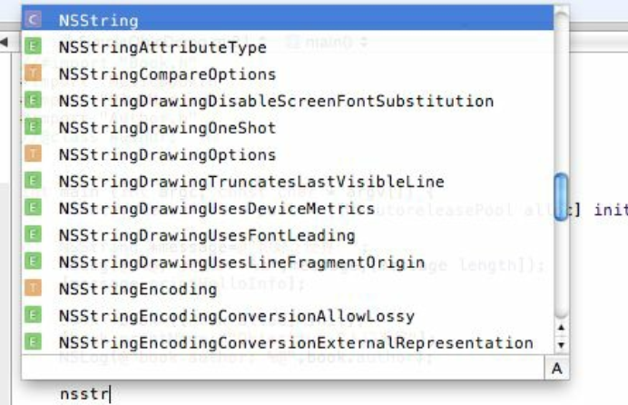
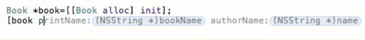

有的时候代码需要缩进，有的时候又要做相反的操作。单行缩进和其他编辑器类似，只需使用 <kbd>Tab</kbd> 键即可。如果选中多行则需要使用快捷键了，其中 <kbd>Command</kbd> + <kbd>]</kbd> 表示缩进，<kbd>Command</kbd> + <kbd>[</kbd> 表示反向移动。

`Xcode` 可以在输入代码的过程中自动给出建议。比如，要输入 `NSString`。当输入到 `NSStr` 的时候，后面的 `ing` 会自动出现，如果正是所需要的，直接按 <kbd>Tab</kbd> 键确认即可。另外也可输入 <kbd>ESC</kbd> 键，这是就会出现结果列表供选择了。

如果正在输入方法，那么会自动完成，如下图所示：

可以使用 <kbd>Tab</kbd> 键确认方法中的内容，或者通过快捷键 <kbd>Ctrl</kbd> + <kbd>/</kbd> 在方法中的参数之间来回切换。