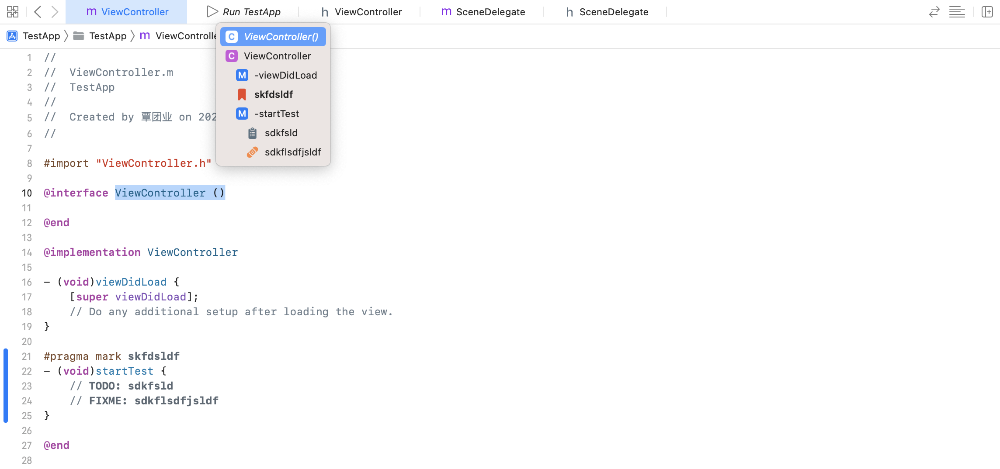

使用 `Eclipse` 的用户会经常用到 `TODO` 标签，比如正在编写代码的时候需要做其他事情，或者提醒自己以后再实现的功能时，可以写一个 `TODO` 注释，这样可以在 `Eclipse` 的视图中找到，方便以后找到这个代码并修改。

`Xcode` 也兼容该格式：

```
// TODO: xxx
```

也可以是：

```
// FIXME: xxx
```

`Xcode` 的标准写法为：

```objc
#pragma mark 描述信息
```

