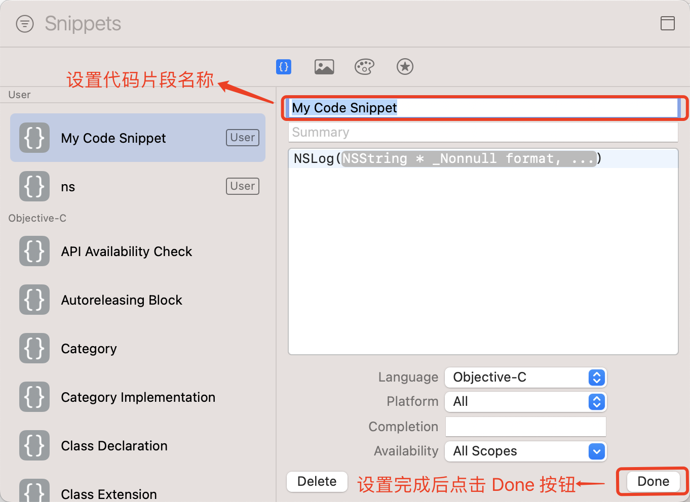
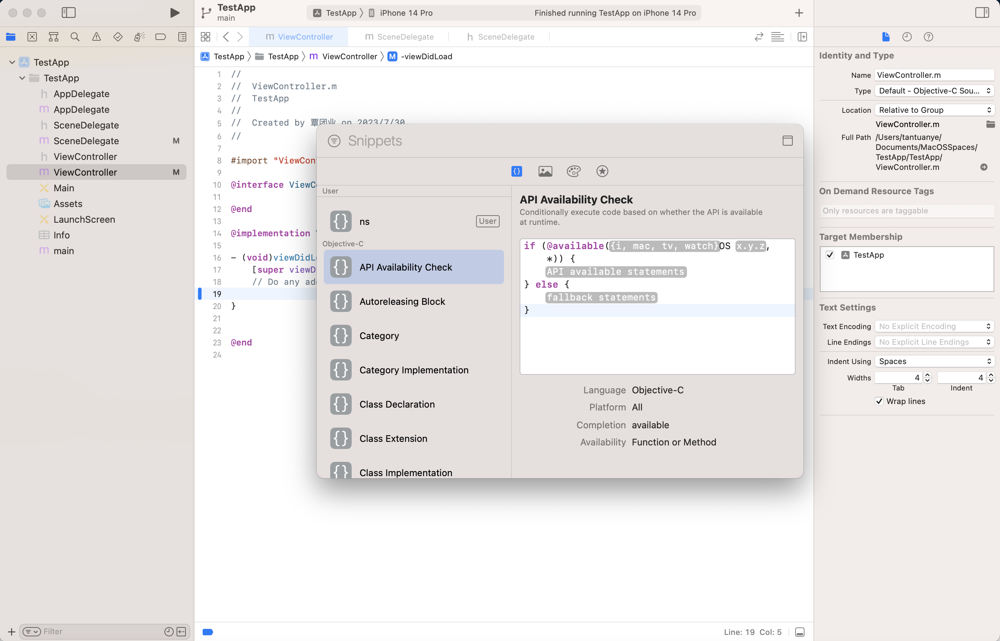
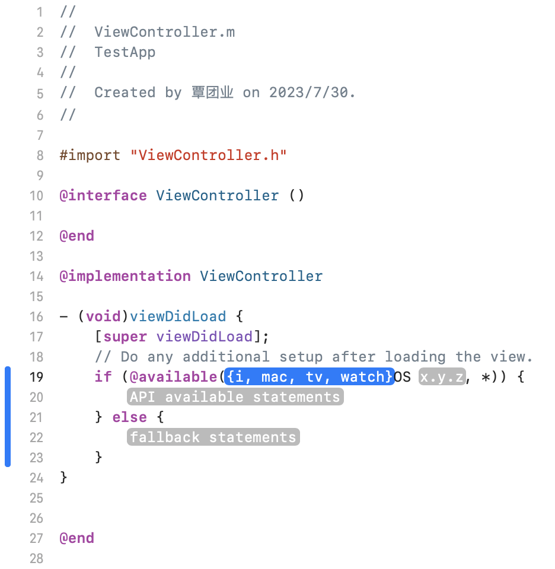

[toc]

### 1. 创建代码片段

首先创建代码片段模板：

```objc
NSLog(NSString * _Nonnull format, ...)
```

然后选中该代码片段，右键选中的代码片段，在弹出的菜单中选择 `Create Code Snippet...` 菜单。

在弹出的创建代码片段对话框中，设置代码片段名称后点击 `Done` 按钮即可完成，按 <kbd>ESC</kbd> 键退出该对话框。



可以使用如下结构添加代码中的模板（用户将会使用自己的数据进行填充）：

```
<#模板说明 #>
```

例如：

```objc
NSLog(<#NSString * _Nonnull format, ...#>)
```

### 2. 使用代码片段

首先将光标移动到要插入代码的位置。然后点击编辑器顶部的  按钮，在弹出的代码片段对话框中双击要插入的代码片段即可。



最后代码插入效果如下：

