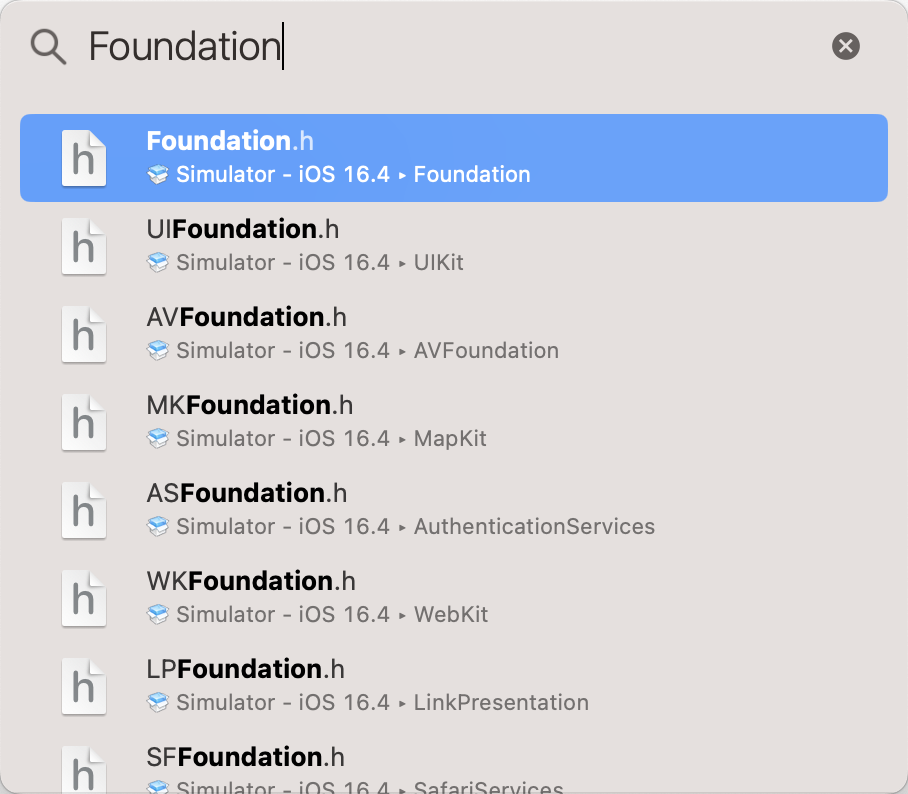

有时候需要快速打开头文件，例如要想知道 `Cocoa.h` 到底是什么内容。依次单击 `File` -> `Open Quickly...` 命令，或者按下 <kbd>Command</kbd> + <kbd>Shift</kbd> + <kbd>O</kbd> 键。此时会弹出下图所示的 `Open Quickly` 对话框。

在弹出的对话框中输入要打开的文件，在列表中单击要打开的文件即可。

