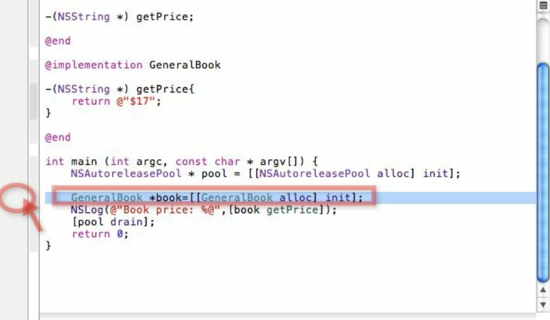
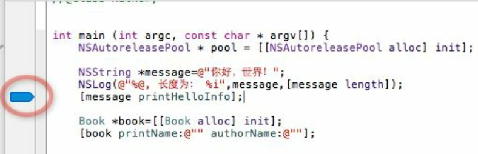
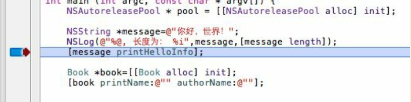
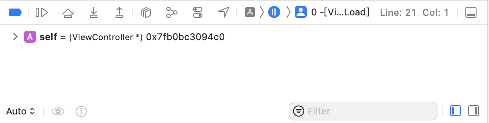

最简单的调试方法是通过 `NSLog` 打印出程序运行中的结果， 然后根据这些结果判断程序运行的流程和结果值是否符合预期。 对于简单的项目， 通常使用这种方式就足够了。 但是， 如果开发的是商业项目， 需要借助 `Xcode` 提供的专门调试工具。 所有的编程工具的调试思路都是一样的。 首先要在代码中设置断点。 程序的执行是顺序的， 可能怀疑某个地方的代码出了问题（引发 `Bug`） ， 那么就在这段代码开始的地方， 比如某个方法的第一行或者循环的开始部分， 设置一个断点。 那么程序在调试时会在运行到断点时中止， 接下来可以一行一行地执行代码， 判断执行顺序是否是自己预期的， 或者变量的值是否和自己想的一样。

设置断点的方法非常简单， 例如在下图中想对方框表示的行设置断点， 就单击该行左侧圆圈的位置。

单击后会出现断点标志，如下图所示：

接着运行代码，比如使用 <kbd>Command</kbd> + <kbd>R</kbd> 命令，这是将运行到断点处停止。

可以通过 <kbd>Shift</kbd> + <kbd>Command</kbd> + <kbd>Y</kbd> 命令显示调试对话框。

下面是主要命令的具体说明：

+   `Continue`：继续执行程序。
+   `Step over`：将执行当前方法内的下一个语句。
+   `Step into`：如果当前语句是方法调用，将单步执行当前语句调用方法内部第一行。
+   `Step out`：将跳出当前语句所在的方法，到方法外的第一行。