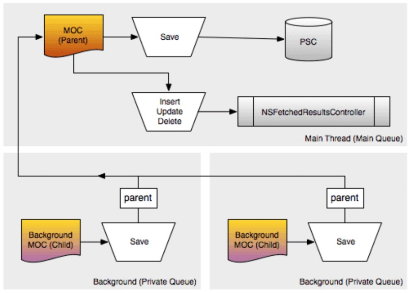
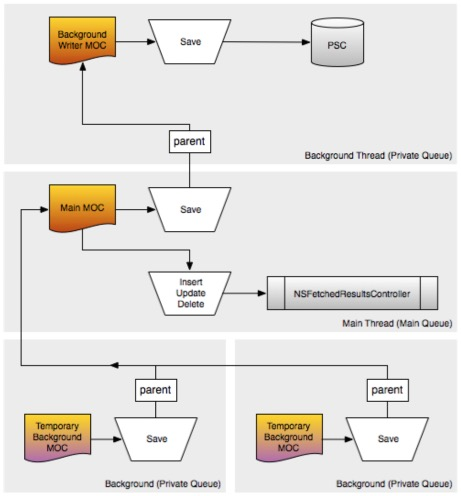

#CoreData多线程结构设计

##1. 两层设计方案

在项目中多线程操作比较简单时，可以创建一个主队列 `mainMOC`，和一个或多个私有队列的 `backgroundMOC`。将所有 `backgroundMOC` 的 `parentContext` 设置为 `mainMOC`，采取这样的两层设计一般就能够满足大多数需求了。



将耗时操作都放在 `backgroundMOC` 中执行，`mainMOC` 负责所有和 `UI` 相关的操作。所有和 `UI` 无关工作都交给 `backgroundMOC`，在 `backgroundMOC` 对数据发生改变后，调用 `save` 方法会将改变 `push` 到 `mainMOC` 中，再由 `mainMOC` 执行 `save` 方法将改变保存到存储区。

##2. 三层设计方案

但是我们发现，上面的 `save` 操作最后还是由 `mainMOC` 去执行的，`backgroundMOC`只是负责处理数据。虽然 `mainMOC` 只执行 `save` 操作并不会很耗时，但是如果 `save` 涉及的数据比较多，这样还是会对慈宁宫能造成影响的。

虽然**客户端很少涉及到大量数据处理**的需求，但是假设有这样的需求。可以考虑在两层结构之上，给 `mainMOC` 之上再添加一个 `parentMOC`，这个 `parentMOC` 也是私有队列的 `NSManagedObjectContext`，用于处理 `save` 操作。



这样 `CoreData` 存储的结构就是三层了，最底层的 `backgroundMOC` 负责处理数据，中间层是 `mainMOC` 负责 `UI` 相关操作，最上层也是一个 `backgroundMOC` 负责执行 `save` 操作。这样就将影响 `UI` 的所有**耗时操作全都剥离到私有队列中**执行，使性能达到了很好的优化。

需要注意的是，执行 `NSManagedObjectContext` 相关操作时，不要阻塞当前主线程。所有 `NSManagedObjectContext`的操作应该是异步的，无论是子线程还是主线程，尽量少的使用同步 `block` 方法。

##3. MOC同步时机

设置 `NSManagedObjectContext` 的 `parentContext` 属性之后，`parent` 对于 `child` 的改变是知道的，但是 `child` 对于 `parent` 的改变是不知道的。

```Objective-C
Employee *emp = [NSEntityDescription insertNewObjectForEntityForName:@"Employee" inManagedObjectContext:backgroundMOC];
emp.name = @"lxz";
emp.brithday = [NSDate date];
emp.height = 1.7f;

[backgroundMOC performBlock:^{
    [backgroundMOC save:nil];
    [mainMOC performBlock:^{
        [mainMOC save:nil];
    }];
}];
```

在上面这段代码中，`mainMOC` 是 `backgroundMOC` 的 `parentContext`。在 `backgroundMOC` 执行 `save` 方法前，`backgroundMOC` 和 `mainMOC` 都不能获取到 `Employee` 的数据，在 `backgroundMOC` 执行完 `save` 方法后，自身上下文发生改变的同时，也将改变 `push` 到 `mainMOC` 中，`mainMOC` 也具有了 `Employee` 对象。

所以在 `backgroundMOC` 的 `save` 方法执行时，是对内存中的上下文做了改变，当拥有 `NSPersistentStoreCoordinator` 的 `mainMOC` 执行 `save` 方法后，是对本地存储区做了改变。