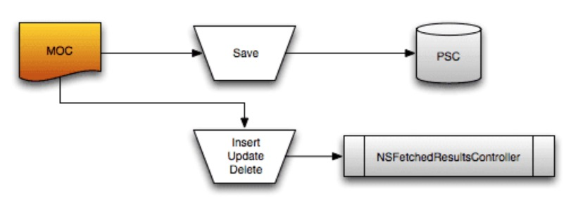
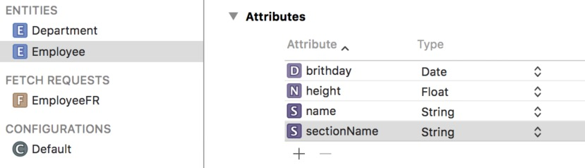

# NSFetchedResultsController

在开发过程中会经常用到 `UITableView` 这样的视图类，这些视图类 `需要自己管理其数据源`，包括网络获取、本地存储都需要写代码进行管理。

而在 `CoreData` 中提供了 `NSFetchedResultsController` 类），`FRC`可以管理 `UITableView` 或 `UICollectionView` 的数据源。这个数据源主要**指本地持久化的数据**，也可以用这个数据源配合着网络请求数据一起使用，主要看业务需求了。

##1. 简单介绍

`NSFetchedResultsController` 就像是上面两种**视图的数据管理者**一样。`NSFetchedResultsController` 可以监听一个 `NSManagedObjectContext` 的改变，如果 `NSManagedObjectContext` 执行了托管对象的增删改操作，就会对本地持久化数据发生改变， `NSFetchedResultsController` 就会回调对应的代理方法，回调方法的参数会包括执行操作的类型、操作的值、`indexPath`等参数。

实际使用时，通过 `NSFetchedResultsController` **”绑定“**一个 `NSManagedObjectContext`，将 `UITableView` 嵌入在 `NSFetchedResultsController` 的执行流程中。在任何地方对这个**“绑定”**的 `NSManagedObjectContext` 存储区做修改，都会触发 `NSFetchedResultsController` 的回调方法， 在 `NSFetchedResultsController` 的回调方法中嵌入 `UITableView` 代码并做对应修改即可。

由此可以看出 `NSFetchedResultsController` 最大优势就是，**始终和本地持久化的数据保持统一**。只要本地持久化的数据发生改变，就会触发 `NSFetchedResultsController` 的回调方法，从而在回调方法中更新上层数据源和 `UI`。这种方式讲的简单一点就可以叫做**数据带动UI**。



但是需要注意一点，在 `NSFetchedResultsController` 的初始化中传入了一个 `NSManagedObjectContext` 参数，  `NSFetchedResultsController` 只能监测传 入的 `NSManagedObjectContext` 发生的改变。假设其他 `NSManagedObjectContext`对同一个存储区发生了改变，  `NSFetchedResultsController` 则不能监测到这个变化，不会做出任何反应。

所以使用 `NSFetchedResultsController` 时， 需要注意 `NSFetchedResultsController` 只能对一个 `NSManagedObjectContext` 的变化做出反应，所以在 `CoreData` 持久化层设计时，尽量一个存储区只对应一个 `NSManagedObjectContext`，或设置一个负责 `UI` 的 `NSManagedObjectContext`，这在后面多线程部分会详细讲解。

##2. 修改模型文件结构

在写代码之前， 先对之前的模型文件结构做一些修改。



讲 `NSFetchedResultsController` 的时候，只需要用到 `Employee` 这一张表，其他表和设置直接忽略。需要在 `Employee` 原有字段的基础上，增加一个 `String` 类型的 `sectionName` 字段，这个字段就是用来存储 `section title` 的。

##3. 初始化NSFetchedResultsController

```Objective-C
// 创建请求对象，并指明操作Employee表
NSFetchRequest *request = [NSFetchRequest fetchRequestWithEntityName:@"Employee"];
// 设置排序规则，指明根据height字段升序排序
NSSortDescriptor *heightSort = [NSSortDescriptor sortDescriptorWithKey:@"height" ascending:YES];
request.sortDescriptors = @[heightSort];

// 创建NSFetchedResultsController控制器实例， 并绑定NSManagedObjectContext
NSError *error = nil;
self.fetchedResultController = [[NSFetchedResultsController alloc] initWithFetchRequest:request managedObjectContext:context sectionNameKeyPath:@"sectionName" cacheName:nil];
// 设置代理，并遵守协议
self.fetchedResultController.delegate = self;
// 执行获取请求，执行后NSFetchedResultsController会从持久化存储区加载数据，其他地方可以通过NSFetchedResultsController获取数据
[self.fetchedResultController performFetch:&error];

// 错误处理
if (error) {
    NSLog(@"NSFetchedResultsController init error : %@", error);
}

// 刷新UI
[self.tableView reloadData];
```

在上面初始化 `NSFetchedResultsController` 时， 传入的 `sectionNameKeyPath:` 参数，是指明当前托管对象的那个属性当做 `section` 的 `title`，在本文中就是 `Employee` 表的 `sectionName` 字段为 `section` 的 `title`。从 `NSFetchedResultsSectionInfo` 协议的 `indexTitle` 属性获取这个值。

在 `sectionNameKeyPath:` 设置属性名后，就以这个属性名作为分组 `title`，相同的 `title` 会被分到一个 `section` 中。

初始化`NSFetchedResultsController` 时参数 `managedObjectContext:` 传入了一个 `NSManagedObjectContext` 参数，`NSFetchedResultsController` 只能监测这个传入的 `NSManagedObjectContext` 发生的本地持久化改变。就像上面介绍时说的，其他 `NSManagedObjectContext` 对同一个持久化存储区发生的改变，`NSFetchedResultsController` 则不能监测到这个变化。

再往后面看到 `cacheName:` 参数，这个参数我设置的是 `nil`。参数的作用是开启 `NSFetchedResultsController` 的缓存，对获取的数据进行缓存并制定一个名字。可以通过调用 `deleteCacheWithName:` 方法手动删除缓存。

但是这个缓存并没有必要，缓存是根据 `NSFetchRequest` 对象来匹配的，如果当前获取的数据和之前缓存的相匹配则直接拿来用，但是在获取数据时每次获取的数据都可能不同，**缓存不能被命中**则很难派上用场，而且缓存还**占用内存资源**。

在 `NSFetchedResultsController`初始化完成后，调用 `performFetch:` 方法来同步获取持久化存储区数据，调用此方法后 `NSFetchedResultsController` 保存数据的属性才会有值。获取到数据后，调用 `tableView`的 `reloadData` 方法，会回调 `tableView`的代理方法，可以在 `tableView` 的代理方法中获取到 `NSFetchedResultsController` 的数据。调用 `performFetch:` 方法第一次获取到数据并不会回调 `NSFetchedResultsController` 代理方法。

##4. 代理方法

`NSFetchedResultsController` 中包含 `UITableView` 执行过程中需要的相关数据，可以通过 `NSFetchedResultsController` 的 `sections` 属性，获取一个遵守 `<NSFetchedResultsSectionInfo>` 协议的对象数组，数组中的对象就代表一个 `section`。

在使用过程中应该将 `NSFetchedResultsController` 和 `UITableView` 相互嵌套，在 `NSFetchedResultsController` 的回调方法中嵌套 `UITableView` 的视图改变逻辑，在 `UITableView` 的回调中嵌套数据更新的逻辑。这样可以**始终保证数据和UI的同步**，在下面的示例地面中将会演示 `NSFetchedResultsController` 和 `UITableView` 的相互嵌套。

**Table View Delegate**

```Objective-C
// 通过NSFetchedResultsController的sections数组属性，获取所有section的count值
- (NSInteger)numberOfSectionsInTableView:(UITableView *)tableView {
    return self.fetchedResultController.sections.count;
}

// 通过当前section的下标从sections数组中取出对应的section对象，并从section对象中获取所有对象count
- (NSInteger)tableView:(UITableView *)tableView numberOfRowsInSection:(NSInteger)section {
    return self.fetchedResultController.sections[section].numberOfObjects;
}

// NSFetchedResultsController根据indexPath获取托管对象，并给cell赋值
- (UITableViewCell *)tableView:(UITableView *)tableView cellForRowAtIndexPath:(NSIndexPath *)indexPath {
    Employee *emp = [self.fetchedResultController objectAtIndexPath:indexPath];
    UITableViewCell *cell = [tableView dequeueReusableCellWithIdentifier:@"identifier" forIndexPath:indexPath];
    cell.textLabel.text = emp.name;
    return cell;
}

// 创建NSFetchedResultsController对象时，通过sectionNameKeyPath:传递进去的section title的属性名，在这里获取对应的属性
- (NSString *)tableView:(UITableView *)tableView titleForHeaderInSection:(NSInteger)section {
    return self.fetchedResultController.sections[section].indexTitle;
}

// 是否可以编辑
- (BOOL)tableView:(UITableView *)tableView canEditRowAtIndexPath:(NSIndexPath *)indexPath {
    return YES;
}

// 这里是简单模拟UI删除cell后，本地持久化区数据和UI同步的操作。在调用下面NSManagedObjectContext保存上下文方法后，NSFetchedResultsController会回调代理方法并更新UI
- (void)tableView:(UITableView *)tableView commitEditingStyle:(UITableViewCellEditingStyle)editingStyle forRowAtIndexPath:(NSIndexPath *)indexPath {
    if (editingStyle == UITableViewCellEditingStyleDelete) {
        // 删除托管对象
        Employee *emp = [self.fetchedResultController objectAtIndexPath:indexPath];
        [self.context deleteObject:emp];
        //保存上下文环境，并做错误处理
        NSError *error = nil;
        if (![self.context save:&error]) {
            NSLog(@"tableView delete cell error: %@", error);
        }
    }
}
```

**Fetched Results Controller Delegate**

```Objective-C
// Cell数据源发生改变会回调此方法，例如添加新的托管对象等
- (void)controller:(NSFetchedResultsController *)controller didChangeObject:(id)anObject atIndexPath:(NSIndexPath *)indexPath forChangeType:(NSFetchedResultsChangeType)type newIndexPath:(NSIndexPath *)newIndexPath {
    switch (type) {
        case NSFetchedResultsChangeInsert:
            [self.tableView insertRowsAtIndexPaths:@[newIndexPath] withRowAnimation:UITableViewRowAnimationAutomatic];
            break;
            
        case NSFetchedResultsChangeDelete:
            [self.tableView deleteRowsAtIndexPaths:@[indexPath] withRowAnimation:UITableViewRowAnimationAutomatic];
            break;
            
        case NSFetchedResultsChangeMove: {
            [self.tableView deleteRowsAtIndexPaths:@[indexPath] withRowAnimation:UITableViewRowAnimationAutomatic];
            [self.tableView insertRowsAtIndexPaths:@[newIndexPath] withRowAnimation:UITableViewRowAnimationAutomatic];
        } break;
            
        case NSFetchedResultsChangeUpdate: {
            UITableViewCell *cell = [self.tableView cellForRowAtIndexPath:indexPath];
            Employee *emp = [self.fetchedResultController objectAtIndexPath:indexPath];
            cell.textLabel.text = emp.name;
        } break;
    }
}

// section数据源发生改变回调此方法，例如修改section title等。
- (void)controller:(NSFetchedResultsController *)controller didChangeSection:(id<NSFetchedResultsSectionInfo>)sectionInfo atIndex:(NSUInteger)sectionIndex forChangeType:(NSFetchedResultsChangeType)type {
    switch (type) {
        case NSFetchedResultsChangeInsert:
            [self.tableView insertSections:[NSIndexSet indexSetWithIndex:sectionIndex] withRowAnimation:UITableViewRowAnimationAutomatic];
            break;
            
        case NSFetchedResultsChangeDelete:
            [self.tableView deleteSections:[NSIndexSet indexSetWithIndex:sectionIndex] withRowAnimation:UITableViewRowAnimationAutomatic];
            break;
            
        default:
            break;
    }
}

// 本地数据源发生改变，将要开始回调NSFetchedResultsController代理方法
- (void)controllerWillChangeContent:(NSFetchedResultsController *)controller {
    [self.tableView beginUpdates];
}

// 本地数据源发生改变，NSFetchedResultsController代理方法回调完成
- (void)controllerDidChangeContent:(NSFetchedResultsController *)controller {
    [self.tableView endUpdates];
}

// 返回section的title，可以在这里对title做进一步处理。这里修改title后，对应section的indexTitle属性会被更新。
- (NSString *)controller:(NSFetchedResultsController *)controller sectionIndexTitleForSectionName:(NSString *)sectionName {
    return [NSString stringWithFormat:@"sectionName %@", sectionName];
}
```